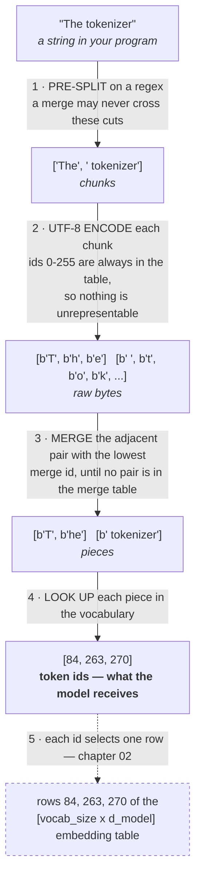

# 01 · Tokenizer

**Stage:** Build the model · **Read after:** 02, 03, 04 · **Feeds:** 02 (input ids), 10 (decoding back to text), 13 (non-text tokens)
**In the twelve-ideas guide:** §3 → *Tokenization*, *Byte-pair encoding (BPE)*

## Why this chapter exists

The model never sees text. It sees a list of integers, and the tokenizer is the function that
gets you there and back. Every practical quirk you have noticed — per-token pricing, models that
cannot count the r's in "strawberry", code costing more than prose, Chinese costing several times
more than English — is a tokenizer fact, not a model fact.

It is also the smallest self-contained piece of the whole stack. A few hundred lines, no
training, no GPU. That makes it the one component you can own completely in an afternoon, which
is why it is worth doing first even though it sits early in the pipeline rather than first in
importance.

## The whole chapter in one picture



Decoding runs 4→2 backwards: look each id up, concatenate the byte strings, decode UTF-8 **once**
at the very end.

## What this chapter computes

```python
encode(text: str) -> list[int]
decode(ids: list[int]) -> str
```

```
  encode('a tokenizer')  ->  [97, 268]
                             pieces: ['a', ' tokenizer']
  decode([97, 268])      ->  'a tokenizer'

  encode('the tokens')   ->  [278, 270]
                             pieces: ['the', ' tokens']
  decode([278, 270])     ->  'the tokens'
```

(Real output from the 24-merge tokenizer in [`bpe-workflow.md`](bpe-workflow.md). Note `'a'` is
id 97 — a raw byte, because no merge ever covered a lone `a`.)

**Input** — any string at all. Prose, source code, emoji, a language the tokenizer has never seen,
random bytes. There is no input it can refuse.

**Output** — a list of integers, each one naming an entry in a fixed table. Typically 3–5 bytes of
English per integer.

**Goal** — compress text into as few integers as possible while guaranteeing that *every* input
can be represented and reconstructed exactly. Those two demands pull against each other, and the
whole design is the compromise: frequent strings get their own entry, rare ones fall back to
smaller pieces, and at the very bottom every single byte has an entry so nothing can fail.

**What it does NOT do** — the usual misconceptions:

- It does **not** understand anything. No grammar, no meaning, no parts of speech. It is a lookup
  table plus a fixed list of merges, all derived from counting.
- It does **not** split on words. For English it happens to land near word boundaries, because
  its pre-split regex forbids crossing them — that is a configuration choice, not a property of
  the algorithm.
- It does **not** learn anything at run time. The table is frozen before the model is trained and
  cannot change afterwards without invalidating every weight that touches it.
- It is **not** lossy. `decode(encode(s)) == s` exactly, for any string.

## Terminology

Everything this chapter introduces, in the order it comes up.

| Term | In plain language |
| --- | --- |
| **token** | One entry in the tokenizer's table. Usually a word fragment — sometimes a whole word, sometimes a single byte. Not a word and not a character. |
| **token id** | The integer naming that entry. The model only ever sees these. |
| **vocabulary** | The table mapping id → byte string. A dict with integer keys. 50,000–250,000 entries in practice. |
| **vocabulary size** | How many entries the table has. Chosen before training; every entry costs one embedding row and one LM-head row forever. |
| **byte** | A number from 0 to 255. Ids 0–255 always name the raw bytes, which is what guarantees no input can fail. |
| **UTF-8** | The standard for storing text as bytes: 1 byte for ASCII, up to 4 for other characters. `'🙂'` is 4 bytes. |
| **subword** | A token that is part of a word rather than a whole one — `'ing'`, `'ize'`, `'oken'`. |
| **BPE** (byte-pair encoding) | The algorithm here: repeatedly fuse the most frequent adjacent pair of pieces into a new single piece. |
| **merge** | One learned fusion of two pieces into one, e.g. `b' to'` + `b'ken'` → `b' token'`. |
| **merge table** | The dict mapping a **pair** of byte strings → the id of their fusion. Keyed by pair, unlike the vocabulary which is keyed by id. Used only when encoding. |
| **merge budget** | How many merges training is allowed to make. `vocab_size − 256 − specials`. Training stops when this runs out, not when anything converges. |
| **pre-splitting** | Cutting the text on a regex *before* any merging. These cuts are hard boundaries that no merge may cross. |
| **chunk** | One piece produced by pre-splitting — usually a word with its leading space, a run of digits, punctuation, or whitespace. |
| **encoding** | Text → ids. Start from bytes, replay the merges in the order they were learned, stop when no adjacent pair is in the merge table. |
| **decoding / detokenization** | Ids → text. Look each id up, concatenate the byte strings, decode UTF-8 once at the very end. |
| **special token** | An entry added to the vocabulary by hand rather than learned, marking structure text cannot: `<|endoftext|>`, BOS, EOS, padding. |
| **BOS / EOS** | Beginning- and end-of-sequence markers, framing an input so the model knows where it starts and stops. |
| **padding token** | Filler added so every sequence in a batch is the same length. Ignored when computing anything. |
| **chat template** | The convention turning a multi-turn conversation into one token stream, using special tokens as role markers. Where "the model was trained on a format" physically lives. → [07](../07-supervised-fine-tuning/) |
| **glitch token** | A string that earned a vocabulary slot but then barely appeared in training, leaving an almost-untrained embedding. Feeding one in produces erratic behaviour. |
| **WordPiece** | BERT's variant: scores candidate merges by likelihood gain rather than raw frequency. |
| **Unigram** | SentencePiece's other algorithm: start with a large vocabulary and prune it, instead of building up. |
| **SentencePiece** | The tokenizer toolkit most non-GPT models use. Can be configured to allow merges across word boundaries. |
| **tokenizer-free / byte-level** | Architectures (ByT5, MegaByte, Byte Latent Transformer) that drop the fixed vocabulary and learn the chunking inside the network instead. |

## Files in this chapter

| File | What it is |
| --- | --- |
| [`essentials/`](essentials/) | UTF-8 and compression, each with a runnable demo. |
| [`bpe-workflow.md`](bpe-workflow.md) | **The main article.** A complete trace of BPE — training, encoding, decoding — with the `merges` and `vocab` tables printed at every step. Read it after this drill list. |
| `bpe_workflow.py` | Generates that article. Change `N_MERGES`, re-run, and the whole article updates. |
| `minibpe_demo.py` | The shortest useful version: ~60 lines, trains, prints the vocabulary, encodes, decodes. |
| `merge_trace.py` | Trains on a real 67KB file. Produces the compression curve and the merge-order-vs-longest-match comparison. |
| `stop_check.py` | Inspects the encoder's stopping condition pair by pair. |
| `presplit.py` | Trains with and without pre-splitting, to show what the regex is actually preventing. |

All are stdlib-only: `python3 <script>.py`, nothing to install.

## Before the drill list: the maths

Two ideas this chapter's guarantees rest on — see **[`essentials/`](essentials/)**:

| If this stops making sense… | Read |
| --- | --- |
| "ids 0–255 are the raw bytes", "nothing is unrepresentable", the streaming `\ufffd` glitch | [UTF-8 and bytes](essentials/utf-8-and-bytes/) |
| "the tokenizer is a compression scheme", "merge the most frequent pair", "bits per token" | [Compression and information](essentials/compression-and-information/) |

## Drill list

**Pre-splitting.** Before any merging, the text is cut on a regular expression — GPT-2's matches a
word with an optional leading space, a run of digits, a run of punctuation, or a run of
whitespace. Merges may never cross these cuts, which is what stops BPE from swallowing whole
phrases into single tokens. Run `presplit.py` to see the difference: with the regex, zero tokens
contain an internal space; without it, BPE learns
`b'the tokenizer tokenizes text into tokens and the token is'` as one token.

**Bytes, not characters.** Each chunk is encoded to UTF-8 — the standard that stores any character
as 1 to 4 bytes. Because the vocabulary always contains all 256 byte values, *any* input can be
tokenized and there is no "unknown word" case, ever. The cost is that non-Latin scripts start
from more bytes: `'Hello'` is 5 bytes, `'你好'` is 6 for two characters, `'🙂'` is 4 for one.

**The vocabulary** is a dictionary from id to byte string: `{256: b' t', 257: b'ok', ...}`. Ids
0–255 are the raw bytes; everything above is something training merged. 50,000–250,000 entries in
practice. → **Q&A below**, and §0 of the article.

**Training the merges.** Count every adjacent pair in the corpus, fuse the most frequent one, give
it the next id, repeat. Stop when you have made as many merges as your vocabulary budget allows —
a number you chose, not a point of convergence. → **§1 of the article.**

**Encoding.** Start from bytes again and replay the merges in the order they were learned, always
applying the lowest merge id available. Not longest-match-first: on real text the two disagree on
44% of chunks, and merge-order compresses better (`merge_trace.py`). → **§2 of the article.**

**Special tokens** are entries added to the vocabulary by hand, not learned from text, so that the
runtime can mark structure the text itself cannot: `<|endoftext|>` for a document boundary, BOS
and EOS ("beginning/end of sequence") to frame an input, a padding token to fill a batch to equal
length. They are kept out of BPE so no ordinary text can accidentally produce them.

**Chat templates** turn a conversation into one token stream using those special tokens — role
markers around each system, user and assistant turn. This is where "the model was trained on a
format" physically lives: get the template wrong and the model is off-distribution, most visibly
by not knowing when to stop. → [07](../07-supervised-fine-tuning/).

**Decoding** needs only the vocabulary: look up each id, concatenate the bytes, decode UTF-8 last.
Decoding last is what makes streaming awkward — `'🙂'` is `b'\xf0\x9f\x99\x82'`, and if a token
boundary falls inside it, the first half alone decodes to the replacement character `'�'` until
the rest arrives.

**The consequences you can now explain.**

- *Spelling and letter-counting.* `' strawberry'` may be a single id; the model has no more access
  to its letters than you have to the pixels of a variable name. It can only recall spellings it
  saw written out.
- *Arithmetic.* How a number splits changes how learnable the arithmetic is, so GPT-4's regex caps
  digit runs at three — `1234567` is forced into groups regardless of how often it appeared.
- *Multilingual cost.* This one is usually explained wrongly. Measured with a tokenizer trained on
  67KB of English prose:

  ```
    text                       chars  bytes  tokens   bytes/token
    'The model reads tokens.'     23     23       5       4.60
    'El modelo lee tokens.'       21     21       8       2.62
    '模型读取词元。'                7     21      21       1.00
  ```

  The Chinese sentence is *fewer bytes* than the English one, yet costs **4× the tokens** — so the
  penalty is not about byte length. It is that no merge was ever learned for those byte sequences,
  so each of `'模'`'s three bytes stays its own token. A language pays in proportion to how little
  of the training corpus it made up.
- *Glitch tokens.* Strings that earned a vocabulary slot from the merge corpus but then barely
  appeared in the model's training data, leaving an embedding that was almost never updated.
  Feed one in and behavior gets erratic. The famous example is ` SolidGoldMagikarp`.

**Alternatives, in one line each.** *WordPiece* (BERT) scores candidate merges by likelihood gain
rather than raw frequency. *Unigram* (SentencePiece) starts from a large vocabulary and prunes it
instead of building up. *SentencePiece* is the toolkit most non-GPT models use, and can be
configured to allow cross-word merges. *Byte-level / tokenizer-free* models (ByT5, MegaByte, Byte
Latent Transformer) drop the fixed vocabulary and learn the chunking inside the network. Recognize
these; do not drill them unless your work needs one.

## Shared prerequisites

- **UTF-8 and bytes** — [`essentials/`](essentials/utf-8-and-bytes/). Referenced by [10](../10-inference-and-decoding/).
- **Compression and information** — [`essentials/`](essentials/compression-and-information/). The
  bridge into [03](../03-training-objective/)'s "loss in bits".

## Build it

1. Run `minibpe_demo.py` and read its output top to bottom. It is the whole algorithm in 60 lines.
2. Open `bpe_workflow.py`, change `N_MERGES`, re-run it, and diff the regenerated
   `bpe-workflow.md`. Watching the ladder grow and the traces change is the fastest way to
   internalize what a merge budget buys.
3. Point `merge_trace.py` at a file of your own — ideally some of your source code — and look at
   which merges it learns. Indentation and your naming conventions will show up in the table.
4. Then Karpathy's *Let's build the GPT Tokenizer* (minbpe) for the full treatment, including the
   regex and special-token handling that these scripts simplify.

## You're done when you can…

- [ ] Write BPE training and encoding from memory in ~100 lines and explain every line.
- [ ] Name the two stopping rules — budget for training, exhaustion for encoding — and say which
      one fires in production.
- [ ] Look at a string and predict roughly what it costs in tokens, and why.
- [ ] Explain why `'the'` and `' the'` are different tokens, and what that costs.
- [ ] Explain what a chat template is and why a wrong one makes a model fail to stop.
- [ ] Say why the tokenizer is frozen before training starts and what breaks if you change it.

## Q&A

### Q: Why use tokens instead of words directly?

**Short answer:** "word" is not a finite, well-defined, or universal unit, and the two obvious
alternatives — a fixed word list, or raw characters — each break something the model can't
afford to lose. Tokens are the empirical compromise: a fixed-size vocabulary that never fails
on unseen input.

**1. There is no finite list of words.** New ones appear constantly: names, typos, URLs,
`getUserById`, `SARS-CoV-2`, `0x7f3a`, slang coined last month. Any word-level vocabulary needs
a cutoff, and everything past it becomes `<UNK>` — one ID meaning "something was here". That is
lossy in a way you cannot undo: the model can neither read the word nor write it back out. A
tokenizer that bottoms out at bytes has no such failure mode; the worst case is that a string
costs more tokens.

**2. Vocabulary size is a direct parameter and compute cost.** Two matrices are vocab-sized —
the embedding table (`vocab × d_model`) and the LM head (`d_model × vocab`) — plus a softmax
over the entire vocabulary at every position.

- Llama-3-8B: vocab 128,256, d_model 4,096 → **525M parameters each**, ~13% of the whole model
  sitting in the two vocab-facing matrices.
- A 1M-word vocabulary at the same width → 4.1B parameters each. You would spend the entire
  model on the dictionary.

So vocabulary is a budget, and you want to spend each slot on a string that earns it by frequency.

**3. The long tail gets no training signal.** Word frequencies follow Zipf's law: a handful of
words are everywhere, and roughly half the distinct words in a corpus appear exactly *once*. A
word-level embedding for a word seen three times is noise — the model never learned it. Subwords
pool statistical strength instead: `token`, `tokenize`, `tokenizer`, `tokenization` all share the
`token` embedding, which has seen millions of updates. Morphology generalization comes free —
because `unhappiness` decomposes, an unseen `unfriendliness` does not start from zero.

**4. Many languages have no words to split on.** Chinese, Japanese and Thai don't put spaces
between words. Word-level tokenization would require a *segmenter* — itself a hard,
language-specific, error-prone NLP model — as a mandatory preprocessing step, with every
segmentation error baked in permanently. And "word" is barely meaningful for much of the corpus
anyway: code, math, markup, base64, DNA.

**5. So why not go all the way down to characters/bytes?** That fixes coverage completely (256
byte values, nothing is ever unknown) but wrecks the compute budget:

- English runs ~4 characters per token under BPE, so byte-level makes sequences **~4× longer**.
- Generation is one forward pass per token → **4× the forward passes** for the same text.
- Attention is O(n²) in sequence length → up to **16× the attention compute** for the same content.
- Each byte carries little information, so early layers burn capacity re-assembling words the
  tokenizer could have handed over for free — and a fixed context window holds 4× less content.

**The framing that makes it click:** the tokenizer is a *compression scheme*, chosen to maximize
information per sequence position subject to a fixed vocabulary budget, while guaranteeing
coverage by bottoming out at bytes. Words are one extreme (most information per token, no
coverage, unaffordable vocabulary); bytes are the other (perfect coverage, least information, 4×
the compute). BPE picks the point in between **empirically from the corpus, not from
linguistics** — which is why its splits are often linguistically silly (`ant`+`idis`+`establish`+
`ment`) but statistically sensible.

**What it costs you** — the quirks further down the drill list: no direct access to the letters
inside a token (spelling, counting the r's in "strawberry"), arithmetic that depends on how
digits happen to group, uneven cost across languages, and behavior that changes with a leading
space. Worth noting that **word-level would make the spelling problem strictly worse** — a word
as a single atomic ID has *zero* internal letter structure — so the intuition "words would be
more natural" points the wrong way here.

**Is this settled?** No. Byte-level and "tokenizer-free" architectures (ByT5, MegaByte, Byte
Latent Transformer) attack exactly this trade-off by learning the chunking inside the model,
usually with a small local network pooling bytes into patches before the expensive layers. It is
an active area and the calculus shifts as attention gets cheaper — but every production model
today ships a fixed subword tokenizer.

→ Related: [02 · embedding table and parameter count](../02-transformer-forward-pass/),
[03 · softmax over the vocabulary](../03-training-objective/).

### Q: What does "the vocabulary as a lookup table id ↔ byte string" actually look like?

Literally a dictionary with integer keys. Nothing more:

```python
vocab = {0: b'\x00', 1: b'\x01', ..., 255: b'\xff',   # every raw byte
         256: b' t', 257: b'ok', 258: b'oke', ...}    # then the merges
```

`minibpe_demo.py` in this folder trains one for real (60 lines, no dependencies) on a small
corpus about tokenizers, with 30 merges. Run it — this is its actual output:

```
merge  0: b' ' + b't'       -> id 256 = b' t'          (96 occurrences)
merge  1: b'o' + b'k'       -> id 257 = b'ok'          (66 occurrences)
merge  2: b'ok' + b'e'      -> id 258 = b'oke'         (66 occurrences)
merge  3: b'oke' + b'n'     -> id 259 = b'oken'        (66 occurrences)
merge  4: b' t' + b'oken'   -> id 260 = b' token'      (42 occurrences)
...
merge 10: b' token' + b'iz' -> id 266 = b' tokeniz'    (24 occurrences)
merge 11: b' tokeniz'+b'e'  -> id 267 = b' tokenize'   (24 occurrences)
merge 14: b' tokenize'+b'r' -> id 270 = b' tokenizer'  (18 occurrences)
```

and the resulting table — **286 entries = 256 bytes + 30 merges**:

```
   id | byte string        | as text
  ----+--------------------+-----------
   32 | b' '               | ' '            <- raw bytes: ids 0-255,
   97 | b'a'               | 'a'               always present, never removed
  255 | b'\xff'            | '�'
  ----+--------------------+-----------
  256 | b' t'              | ' t'           <- merges, in the order learned
  259 | b'oken'            | 'oken'
  260 | b' token'          | ' token'
  263 | b'he'              | 'he'
  269 | b' the'            | ' the'
  270 | b' tokenizer'      | ' tokenizer'
  281 | b'ing'             | 'ing'
  285 | b' and'            | ' and'
```

**Six things this table shows you**

1. **Ids 0–255 are the raw bytes and are never removed.** That's the whole coverage guarantee
   from the previous question: any input at all bottoms out in rows that always exist.
2. **An entry is a byte string — that's it.** No part of speech, no meaning, no word boundary
   flag. `b'oken'` is a vocabulary entry of equal standing to `b' the'`.
3. **The leading space is part of the token.** Id 260 is `b' token'`, *with* the space. This is
   why `"token"` and `" token"` encode to different ids, and why a prompt ending in a space
   often behaves oddly — you've handed the model a different token than it expects.
4. **Merges are hierarchical and the intermediates stay forever.** `ok` → `oke` → `oken` →
   `' token'` → `' tokeniz'` → `' tokenize'` → `' tokenizer'`. Every rung keeps its row, because
   other words need them. Vocabulary slots are spent on the ladder, not just the top.
5. **Frequency, not linguistics, decides.** Encoding `"A tokenizing quokka"` gives
   `['A', ' tokeniz', 'ing', ' ', 'q', 'u', 'ok', 'k', 'a']` — an unseen word falls apart into
   whatever rows exist, and `quokka` borrowed the `ok` that was learned from *token*. The
   tokenizer has no idea these are unrelated words.
6. **Encode and decode use only this table.** Decode is a reverse lookup and a concatenation:
   `b"".join(vocab[i] for i in ids).decode('utf-8')`. `[84, 263, 270]` →
   `b'T' + b'he' + b' tokenizer'` → `"The tokenizer"`.

**Scaling to a production size.** Same structure, more rows. GPT-2's vocabulary is exactly
**50,257 = 256 bytes + 50,000 merges + 1 special token** (`<|endoftext|>`) — you can verify that
arithmetic against the published config. Others: GPT-4 `cl100k_base` 100,277; GPT-4o
`o200k_base` ~199,998; Llama-3 128,256; Gemma 256,000. The range in the drill list (50k–250k) is
just where the trade-off from the previous question lands in practice.

**Why the table is load-bearing for the rest of the stack:** vocabulary entry *i* corresponds to
**row *i* of the embedding table** and to **logit *i* at the output** ([02](../02-transformer-forward-pass/),
[03](../03-training-objective/)). The table is the model's entire inventory of symbols — it
cannot think a thought that isn't expressible as a sequence of these rows, and changing the table
invalidates every weight that touches it, which is why the tokenizer is frozen before training
starts.

### Q: How does the merge get processed — what does it start with, when does it end, and why?

There are **two** merge processes with different stopping rules, and conflating them is the usual
confusion. Both start from raw bytes; one ends because you ran out of *budget*, the other
because it ran out of *work*.

`merge_trace.py` in this folder produces everything below — it trains on
`../twelve-ideas-behind-modern-ai.md` (67,652 bytes of real prose).

---

#### A. Training the merge list — done once, offline

**Starts with:** every pre-split chunk as a sequence of individual bytes. The whole 67,652-byte
corpus is 67,652 tokens at this point, and the vocabulary is just ids 0–255.

**Each step:** count every adjacent pair across the entire corpus → take the single most frequent
→ give it the next free id → replace every occurrence of that pair everywhere. Repeat.

**Why most-frequent?** It is greedy compression. Merging a pair that occurs *n* times removes
*n* tokens from the corpus, so the most frequent pair buys the largest reduction in total
sequence length for the one vocabulary slot it costs. That is the entire objective: *minimize
total tokens, subject to a vocabulary budget*. Note this is greedy, not optimal — no lookahead,
and a different corpus produces a completely different merge list.

**Ends when:** you have done N merges, where `N = target_vocab_size − 256 − num_special_tokens`.
**It is a hyperparameter, not a convergence criterion.** Nothing in the algorithm says "done" —
you stop because the budget ran out. (Left running, it would continue until every pre-split
chunk is a single token and no pairs remain; the pre-splitting regex is what caps it there
rather than letting it merge across whitespace into whole phrases.)

**Why that N?** The compression is sharply diminishing — measured on the guide text:

```
  after    0 merges:  67652 tokens  (100.0% of byte-level)   tokens saved per merge:      —
  after    1 merges:  66197 tokens  ( 97.8%)                                          1455.0
  after   10 merges:  58913 tokens  ( 87.1%)                                           656.2
  after   50 merges:  46203 tokens  ( 68.3%)                                           273.9
  after  100 merges:  40218 tokens  ( 59.4%)                                           119.7
  after  200 merges:  34796 tokens  ( 51.4%)                                            54.2
  after  400 merges:  29478 tokens  ( 43.6%)                                            21.9
  after  600 merges:  26601 tokens  ( 39.3%)                                            12.9
```

The first merge saves 1,455 tokens; merges 500–600 save about 13 each — a 100× fall, and it
keeps going (Zipf's law again). Meanwhile **every merge costs the same fixed price**: one row in
the embedding table and one in the LM head — at Llama-3's `d_model` 4,096 that's 8,192
parameters per merge, forever. You stop where the marginal token savings stop justifying that
fixed cost. 50k–250k is where that crossover empirically lands.

**What the ladder looks like on real text.** The merges that eventually build `b' tokenizer'`
are scattered across training, interleaved with merges for unrelated words:

```
  merge   0 -> id 256: b' ' + b't'      = b' t'       (1455 occurrences)
  merge   6 -> id 262: b'e' + b'r'      = b'er'        (639 occurrences)
  merge   9 -> id 265: b'e' + b'n'      = b'en'        (616 occurrences)
  merge  33 -> id 289: b' t' + b'o'     = b' to'       (288 occurrences)
  merge  86 -> id 342: b'k' + b'en'     = b'ken'        (99 occurrences)
  merge  97 -> id 353: b' to' + b'ken'  = b' token'     (86 occurrences)
  merge 196 -> id 452: b'i' + b'z'      = b'iz'         (40 occurrences)
```

Note `b' token'` is assembled as `b' to'` + `b'ken'` — not the way a human would cut it. Nobody
chose that; it fell out of pair counts.

---

#### B. Encoding new text — done every time you call the tokenizer

**Starts with:** the same place — the input string as individual bytes.

**Each step:** of all adjacent pairs currently present, apply the one with the **lowest merge id**
— that is, the one learned *earliest* during training.

**Ends when:** no adjacent pair in the sequence appears in the merge table. Guaranteed to
terminate, since every merge shortens the sequence by one. Fully deterministic: the same string
always yields the same ids.

```
encoding ' tokenizer' — replaying the merge list in order
  start:                       [' ', 't', 'o', 'k', 'e', 'n', 'i', 'z', 'e', 'r']
  apply merge id 256 (' '+'t'):[' t', 'o', 'k', 'e', 'n', 'i', 'z', 'e', 'r']
  apply merge id 262 ('e'+'r'):[' t', 'o', 'k', 'e', 'n', 'i', 'z', 'er']
  apply merge id 265 ('e'+'n'):[' t', 'o', 'k', 'en', 'i', 'z', 'er']
  apply merge id 289 (' t'+'o'):[' to', 'k', 'en', 'i', 'z', 'er']
  apply merge id 342 ('k'+'en'):[' to', 'ken', 'i', 'z', 'er']
  apply merge id 353 (' to'+'ken'):[' token', 'i', 'z', 'er']
  apply merge id 452 ('i'+'z'):[' token', 'iz', 'er']
  done: no pair left in the merge table -> 3 tokens
```

**Why replay in learned order rather than just taking the longest match?** Because merges are
*built on each other* — `b' token'` only exists because `b' to'` and `b'ken'` were made first, so
applying them out of order can strand you on a branch where the bigger token can never form.
This is not a technicality; measured over the guide's 2,734 distinct chunks, **1,191 of them
(44%) tokenize differently** under longest-match-first:

```
  ' engineers'
     merge-order  : [' engine', 'ers']              (2 tokens)
     longest-first: [' e', 'n', 'gine', 'ers']      (4 tokens)   <- 'gine' formed early and blocked ' engine'
  ' guide'
     merge-order  : [' g', 'u', 'ide']              (3 tokens)
     longest-first: [' g', 'u', 'id', 'e']          (4 tokens)
```

Greedy longest-match is a *different algorithm* that gives worse compression. (It is roughly
what WordPiece does, with a different training objective to match.) BPE's encoder is a replay of
history, which is why a tokenizer ships its **ordered** merge list — GPT-2's `merges.txt` is
50,000 lines, one pair per line, and the line number *is* the priority.

---

See **[`bpe-workflow.md`](bpe-workflow.md)** for the same process traced end to end with both
tables shown at every step.

#### The one-sentence version

Training: start at bytes, repeatedly fuse the most common adjacent pair, stop when the vocabulary
budget runs out. Encoding: start at bytes, replay those same fusions in the order they were
learned, stop when none apply.

### Q: What does "no adjacent pair is in the merge table" mean?

**First: there are two tables, not one.** Every merge during training writes one entry into each,
and encode/decode use different ones.

```python
vocab  = {353: b' token', 452: b'iz', 262: b'er', ...}   # id -> byte string   (decode uses this)
merges = {(b' to', b'ken'): 353, (b'i', b'z'): 452, ...}  # PAIR -> id          (encode uses this)
```

The stopping condition is about `merges`, and its keys are **pairs** — two byte strings in a
specific order.

**"Adjacent pair"** means a neighbouring pair in the *current* piece list, which changes as you
go. Encoding ` tokenizer` passes through states like `[' to','ken','i','z','er']`; the adjacent
pairs at that moment are `(' to','ken')`, `('ken','i')`, `('i','z')`, `('z','er')`. Every step you
recompute them, because merging changes what is next to what.

**The check is an exact dictionary lookup** — `if (a, b) in merges` — not a substring search and
not "is this a real token". You stop when every one of those lookups misses.

Here is the real check at the end of encoding, from a 600-merge tokenizer trained on the guide:

```
final state of ' tokenizer': [' token', 'iz', 'er']
   pair 0: (' token', 'iz')   A in vocab? yes (id 353)   B in vocab? yes (id 452)   PAIR in merges? no
   pair 1: ('iz',     'er')   A in vocab? yes (id 452)   B in vocab? yes (id 262)   PAIR in merges? no
   -> no pair is a merge key: STOP, 3 tokens
```

**This is the part worth internalising:** both pieces are perfectly good vocabulary entries with
real ids, and they are sitting right next to each other — and they still cannot combine, because
**`(b' token', b'iz')` was never merged during training**, so it is not a key. Being a valid
token is not the same as being combinable with your neighbour. Merging is only ever permitted
along the exact paths training carved out.

**Why it stops so quickly.** The merge table is nearly empty as a relation:

```
  vocabulary entries (id -> byte string): 856
  merge table entries (pair -> id)      : 600
  possible adjacent pairs over 856 tokens: 732,736
  fraction of pairs that are merges     : 0.08%
```

At production scale it is far emptier still — GPT-2 has 50,000 merges against 50,257² ≈ 2.5
billion possible pairs, about **0.002%**. So after a handful of merges you are almost certainly
looking at pairs that were never learned, and the loop halts. Termination is also guaranteed
structurally: each merge shortens the list by one, so an *n*-byte string can take at most *n*−1
steps regardless.

**Why it stops at *that particular* split.** Because training, on its corpus, never found
`(' token', 'iz')` frequent enough to spend a slot on. Change the corpus and the stopping point
moves — the same word under the tokenizer-heavy toy corpus from `minibpe_demo.py`:

```
  minibpe_demo (30 merges, corpus full of "tokenizer"):  ' tokenizer' -> [' tokenizer']        1 token
  merge_trace  (600 merges, the guide's prose):          ' tokenizer' -> [' token','iz','er']  3 tokens
```

Same string, same algorithm, different training data → different stopping point. There is no
"correct" tokenization of a word; there is only where *this* tokenizer's merge table runs out.
That is also why token counts differ between model families for identical text, and why the
tokenizer is part of the model rather than a general-purpose text utility.

### Q: So for English, a tokenizer can split a word but never combine words — correct?

**Correct**, with one thing worth making precise: that is a property of the **pre-split regex**,
not of BPE. BPE itself is perfectly happy to merge across spaces; the regex is what forbids it.

`presplit.py` in this folder trains the same corpus both ways:

```
WITH pre-splitting (regex ' ?[a-zA-Z]+|[^a-zA-Z]')
  merge entries containing an internal space: 0
  longest merged entries: [b' tokenize', b' tokenizer', b' tokenizes']

WITHOUT pre-splitting (whole lines as one chunk)
  merge entries containing an internal space: 23
     b'the token'
     b'the tokenizer'
     b'the tokenizer tokenize'
  longest merged entries:
     b'the tokenizer tokenizes text into tokens and the token is'
```

Unconstrained, BPE eats the corpus — a 58-byte token covering most of a sentence. That is why
pre-splitting exists: without it, vocabulary slots get spent on corpus-specific phrases that
generalize badly, and a token appearing in one context only gets a poorly trained embedding.
The regex is a **hard boundary that merges may never cross**, and it is applied identically at
training time and encode time, so it's part of the tokenizer's specification.

**Four qualifications to "never combines words":**

1. **A token does contain a space — the leading one.** `b' token'` includes it, because
   `" ?[a-zA-Z]+"` attaches a preceding space to its word. What never happens is a space *between*
   two words inside one token.
2. **Whitespace runs do merge**, and this matters enormously for code:
   ```
   pure-whitespace tokens learned from Python source:
      b'  '   b'    '   b'\n    '   b'\n        '
   ```
   A 4-space indent is one token, not four. Same for runs of punctuation (`...`, `!!!`) under the
   punctuation branch of the regex.
3. **Digits get deliberately capped.** GPT-4's regex limits digit runs (`\p{N}{1,3}`), so long
   numbers are *forced* to split into groups regardless of frequency — a design choice aimed at
   making arithmetic more learnable.
4. **"For English" is doing real work.** The letter branch is `\p{L}+` — a run of letters with no
   spaces. In Chinese, Japanese or Thai there *are* no spaces, so a single chunk can be an entire
   phrase and merges absolutely can span what a speaker would call several words. The no-combining
   guarantee is an artifact of space-delimited writing systems, not of the algorithm.

**And it is a configurable choice, not a law.** SentencePiece exposes `split_by_whitespace`; turn
it off and you get cross-word merges by design. The regex-based tokenizers (GPT-2, GPT-4,
Llama-3) all choose to forbid it for English-like text.

**The asymmetry you identified is real and worth keeping:** splitting is *unbounded* — any word
whose full form was never merged gets broken up, down to raw bytes in the worst case — while
combining is *capped* at the pre-split chunk. So for English the chunk is the ceiling: a token can
be at most one word (plus its leading space), and often less.

### Q: How does the model handle `'the'` vs `' the'` then?

**It never unifies them.** Different ids mean **different rows in the embedding table** — fully
independent vectors, learned separately. There is no lemmatizer, no normalization pass, no weight
tying between variants. At the input layer, `the` and `' the'` are as unrelated to the model as
`the` and `banana`.

**Why that is survivable.** The training objective does the work: both variants appear constantly
in contexts demanding similar predictions, so next-token prediction pushes their embeddings toward
similar regions of the space (the distributional hypothesis, [02](../02-transformer-forward-pass/)).
And after the first attention layer the token is contextualized anyway — by the middle of the
residual stream the distinction has largely washed out. The model's *understanding* is fine.

**What it genuinely costs**, measured on the guide's 67KB of real prose:

```
  the       ' the':522   'the':  9    ' The':67   'The':29    -> 4 distinct chunks
  model     ' model':120 'model': 0   ' Model': 2 'Model': 1  -> 3 distinct chunks
  attention ' attention':20 'attention':2 ' Attention':4 'Attention':6  -> 4 distinct chunks
```

1. **Vocabulary slots.** Four ids for "the", each with an embedding row *and* an LM-head row.
   Across a full vocabulary a meaningful share of the budget goes to case-and-space variants of
   the same words.
2. **Lopsided training signal.** The leading-space form takes 83–99% of occurrences. `'model'`
   with no leading space appears **zero** times in 67KB — that embedding is essentially untrained
   at this scale. At internet scale it gets enough data, but it is always the poor relation.

**Where it bites in practice — the trailing-space problem:**

```
  prompt 'The capital of France is'
     prompt ends: [' France', ' is']
     model emits: [' Paris']     <- the common variant, well trained

  prompt 'The capital of France is '
     prompt ends: [' is', ' ']   <- dangling whitespace token
     model emits: ['Paris']      <- the rare variant, poorly trained
```

Typing the trailing space consumes the space yourself, so the model can no longer emit `' Paris'`.
It is forced onto `'Paris'`, a token it has seen far less often in that position, while also
reconciling a stray whitespace token it rarely sees mid-sentence. That is the concrete mechanism
behind the old advice **never end a prompt with a trailing space**, and why few-shot template
formatting (space after the colon or not) measurably changes results. → [10](../10-inference-and-decoding/)

**The reframe worth keeping.** From the model's side this is not a bug. `'the'` without a leading
space reliably means *start of a line, or just after punctuation* — the distinction carries real
positional and formatting information that `' the'` does not. The tokenizer is not failing to
merge two identical things; it is encoding two things that genuinely occur in different
distributions. The cost is vocabulary slots and thin signal on the rare variant; the benefit is
that formatting context arrives for free.

## Notes

