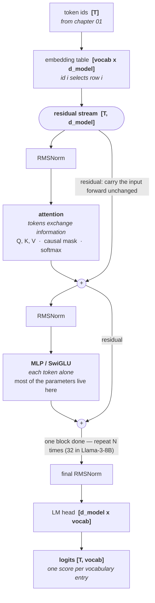

# 02 · The Transformer forward pass

**Stage:** Build the model · **Read first.** · **Feeds:** everything — 03 (what the logits are for), 04 (what gets updated), 10 (what runs at inference), 11 (what gets optimized), 12 (RoPE), 13 (same block, other tokens)
**In the twelve-ideas guide:** §4 *Attention and the Transformer* (all drill-downs), §2 *Embeddings* (the table half), §1 *Representation learning* (why depth)

## Why this chapter exists

This is the machine. Give it a list of token ids and a fixed set of matrices turn them into a
probability distribution over the next token. No training, no loop, no cleverness — just
arithmetic, running the same way every time.

Everything else in this curriculum is either about *how those matrices get chosen* (chapters
03–09) or *how to run this computation cheaply* (10–11). So if you can trace one token through
one block by hand, nothing later is magic. That is the whole goal of this chapter, and it is
achievable in an afternoon.

## The whole chapter in one picture



The two `+` nodes are the thing to notice. A sublayer never *replaces* the stream — it reads it,
computes a correction, and adds that correction back. That is what lets you stack a hundred of
these without the signal dying.

## What this chapter computes

```python
forward(token_ids: list[int]) -> logits: list[list[float]]   # [T, vocab]
```

```
  forward([0, 1, 2, 3, 4, 5])          # "the trophy did not fit it"

  -> logits, one row per token. The last row is the prediction after 'it':

           the   trophy      did      not      fit       it
          4.76     3.10     2.26     2.26     2.24     3.05

  -> softmax of that row = the next-token distribution:

         0.618    0.118    0.051    0.051    0.050    0.112     (sums to 1.000)
```

(Real output from `tiny_transformer.py`. The ids `0..5` are this toy's whole vocabulary; a real
model's would be six numbers under 128,256.)

**Input** — a list of token ids, the integers chapter 01 produced from your text.

**Output** — for each position, one raw score per vocabulary entry. Run those scores through
softmax and you get a probability distribution over what token comes next.

**Goal** — answer the question *"given everything so far, what comes next?"*, using a fixed set of
matrices and nothing else. The same input always gives the same output.

**What it does NOT do** — and this trips up nearly everyone:

- It does **not** pick a token. It hands back a distribution and stops. Choosing one is sampling,
  and that lives in [chapter 10](../10-inference-and-decoding/).
- It does **not** loop. Generating 50 tokens means calling this 50 times, appending each result.
- It does **not** learn. No weight changes here; that is [chapter 04](../04-optimization-loop/).
- It does **not** know the text. It never sees characters — only integers indexing a table.

## Before the drill list: the maths

Chapter 02 assumes a handful of mathematical ideas. If any of them is shaky the chapter becomes
symbol-shuffling, so each one is written up in **[`essentials/`](essentials/)** — self-contained,
high-school maths only, one runnable script each:

| If this stops making sense… | Read |
| --- | --- |
| "the dot product measures alignment", cosine similarity | [Vectors and dot products](essentials/vectors-and-dot-products/) |
| `W_Q`, "projection", `[n,k] @ [k,m]`, any shape error | [Matrices as functions](essentials/matrices-as-functions/) |
| "weights sum to 1", the `-inf` mask, the output distribution | [Softmax and probability](essentials/softmax-and-probability/) |
| RMSNorm, and the `/ √d_head` in every score | [Averages and normalization](essentials/averages-and-normalization/) |
| "superposition", "nearly orthogonal" | [Why 4096 dimensions is strange](essentials/high-dimensional-space/) |
| positional encoding, "order-blind", RoPE | [Rotation and RoPE](essentials/rotation-and-rope/) |
| SiLU, SwiGLU, "why does depth help?" | [Why a network needs a bend](essentials/why-nonlinearity/) |

You do not need to read them up front — come back when a sentence stops landing.

## Terminology

Everything this chapter introduces, in the order it comes up.

| Term | In plain language |
| --- | --- |
| **token id** | An integer naming one vocabulary entry. The only thing the model ever receives. → [01](../01-tokenizer/) |
| **`d_model`** | How many numbers represent one token. A single integer fixed before training. Also called `hidden_size`, `n_embd`, `hidden_dim`. |
| **residual stream** | The one tensor that flows through the whole model, shaped `[T, d_model]`. Every sublayer reads it, computes a correction, and adds that back — it is never replaced. |
| **`[T, d_model]`** | Shape notation: `T` rows (one per token), each row `d_model` numbers long. Real models add a batch dimension in front: `[batch, T, d_model]`. |
| **embedding table** | A `[vocab, d_model]` matrix. Token id *i* selects row *i*. That is the entire lookup — no meaning is built in. |
| **parameter / weight** | One learned number. "8B parameters" means 8 billion numbers, nearly all of them sitting in the matrices listed here. |
| **RMSNorm** | Rescale a vector so its root-mean-square is 1, then multiply by a learned per-dimension gain. Keeps values in a steady range no matter how many layers have added to the stream. |
| **LayerNorm** | The older version of the same idea; it also subtracts the mean. Most modern models use RMSNorm because it is cheaper and works as well. |
| **query (Q)** | A projection of a token's vector meaning *"what am I looking for?"* |
| **key (K)** | A different projection of the same vector, meaning *"what do I contain?"* |
| **value (V)** | A third projection: *"what information do I hand over if I am selected?"* |
| **`W_Q`, `W_K`, `W_V`, `W_O`** | The learned matrices producing query, key and value, and the one that projects the heads' combined output back to `d_model`. |
| **attention score** | `dot(query_i, key_j) / √d_head` — how well what token *i* wants matches what token *j* has. |
| **`Q · Kᵀ`** | All those dot products at once, as a `[T, T]` matrix: every query against every key. |
| **`√d_head`** | The number scores are divided by, so they do not grow with dimension until softmax collapses to a single hard pick. |
| **causal mask** | Setting every position to the right of the diagonal to `-∞` before softmax, so a token can only attend to itself and earlier tokens. |
| **autoregressive** | Producing output one token at a time, each conditioned on everything before it. The causal mask is what enforces it. |
| **softmax** | Turns a list of scores into positive numbers that sum to 1. `exp` each, divide by the total. |
| **attention weights** | The output of softmax over the scores: a `[T, T]` matrix whose rows each sum to 1, saying how much each token borrows from each earlier token. |
| **head** | One independent copy of the attention computation, running on a slice of the vector. |
| **`d_head`** | How many dimensions one head sees. Normally `d_model = n_heads × d_head` — the heads *split* the vector, they do not each copy it. |
| **multi-head attention** | Running several heads in parallel on different slices, then concatenating the results. Different heads learn different jobs. |
| **attention sink** | A head that parks most of its weight on the first token. Extremely common in real models: a head with nothing useful to do has to put its weight somewhere. |
| **GQA / MQA** | Grouped-query and multi-query attention: several query heads share one set of keys and values. Saves parameters, but the real win is a smaller KV cache when serving. → [11](../11-efficiency/) |
| **KV cache** | Storing past keys and values so they are not recomputed for every new token. Possible only because the causal mask means they can never change. → [10](../10-inference-and-decoding/) |
| **MLP / feed-forward** | The sublayer that processes each token entirely on its own, with no mixing between tokens. Holds most of a model's parameters. |
| **`ffn_hidden`** | The width the MLP expands to internally before projecting back down — typically around 4 × `d_model`. |
| **SiLU** | A smooth activation function, `x · sigmoid(x)`. Like ReLU but without the hard corner at zero. |
| **SwiGLU** | The modern MLP shape: two up-projections, one passed through SiLU and used to *gate* the other, then projected back down. |
| **residual connection** | Computing `x + f(x)` instead of `f(x)`, so each layer contributes a correction rather than a replacement. This is what makes 100-layer models trainable. |
| **positional encoding** | Anything that tells the model where a token sits. Needed because attention by itself is order-blind. |
| **order-blind** | Attention sees *what* is present, never *where*. Without positional encoding, reordering the input changes nothing. |
| **RoPE** | Rotary position embedding: rotate each query and key by an angle proportional to its position, so scores come to depend on the distance between tokens. |
| **logit** | One raw, unbounded score for one vocabulary entry, before softmax. |
| **LM head** | The final `[d_model, vocab]` matrix turning each token's vector into one logit per vocabulary entry. |
| **weight tying** | Using the embedding table transposed as the LM head, so one matrix does id → vector on the way in and vector → score on the way out. |
| **superposition** | Packing more features into `d_model` dimensions than there are dimensions, by giving each feature its own near-orthogonal direction. Why one dimension rarely means one clean thing. |
| **logit lens** | Applying the LM head to the residual stream at an intermediate layer, to watch the prediction take shape as depth increases. |

## Files in this chapter

| File | What it is |
| --- | --- |
| [`essentials/`](essentials/) | **The maths this chapter assumes**, seven articles with runnable demos. Start here if any notation is unfamiliar. |
| [`forward-pass.md`](forward-pass.md) | **The main article.** One sentence traced through one complete block, with every real intermediate value: embeddings, Q/K/V, the score matrix, the causal mask, attention weights, both residual adds, logits, probabilities, and the parameter count. |
| `forward_pass.py` | Generates that article. |
| `residual_stream.py` | Four measurements of the residual stream: what each stage writes, add-vs-replace, depth, and the logit lens. |
| `dmodel_check.py` | Where `d_model` appears, how parameters scale with it, and a parameter-count check against published model sizes. |
| `tiny_transformer.py` | The model itself — a complete block in pure Python, ~150 lines, no dependencies. `d_model=8`, 2 heads, 6 tokens, weights hand-set so the behaviour is legible. Run it directly to see the attention weights. |

## Drill list

**Shapes first.** One tensor flows through the entire model: the **residual stream**, shaped
`[batch, seq, d_model]`. Hold that in your head for the whole chapter. Every sublayer reads it,
computes a correction, and adds the correction back — the stream is never replaced.

**The embedding table** is a `[vocab, d_model]` matrix, and a token id simply selects a row. That
row is a learned vector; nothing about "meaning" is built in. The geometry you may have heard
about — similar words nearby, relationships as directions — is a *result* of training, not
something the lookup does.

**Attention** is the only place tokens see each other, and it is worth owning completely.

- **Q, K, V** are three different projections of the same vector, answering three questions:
  *what am I looking for* (query), *what do I contain* (key), *what do I hand over if chosen*
  (value). The usual sticking point is why query and key need separate matrices. The answer is
  that a single matrix would only ever let a token look for things *like itself*; two matrices
  let "what I am" and "what I want" point in different directions, which is what lets a pronoun
  find its referent. The article demonstrates this directly with `'it'` → `'trophy'`.
- **Scores** are `Q · Kᵀ / √d_head` — a dot product measures how well a query aligns with a key,
  and the `√d_head` stops scores growing with dimension until softmax saturates into a hard pick.
- **The causal mask** sets everything to the right of the diagonal to `-∞` before softmax. One
  triangle, three consequences: the model is autoregressive, a whole document can be trained on
  in a single forward pass, and past keys can be cached at inference because they can never
  change.
- **Softmax** turns scores into weights that sum to 1, and `exp(-∞) = 0` drops the masked
  positions for free. The output is the weighted sum of the value vectors.
- **Multi-head** runs all of that several times in parallel on slices of the vector, then
  concatenates. Heads specialize: the article's head 0 matches content while head 1 is an
  *attention sink* that parks its weight on the first token — a real, ubiquitous pattern.
- **Cost.** Every token attends to every other token, so it is O(n²) in sequence length — a
  nested loop. That single fact drives [11](../11-efficiency/) and [12](../12-context-and-knowledge/).
- **GQA / MQA** (grouped- and multi-query attention) share keys and values across several query
  heads. The point is not saving parameters but shrinking the KV cache at serving time.

**Positional encoding.** Attention on its own is **order-blind** — it is a set operation that
sees *what* is present and never *where*. "dog bites man" and "man bites dog" produce identical
queries, keys and values. Position must be injected deliberately: the original Transformer added
sine waves, modern models use **RoPE** (rotary position embedding), which rotates each query and
key by an angle proportional to its position so that the dot product between two tokens comes to
depend on the distance between them. The article proves the order-blindness by moving a word and
showing the attention weight does not budge. RoPE's design is also what makes context extension
possible later — [12](../12-context-and-knowledge/).

**The MLP** processes each token on its own, with no mixing at all. Modern models use SwiGLU: two
up-projections, one gating the other through SiLU, then a projection back down, typically ~4×
wider than `d_model`. This is where most parameters — and most of a model's stored knowledge —
live: **81% of every Llama-3-8B block**, measured in the article.

**Residual connections and normalization** are what make depth possible. A residual connection
computes `x + f(x)` rather than `f(x)`, so a gradient can flow straight through the addition and
a layer that learns nothing useful simply passes its input along. **RMSNorm** rescales each
vector to a fixed size before each sublayer, keeping activations stable no matter how many layers
have added to the stream. Together they turn the model into a *residual stream* that each block
reads from and writes small updates to.

**The LM head** is a `[d_model, vocab]` matrix producing one raw score (**logit**) per vocabulary
entry, often **tied** to the embedding table — the same matrix transposed, doing id → vector on
the way in and vector → score on the way out. Softmax over the logits gives a probability
distribution, and **that is where the forward pass ends**. No sampling, no loop, no learning.

**Parameter count.** Add up the matrices for a real config and check it against the advertised
size. The article does this for Llama-3-8B and lands on 8,030,261,248 — a good check that nothing
has been left out, and the fastest way to internalise where the weight actually sits.

**Why depth works.** Each block refines the stream; early layers do local and syntactic work,
later layers more abstract. This is observable rather than an article of faith — the *logit lens*
decodes the residual stream at intermediate layers and watches the prediction sharpen.

## Shared prerequisites — owned here

**Linear algebra as geometry.** Drill this until the notation disappears:

- A **vector** is a point or arrow in space; a list of numbers is just its coordinates.
- The **dot product** measures alignment: large when two vectors point the same way, zero when
  perpendicular, negative when opposed. **Cosine similarity** is the dot product with the lengths
  divided out, so it measures direction only.
- A **matrix** is a function that maps every vector in one space to a vector in another, and
  **matrix multiplication is composing those functions**. A "linear layer" is exactly this.
- Shapes multiply as `[n, k] @ [k, m] -> [n, m]`; the inner dimensions must match and they
  vanish.

You are done when `Q · Kᵀ` reads as *"compare every query against every key"* rather than as
symbols. Chapters 03, 12 and 13 all lean on this and will not re-explain it.

## Build it

1. Run `python3 tiny_transformer.py`. Read the attention weight matrices. Find `'it'` attending
   to `'trophy'`, and notice head 1 doing something completely different.
2. Read [`forward-pass.md`](forward-pass.md) start to finish with the code open beside it.
3. **Break something and predict the result first.** Delete the `/math.sqrt(D_HEAD)`. Remove the
   causal mask. Set `W_Q[6][1] = 0.0`. Make both heads identical. Each one teaches a specific
   lesson, and predicting before running is the part that sticks.
4. Then Karpathy's *Let's build GPT: from scratch* (nanoGPT) for the trained, batched, GPU
   version of the same block.

## You're done when you can…

- [ ] Draw the block from memory with tensor shapes on every arrow.
- [ ] Explain why query and key are separate matrices, with a concrete example.
- [ ] Explain the causal mask and its three consequences (autoregressive, one-pass training,
      cacheable inference).
- [ ] Say what breaks if you remove the `√d_head`, the residual connections, or the positional
      encoding.
- [ ] Count the parameters of a given config to within 10%, and say which component dominates.
- [ ] State exactly what the model outputs, and what it does *not* do.

## Q&A

### Q: What is `d_model`?

**The length of the vector that represents one token.** A single integer, chosen before training.

In `tiny_transformer.py`, `d_model = 8`, so each token is 8 numbers:

```
  the      [   1.0    0.0    0.0    0.0    2.0    0.0    0.0    1.0]
  trophy   [   0.0    1.0    0.0    0.0    0.0    0.0    0.0    1.0]
```

In Llama-3-8B it is 4096, so each token is a list of 4096 numbers. Same idea, wider.

**The property that matters is that it never changes.** Every sublayer takes `[T, d_model]` and
returns `[T, d_model]` — attention returns that shape, the MLP returns that shape, and the
residual add requires it. It is the width of a fixed-size record flowing through a pipeline where
every stage must accept and emit the same record. That constraint is exactly what lets the block
be stacked 32 or 100 times with nothing redesigned, and it is why the diagram at the top of this
README has one tensor running all the way down.

**It sizes nearly every matrix in the model:**

```
   embedding table  [vocab, d_model]
   W_Q              [d_model, n_heads*d_head]
   W_K / W_V        [d_model, n_kv*d_head]
   W_O              [n_heads*d_head, d_model]
   W_gate / W_up    [d_model, ffn_hidden]
   W_down           [ffn_hidden, d_model]
   LM head          [d_model, vocab]
```

Because `ffn_hidden` and `n_heads*d_head` are themselves proportional to `d_model`, **parameters
per layer scale as `d_model²`** (`dmodel_check.py`):

```
    d_model    params/layer       x
        512       3,802,112
       1024      15,206,400     4.0
       2048      60,821,504     4.0
       4096     243,277,824     4.0
       8192     973,094,912     4.0
```

Double the width, quadruple the cost per layer. That is why it cannot simply be made huge, and
why trading width against depth is a real decision — [06](../06-planning-a-run/) is where scaling
laws settle it.

**Real values**, each verified by computing the full parameter count and comparing against the
published model size:

```
   GPT-2 small  d_model=768   ->     124,439,808   (published ~124M)   OK
   Llama-3-8B   d_model=4096  ->   8,030,261,248   (published ~8B)     OK
   Llama-3-70B  d_model=8192  ->  70,553,706,496   (published ~70B)    OK
```

**One relationship worth memorising: `d_model = n_heads × d_head`.** The heads do not each get
their own copy of the vector — they *split* it:

```
   GPT-2 small    12 heads x   64 =    768   OK
   Llama-3-8B     32 heads x  128 =   4096   OK
   Llama-3-70B    64 heads x  128 =   8192   OK
```

That is exactly what the toy does: `d_model=8` with 2 heads, so head 0 gets dimensions 0–3 and
head 1 gets 4–7. It is why the two heads in [`forward-pass.md`](forward-pass.md) can behave
completely differently — they are looking at different slices of the same vector.

**Names vary** — `d_model`, `hidden_size`, `n_embd`, `hidden_dim` — all the same number.


### Q: Further explain the residual stream

**The residual stream is the one tensor that flows through the entire model** — shaped
`[T, d_model]`, created by the embedding lookup, consumed by the LM head. Everything in between
reads it and adds to it. It is never replaced.

That is the whole of it, in code:

```python
x = embed(ids)                    # the stream is born
x = x + attention(norm(x))        # attention adds a correction
x = x + mlp(norm(x))              # the MLP adds a correction
...                               # x 32 blocks
logits = lm_head(norm(x))         # the stream is read out
```

The `x +` on those middle lines *is* the stream. Every sublayer is a function returning a small
delta, and the stream is the running total.

**The anchor that makes it click:** it is a context object passed through middleware. Each stage
reads the request, attaches something, passes it on — it never constructs a new request. A layer
with nothing to contribute writes approximately zero and the object flows on unchanged.

#### 1. What it looks like in practice

Watching `'it'` move through one block (`residual_stream.py`):

```
   stage                 d0     d1     d2     d3     d4     d5     d6     d7    length
   after embedding     0.00   0.00   0.00   0.00   0.00   0.00   1.00   1.00      1.41
   after attention     0.09   1.19   0.16   0.16   1.54   0.13   1.13   2.44      3.33
   after MLP           0.09   1.27   0.16   0.16   1.68   0.13   1.20   2.83      3.74
```

Dimension 1 is "trophy": it starts at **0.00** and attention writes **1.19** into it, copied from
four positions back. Dimension 6 is "it": still **1.20** at the end.

**Both are present at once.** That is the point of adding rather than replacing — the token did
not *become* trophy-ish, it *accumulated* trophy-ness while remaining itself. A head in layer 27
can still read what the embedding put there.

#### 2. Why "residual"

From ResNet (2015). A layer computes `x + f(x)`, so `f` only has to learn the **residual** — the
difference from doing nothing. "Change almost nothing" means outputting ≈0, which is easy.
Without the skip, a layer that should pass its input through would have to learn the identity
function from scratch, which is surprisingly hard.

Replacing instead of adding costs exactly that:

```
   residual=ON   'it' after 4 blocks: [0.00 ... 3.40 3.40]  length 4.808
   residual=OFF  'it' after 4 blocks: [0.00 ... 0.60 0.60]  length 0.849
```

#### 3. Three consequences

**Gradients survive depth.** `d(x + f(x))/dx = 1 + f'(x)` — there is always a path of derivative
exactly 1 from the loss back to every layer, however many layers sit between. This is *the*
reason 100-layer models train at all. A rough illustration of signal through N blocks:

```
    blocks   with residual       without
         8            8.16      6.56e-05
        32         4427.79      1.85e-17
```

That arithmetic is **illustrative, not a trained model** — gradients cannot be measured here
without autograd. The mathematical claim above is the real one;
[04](../04-optimization-loop/) measures it properly.

**Layers become semi-independent.** Because each contributes an increment rather than a
transformation, you can delete or reorder blocks in a *trained* model and still get
degraded-but-sensible output. That would be unthinkable in a plain stack.

**It is a communication channel across depth.** Layer 3 can write a feature that layer 27 reads
directly. Information need not be relayed hand-to-hand through every intervening layer.

#### 4. Reading the stream mid-flight — the logit lens

The LM head is just a matrix, so you can apply it to the stream at *any* depth and see what the
model would predict if it stopped there:

```
   after embedding  it=0.596  the=0.081  trophy=0.081
   after attention  the=0.629  trophy=0.116  it=0.111
   after MLP        the=0.618  trophy=0.118  it=0.112
```

Straight after embedding the model just echoes its input — the top prediction is `it`, the token
it was handed. After attention the prediction has **moved** to `the`. You are watching the answer
form. In real models this shows predictions sharpening layer by layer, and it is a standard
interpretability tool.

#### 5. The bandwidth view

`d_model` is a fixed budget of space that every layer shares, and features are written as
**directions** in it. Models track far more features than they have dimensions, so those
directions are packed in near-orthogonally and overlap slightly — **superposition**. It is why a
4096-dimensional stream can carry far more than 4096 distinct features, and a large part of why
interpretability is hard: a single dimension rarely means one clean thing.

## Notes

