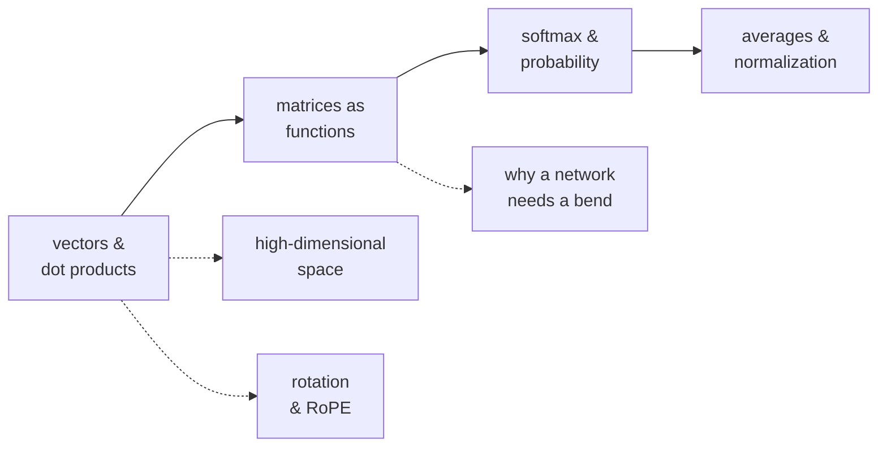

# Essentials — the maths chapter 02 assumes

Chapter 02 leans on a handful of mathematical ideas without stopping to explain them. If any of
these is shaky, the chapter turns into symbol-shuffling. Each article here is self-contained,
assumes only high-school maths, and proves its claims with a script you can run.

**You do not need to read them all.** Use the table: when a chapter 02 sentence stops making
sense, come here, read the one article, go back.

| Article | Read it when you hit… |
| --- | --- |
| [Vectors and dot products](./vectors-and-dot-products/) | "attention score", "cosine similarity", "the dot product measures alignment" |
| [Matrices as functions](./matrices-as-functions/) | `W_Q`, "projection", `[T, d_model] @ [d_model, vocab]`, any shape error |
| [Softmax and probability](./softmax-and-probability/) | "attention weights sum to 1", the `-inf` mask, the output distribution |
| [Averages and normalization](./averages-and-normalization/) | RMSNorm, and the `/ √d_head` in every score |
| [Why 4096 dimensions is strange](./high-dimensional-space/) | "superposition", "nearly orthogonal", why embeddings work at all |
| [Rotation and RoPE](./rotation-and-rope/) | positional encoding, "attention is order-blind", context extension |
| [Why a network needs a bend](./why-nonlinearity/) | SiLU, SwiGLU, "why does depth help?" |

## How this folder is laid out

One folder per concept. The article is always `README.md`, the script is always `demo.py`:

```text
essentials/
  README.md                       this index
  vectors-and-dot-products/
    README.md                     the article
    demo.py                       prints the numbers the article quotes
  matrices-as-functions/
    README.md
    demo.py
  ... one folder per concept
```

To run any of them:

```bash
cd vectors-and-dot-products && python3 demo.py
```

Every script is standard-library only and deterministic — nothing to install, and the output
matches what the article quotes. If a claim in an article looks surprising, run the script and
change a number; that is faster than arguing with the prose.

## Suggested order, if you want to read them all

**Vectors → matrices** first: together they are the whole language of the chapter. Then
**softmax**, which appears three separate times. Then **averages** for the two divisions the
chapter performs. **High-dimensional space**, **rotation** and **non-linearity** are independent —
read each when its topic comes up.



## These are not chapter-02-only

They are the shared mathematical base for the whole curriculum. Chapter 03 uses softmax and
probability, 04 builds on them for gradients, 12 and 13 lean on vectors and high-dimensional
geometry. Later chapters link back here rather than re-explaining.
