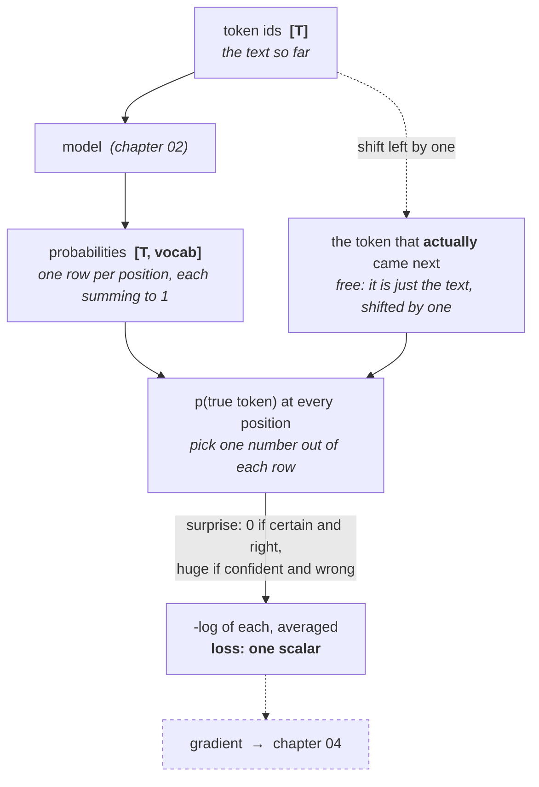

# 03 · The training objective

**Stage:** Pretrain · **Read after:** 02 · **Feeds:** 04 (the loss whose gradient we follow), 06 (loss is the y-axis of every scaling law), 08–09 (KL as a leash), 15 (perplexity)
**In the twelve-ideas guide:** §3 *Self-supervised next-token prediction* (main), §3 → *Softmax and cross-entropy loss*

## Why this chapter exists

Chapter 02 produces a probability for every possible next token. This chapter is the single
number that says how wrong those probabilities were — and the argument for why making that
number smaller, on ordinary text, produces grammar, facts and reasoning as side effects.

It is the shortest chapter and the most important "why". The whole field is downstream of one
scalar. Everything in chapters 04–09 is a different way of pushing it down.

## The whole chapter in one picture



Nothing is labelled by a human. The target at every position is the next token, which the text
already contains. That is what *self-supervised* means.

## What this chapter computes

```python
loss(model, token_ids: list[int]) -> float          # cross-entropy, in nats
```

```
  loss(bigram, "the capital of france is paris")

  position 1: p('the'     | '<s>'    ) =  0.394   -log p =  0.932
  position 2: p('capital' | 'the'    ) =  0.351   -log p =  1.046
  position 3: p('of'      | 'capital') =  0.448   -log p =  0.802
  position 4: p('france'  | 'of'     ) =  0.241   -log p =  1.421
  position 5: p('is'      | 'france' ) =  0.238   -log p =  1.435
  position 6: p('paris'   | 'is'     ) =  0.172   -log p =  1.758

  -> 1.232 nats     (= 1.778 bits per token,  = perplexity 3.43)
```

(Real output from `bigram_lm.py`, a bigram model trained by counting on an 8-line corpus. The
uniform-guess baseline over its 17-token vocabulary is `ln 17 = 2.833` nats.)

**Input** — a model and a sequence of token ids: the text you want to score.

**Output** — one number. The average, over every position, of how surprised the model was by the
token that actually came next.

**Goal** — turn "how good is this model?" into a single quantity that can be compared, plotted,
and — in [chapter 04](../04-optimization-loop/) — differentiated. Lower is better. Training is
nothing but pushing this number down.

**What it does NOT do:**

- It does **not** reward being helpful, correct, brief or safe. It rewards predicting *what
  people wrote*, including their errors and the internet's distribution. Post-training exists
  because of this gap ([07](../07-supervised-fine-tuning/)–[09](../09-reasoning-training/)).
- It does **not** change the model. Computing the loss is read-only; the update is chapter 04.
- It does **not** need labels. The next token is the label, and it is already in the text.
- It does **not** care *which* wrong token got the probability. Only `p(true token)` enters.

## Before the drill list: the maths

Three ideas carry this chapter, written up in **[`essentials/`](essentials/)**:

| If this stops making sense… | Read |
| --- | --- |
| `-log p`, "nats", "bits per token", "loss is compression" | [Logarithms and bits](essentials/logarithms-and-bits/) |
| "given everything before it", why the loss is a *sum* | [The probability of a sequence](essentials/probability-of-a-sequence/) |
| "cross-entropy loss", "KL", "irreducible loss" | [Entropy and cross-entropy](essentials/entropy-and-cross-entropy/) |

Softmax and probability distributions themselves are owned by
[chapter 02's essentials](../02-transformer-forward-pass/essentials/softmax-and-probability/).

## Terminology

| Term | In plain language |
| --- | --- |
| **objective / loss function** | The formula that scores a model's output as one number, lower = better. Training minimises it. |
| **next-token prediction** | The task: given tokens so far, output a probability for every possible next token. |
| **self-supervised** | The label comes from the data itself — here, the next token. No human annotation. |
| **label / target** | The correct answer for one example. Here, the token that actually came next. |
| **teacher forcing** | During training the model always sees the *true* prefix, never its own guesses. One forward pass scores every position. |
| **likelihood** | The probability the model assigns to the observed text. Training maximises it. |
| **negative log-likelihood (NLL)** | `-log p(true token)`. Same number as cross-entropy against a one-hot target. |
| **cross-entropy** | Average surprise when you believe distribution *q* but events follow *p*. The loss is this, with *p* a one-hot. → [essentials](essentials/entropy-and-cross-entropy/) |
| **one-hot** | A distribution with all mass on a single outcome. The target at each position. |
| **nat** | Unit of `-ln p`. What papers report loss in. |
| **bit** | Unit of `-log2 p`. `bits = nats / ln 2`. One yes/no question. |
| **perplexity** | `exp(loss)`. "As uncertain as choosing among this many equally likely tokens." Lower is better; 1 is perfect. |
| **uniform baseline** | Guessing every token equally: loss `ln(vocab)`. The ceiling any model must beat. |
| **irreducible loss** | The entropy of language itself — the part of the loss no model can remove, because the next word is sometimes genuinely uncertain. |
| **KL divergence** | The gap between cross-entropy and entropy: the extra cost of a wrong model. Always ≥ 0. Reappears as a leash in [08](../08-preference-optimization/). |
| **n-gram / bigram** | A model that predicts from the previous *n−1* tokens by counting. Bigram: previous one. Used here as the simplest possible model. |
| **smoothing** | Adding a small count to every possible next token so nothing unseen has probability exactly 0 (which would be infinite loss). |
| **held-out** | Text kept out of training and used only for measuring. Loss on held-out text is the honest number. |
| **masked language modelling** | BERT's alternative: hide tokens in the *middle* and predict them. Better for understanding, worse for generation. |

## Files in this chapter

| File | What it is |
| --- | --- |
| [`essentials/`](essentials/) | The three ideas this chapter rests on — logs, sequence probability, entropy — each with a runnable demo. |
| [`objective.md`](objective.md) | **The main article.** The loss traced term by term on a readable corpus: teacher forcing, the count table, units, baselines, and why lowering the loss forces the model to use context. |
| `objective.py` | Generates that article. |
| `bigram_lm.py` | The model — a bigram counter, ~100 lines, no gradients. Isolates the objective from the optimizer. Run it directly. |

## Drill list

**The task.** For every position *t*, predict token *t+1* given tokens *≤ t*. A document of
length *T* yields *T−1* examples, and — because of chapter 02's causal mask — one forward pass
computes all of them at once. In `bigram_lm.py` a six-word sentence produces six predictions.

**Teacher forcing.** During training the model always sees the *true* prefix, never its own
earlier guesses. That is what makes the single-pass trick work, and it is efficient. It also
creates a mismatch at inference, where the model *does* see its own output — a mild instability
that [chapter 10](../10-inference-and-decoding/) has to live with.

**Softmax turns logits into probabilities.** Exponentiate every logit, divide by the sum. Owned by
[chapter 02](../02-transformer-forward-pass/essentials/softmax-and-probability/); here it matters
only that the row sums to 1 and that dividing logits by a temperature first sharpens or flattens
it.

**Cross-entropy loss** is `-log p(true token)`, averaged over positions. `p = 0.9` costs 0.105
nats; `p = 0.01` costs 4.6. The log is what turns a product of probabilities along a sequence into
a sum that can be averaged and differentiated, and `-log` is *surprise*: nothing if certain and
right, unbounded if confident and wrong.

**Three units, one number.** Loss in **nats** is what papers report. Divide by `ln 2` for **bits
per token** — literally the compression rate a model of that quality achieves. Exponentiate for
**perplexity**, the number of equally-likely options the model is effectively hedging between.
The bigram's 1.232 nats is 1.778 bits and perplexity 3.43.

**The ceiling and the floor.** The ceiling is the uniform guess, `ln(vocab)`: 2.83 nats for a
17-token vocabulary, `ln 50,257 = 10.82` for GPT-2's, `ln 128,256 = 11.76` for Llama-3's. The floor
is the **entropy of language** — the next word is sometimes genuinely uncertain, and no model can
be less surprised than the source. Every scaling curve in [06](../06-planning-a-run/) flattens
towards that floor.

**Loss as compression.** A model with loss *L* bits/token drives a compressor at *L* bits/token.
Better predictor, smaller file. Many researchers take this literally — "compress the internet
well" and "understand it" become the same problem.

**Why the objective is bottomless.** To lower the loss on *all* text the model must, in turn,
learn spelling, then grammar, then facts, style, arithmetic, argument structure, dialogue. Each is
just a way of being less surprised on some slice of the corpus. The article shows the smallest
version: with two words of context the model can finally tell `france is paris` from
`france is rome` — the right answer gets cheaper *and* the wrong one gets dearer. Nothing was
taught; lower loss simply *required* the fact.

**It rewards context, so architecture matters.** A bigram cannot use `france` when predicting
after `is`. The objective pays for whatever the architecture can carry — and chapter 02's
attention carries thousands of tokens. That is the link between these two chapters.

**The honest caveat.** It learns to predict what people *wrote*. Helpfulness, truth, brevity and
safety are not in the formula. Post-training ([07](../07-supervised-fine-tuning/)–[09](../09-reasoning-training/))
exists to close that gap.

**Alternatives to recognise.** *Masked language modelling* (BERT) hides words in the middle — good
for understanding, poor for generation. *Contrastive* objectives compare pairs rather than
predicting tokens ([13](../13-multimodality/)).

## Shared prerequisites — owned here

- **Probability for LLMs** — conditional probability and the chain rule of probability (why a
  sequence's probability factorises into next-token predictions), log-likelihood, entropy as
  expected surprise, cross-entropy, KL divergence. All in [`essentials/`](essentials/).
  Referenced by 06, 08, 10 and 15; those chapters will not re-explain them.

## Build it

1. Run `python3 bigram_lm.py` and read every section. Then change the corpus — add a line, remove
   one — and predict how the loss on the held-out sentence will move before re-running.
2. Read [`objective.md`](objective.md) with the code open.
3. Karpathy's *makemore* parts 1–2: a bigram model, then an MLP, trained with exactly this loss on
   names. Watch loss fall, compute perplexity, sample, and see quality track the number.

## You're done when you can…

- [ ] Compute the cross-entropy loss of a 3-token sequence by hand from given probabilities.
- [ ] Explain why one forward pass over a 1,000-token document gives 999 training signals.
- [ ] Convert between loss in nats, bits per token, and perplexity without looking anything up.
- [ ] State the ceiling (`ln vocab`) and the floor (entropy of language), and say why the floor exists.
- [ ] Argue, with the `france is ___` example, why lowering this loss requires knowing things.
- [ ] Say what the objective does *not* optimise for, and which chapters exist because of that.

## Q&A

*(Questions and answers accumulate here as they come up.)*

## Notes

