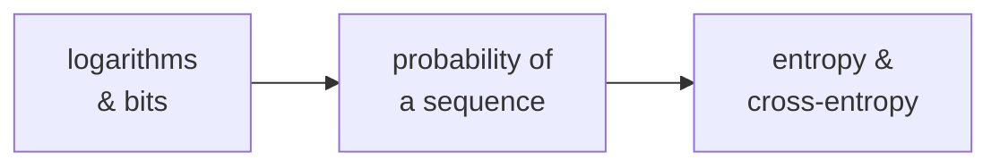

# Essentials — the maths chapter 03 assumes

Chapter 03 is short and rests almost entirely on three ideas. If any of them is shaky, "the
loss is 1.232 nats" is just a number.

**You do not need to read them all.** When a chapter 03 sentence stops making sense, find it
below, read the one article, go back.

| Article | Read it when you hit… |
| --- | --- |
| [Logarithms and bits](./logarithms-and-bits/) | `-log p`, "nats", "bits per token", "loss is compression" |
| [The probability of a sequence](./probability-of-a-sequence/) | "given everything before it", "chain rule", why the loss is a sum |
| [Entropy and cross-entropy](./entropy-and-cross-entropy/) | "cross-entropy loss", "KL", "irreducible loss" |

## How this folder is laid out

One folder per concept; the article is always `README.md`, the script always `demo.py`:

```text
essentials/
  README.md                       this index
  logarithms-and-bits/
    README.md                     the article
    demo.py                       prints the numbers the article quotes
  ...
```

```bash
cd logarithms-and-bits && python3 demo.py
```

Standard-library only, deterministic. If a claim looks surprising, run the script and change a
number.

## Suggested order

Logarithms → probability of a sequence → entropy. Each uses the one before it.



## Owned here, used everywhere after

Chapter 04 takes gradients of this loss; 06 fits curves to it; 08 and 09 use KL divergence as a
leash; 10 uses the distribution these articles define; 15 reports perplexity. Softmax and
probability *distributions* themselves are owned by
[chapter 02's essentials](../../02-transformer-forward-pass/essentials/softmax-and-probability/).
