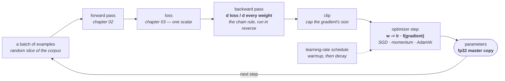

# 04 · The optimization loop

**Stage:** Pretrain · **Read after:** 03 · **Feeds:** 06 (compute per step), 07–09 (same loop, different data and loss), 11 (mixed precision, parallelism)
**In the twelve-ideas guide:** §1 → *Neural networks and backpropagation*, *Gradient descent*; §8 → *Mixed precision*

## Why this chapter exists

Chapter 03 gave a single number that says how wrong the model is. This chapter is the
`for step in range(N):` that makes it go down: forward pass, loss, backward pass, update — for
weeks, on thousands of GPUs. Every training "trick" you have heard of (warmup, cosine decay,
weight decay, gradient clipping, bf16) is one line in this loop, and each exists because
something specific went wrong without it.

It is also where calculus enters. If "take the gradient" is a metaphor to you rather than an
instruction, the [essentials](essentials/) turn it back into one.

## The whole chapter in one picture



One trip around that ring is a **step**. Llama-3-8B took on the order of a million of them.

## What this chapter computes

```python
train_step(params, batch) -> params          # one trip around the ring
```

```
  batch:    prev tokens [12, 4, 18, 10]  ->  true next [10, 0, 19, 7]

  forward:  loss = 3.0199                  (uniform guess would be 2.9957)
  backward: dlogits = (p - onehot) / B
            row 0 at the true token:  -0.2387   <- negative: push this logit UP
            |dW| 0.1846   |db| 0.4470   |dE| 0.2176
  update:   W -= 0.5 * dW                  largest single change 0.0318
```

(Real output from `train_loop.py` — a neural bigram model, hand-written backward pass, numpy.
The finite-difference check agrees with the analytic gradient to six decimals.)

**Input** — the current parameters, and a batch: a random handful of (context, true next token)
pairs from the corpus.

**Output** — slightly different parameters. Nothing else. The loss went down a little on this
batch; on average it goes down on everything.

**Goal** — find parameters that make chapter 03's loss small across the whole corpus, by taking
many small steps in the direction that reduces it on a sample. That is all "training" is.

**What it does NOT do:**

- It does **not** see the whole corpus per step. It sees a batch, and the gradient is a *noisy
  estimate* — noise that falls as `1/√B`.
- It does **not** know where the minimum is. It knows the slope where it stands and steps
  downhill. There is no map.
- It does **not** guarantee convergence. Too large a learning rate and the loss is `NaN` in a
  few steps.
- It does **not** differ between pretraining and fine-tuning. Chapters 07–09 run *this exact
  loop* with different data and a different loss.

## Before the drill list: the maths

Four ideas carry this chapter, written up in **[`essentials/`](essentials/)**:

| If this stops making sense… | Read |
| --- | --- |
| "the gradient", `w -= lr * grad`, "learning rate too high" | [Derivatives and gradients](essentials/derivatives-and-gradients/) |
| "backprop is the chain rule", "vanishing gradients", why it runs *backwards* | [The chain rule](essentials/the-chain-rule/) |
| bf16, fp16, "mixed precision", "master weights", `NaN` | [Floating-point numbers](essentials/floating-point/) |
| momentum, Adam's `m` and `v`, "bias correction" | [Moving averages](essentials/moving-averages/) |

## Terminology

| Term | In plain language |
| --- | --- |
| **step / iteration** | One trip around the ring: forward, loss, backward, update. |
| **batch** | The handful of examples one step looks at. Its size is `B`. |
| **epoch** | One pass over the entire corpus. LLM pretraining is usually about one epoch. |
| **gradient** | For every weight, how much the loss would change if that weight moved. A vector with one entry per parameter. → [essentials](essentials/derivatives-and-gradients/) |
| **backward pass / backpropagation** | Computing the gradient by walking from the loss back to the inputs, multiplying local slopes — the chain rule in reverse. → [essentials](essentials/the-chain-rule/) |
| **autograd** | Software that records every operation during the forward pass so the backward pass can be run automatically. `autograd.py` is one in 80 lines. |
| **`p − onehot`** | The gradient of softmax-plus-cross-entropy with respect to the logits. The cleanest derivative in the field. |
| **gradient check** | Comparing an analytic gradient to `(loss(w+h) − loss(w−h)) / 2h`. How you know backward is right. |
| **learning rate (lr)** | The step-size multiplier. The one hyperparameter that cannot be approximately right. |
| **SGD** | Stochastic gradient descent: `w -= lr · g`. "Stochastic" because `g` comes from a random batch. |
| **momentum** | Keep a running average of the gradient and step along that. Smoother, keeps moving through flat stretches. |
| **Adam** | Two running averages — gradient and squared gradient — giving each parameter its own normalised step. → [essentials](essentials/moving-averages/) |
| **AdamW** | Adam with weight decay applied to the weights directly. The default optimizer for LLMs. |
| **β₁, β₂** | Adam's forgetting factors: 0.9 (direction, ~10-step memory) and 0.999 (magnitude, ~1000-step memory). |
| **weight decay** | Shrinking every weight by a tiny fraction each step. Stops parameters drifting unboundedly. |
| **schedule** | How the learning rate changes over training. |
| **warmup** | Ramping lr up from zero over the first steps, while the weights are still random. |
| **cosine decay** | Easing lr down along a cosine curve so training settles instead of bouncing. |
| **gradient clipping** | If the gradient's total size exceeds a threshold, scale it down. A safety net against spikes. |
| **loss spike** | A sudden jump in the loss curve, usually from one pathological batch. Clipping is the defence. |
| **divergence** | The loss growing instead of shrinking, ending in `NaN`. Almost always the learning rate. |
| **loss curve** | Loss plotted against steps. Fast drop, slowing approach, floor. Learn to read it. |
| **irreducible loss** | The floor: the entropy of the data. Owned by [03](../03-training-objective/). |
| **overfitting** | Loss keeps falling on training data but rises on held-out data — the model is memorising. |
| **generalization** | Doing well on data you did not train on. The thing you actually want. |
| **initialization** | The random starting values of the weights. Their *scale* matters a great deal. |
| **fp32 / bf16 / fp16** | 32-bit and two 16-bit number formats. Training does the heavy multiplies in bf16 and keeps weights in fp32. → [essentials](essentials/floating-point/) |
| **mixed precision** | Using 16-bit for speed where rounding is harmless and 32-bit where it accumulates. |
| **master weights** | The fp32 copy of the parameters that the optimizer actually updates. |
| **loss scaling** | Multiplying the loss so tiny gradients stay representable in fp16. Unnecessary with bf16. |
| **hyperparameter** | A number you choose rather than train: lr, batch size, β, weight decay, schedule. |

## Files in this chapter

| File | What it is |
| --- | --- |
| [`essentials/`](essentials/) | Derivatives, the chain rule, floating point, moving averages — each with a runnable demo. |
| [`training-loop.md`](training-loop.md) | **The main article.** One step traced with real numbers, the gradient check, three optimizers, the learning-rate sweep, schedules, batch noise, clipping, weight decay, numerics, and the arithmetic at Llama-3 scale. |
| `loop.py` | Generates that article from live runs. |
| `train_loop.py` | The model and the loop — neural bigram, hand-written backward, SGD/momentum/Adam/AdamW, schedules, clipping. numpy. Trained on a synthetic source whose true entropy is known, so the floor is exact. |
| `autograd.py` | A scalar automatic-differentiation engine in ~80 lines, standard library only. Backprop with nothing hidden. Includes a gradient check and a two-parameter regression trained with it. |

## Drill list

**The loop.** `loss, grads = loss_and_grads(params, batch)` → `grads = clip(grads)` →
`lr = schedule(step)` → `params = optimizer.step(params, grads, lr)`. Four lines. Everything in
this chapter is a measurement of one of them.

**Backpropagation is the chain rule, mechanised.** Every operation records its inputs during the
forward pass. `.backward()` walks that record in reverse, and at each node multiplies the
incoming gradient by the node's *local* derivative — `2x` for a square, the other operand for a
multiply, `1 − tanh²` for tanh. `autograd.py` does exactly this in 80 lines and agrees with finite
differences to six decimals. The whole backward pass costs about twice the forward pass, and
that ratio is why the compute rule in [chapter 06](../06-planning-a-run/) is `6ND` rather than `2ND`.

**The gradient of softmax-plus-cross-entropy is `p − onehot`.** The exponentials and logs cancel.
In the traced step every entry of `dlogits` is about `+0.0125` except the true token's, which is
`−0.2387`: *raise this one, lower the rest slightly*. That is the entire content of a step.

**Residual connections are what make gradients survive depth** — the `+1` in `d(x + f(x))/dx`
means there is always a path of slope 1 from the loss back to any layer. The
[chain-rule essential](essentials/the-chain-rule/) shows twenty slopes of 0.5 multiplying to
`10⁻⁶`, and twenty slopes of `1.05` staying near 1.

**Gradient descent.** `w -= lr · g`. Step against the gradient. **Stochastic** because `g` is
estimated from a batch, and the estimate's error falls as `1/√B` — measured in the article at
sizes 1 through 1,024. Quadrupling the batch halves the noise and no more, which is why batch
size is set by hardware throughput rather than accuracy.

**The learning rate is the hyperparameter.** In the sweep, SGD at 0.01 has barely moved after
600 steps; at 50 it is `NaN`. There is a window, it is not wide, and the right value depends on
the optimizer, the model width and the batch size. At frontier scale it is chosen by fitting on
small runs ([06](../06-planning-a-run/)).

**Momentum, then Adam.** Momentum keeps a running average of the gradient and steps along it.
Adam keeps two — the gradient and its square — and steps by `lr · m / √v`, which gives every
parameter a step normalised by its own recent gradient scale. One learning rate then serves all
eight billion parameters, which is why AdamW is the default. It reaches loss 2.47 in 50 steps in
the article; SGD needs 200. Know what the two moment estimates are and what the bias correction
does. → [essentials](essentials/moving-averages/)

**Schedules.** Warmup ramps the learning rate up from zero while the weights are random and a
full step would do damage; cosine decay eases it down at the end so the model settles. Measured:
at a gentle rate the schedule barely matters; at an aggressive one it turns 2.25 into 2.13. Real
training runs at the aggressive end, because a higher rate that works is faster.

**Gradient clipping.** If the gradient's norm exceeds a threshold, scale the whole thing down.
The article injects a 200× spike every 100 steps: unclipped, the run stalls at 2.30 and never
recovers; clipped, it reaches the floor. The mechanism is worth knowing — a spike inflates
Adam's `v` and, with `β₂ = 0.999`, that inflation persists for a thousand steps, shrinking every
subsequent update. One bad batch poisons the optimizer's memory. Every real config has a clip.

**Weight decay.** Shrink every weight by `lr · wd` each step. Nearly the same loss, smaller
weights; over a million steps it stops parameters drifting unboundedly. **AdamW** applies it to
the weights directly rather than through the gradient — the older way interacted badly with
Adam's normalisation. Dropout, the other classic regulariser, is mostly gone at LLM scale because
one epoch over trillions of tokens does not overfit.

**Generalization.** Track loss on held-out data, not just training data. When the training loss
keeps falling while held-out rises, the model is memorising. LLM pretraining mostly sees each
token once, which changes the picture: overfitting is rare in pretraining and common in
fine-tuning ([07](../07-supervised-fine-tuning/)).

**Initialization.** Weights start random, and their *scale* is not a detail: too large and the
first steps saturate softmax; too small and nothing propagates. The standard is roughly `1/√d`,
with residual branches scaled down further so early layers do not dominate the stream.

**Numerics.** `fp16` has fine precision but overflows at 65,504; `bf16` has `fp32`'s range and
cannot tell `1.001` from `1.0`. Gradients span orders of magnitude, so range wins and bf16 is
standard for the matrix multiplies, with the weights themselves kept in fp32 because rounding
accumulates over a million updates. `NaN` in a loss means something overflowed or divided by
zero — usually the learning rate, sometimes a format. → [essentials](essentials/floating-point/)

**Reading a loss curve.** Fast early drop; slowing approach; a floor it never crosses. A bump at
the start is warmup. A sudden jump is a spike. A final dip is the decay. Plateaus happen. You
should be able to look at a curve and name what each feature is — the article's optimizer table
is the simplest one to practise on.

**The same loop serves every later chapter.** SFT, RLHF and reasoning training all run this ring.
What changes is the data on the left and the loss in the middle; the optimizer, the schedule and
the numerics are identical.

## Shared prerequisites — owned here

- **Calculus for training** — derivative as sensitivity, partial derivatives and the gradient as
  the vector of them, the chain rule as multiplying sensitivities along a path. That is all
  backprop is. In [`essentials/`](essentials/). Referenced by 08 and 09, where policy gradients
  are this with an expectation added.
- **Floating-point formats** — also in [`essentials/`](essentials/); [11](../11-efficiency/)
  builds quantization on it.

## Build it

1. Run `python3 autograd.py`. Read the `Value` class — it is short. Then add one operation
   (`sigmoid`, say), write its backward, and check it against finite differences.
2. Run `python3 train_loop.py`. Change the learning rate, the optimizer, the batch size, one at
   a time, and predict the loss curve before you look.
3. Read [`training-loop.md`](training-loop.md) with the code open beside it.
4. Karpathy: *micrograd* (this chapter's `autograd.py`, in a video), then *makemore* part 3 for
   what activations, gradients and initialization scale look like when they go wrong.

## You're done when you can…

- [ ] Implement backward for `+`, `×` and `tanh`, and say why the graph is walked in reverse.
- [ ] Write `d loss / d logits = p − onehot` and explain what it tells each logit to do.
- [ ] Describe Adam's two running averages, the bias correction, and what AdamW changes.
- [ ] Sketch a full learning-rate schedule and say what goes wrong without warmup.
- [ ] Explain why a gradient spike hurts Adam for a thousand steps, and what clipping does about it.
- [ ] Look at a loss curve and name each feature.
- [ ] Say why bf16 beat fp16, and why the weights stay in fp32 anyway.

## Q&A

*(Questions and answers accumulate here as they come up.)*

## Notes

