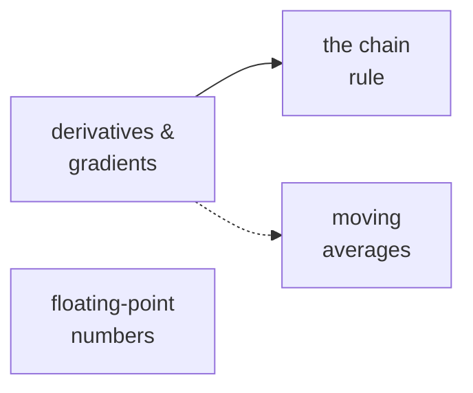

# Essentials — the maths chapter 04 assumes

Chapter 04 is where calculus enters the curriculum. If derivatives are a memory from school, the
phrase "take the gradient and step downhill" is a metaphor rather than an instruction; these four
articles turn it back into an instruction.

**You do not need to read them all.** When a chapter 04 sentence stops making sense, find it
below, read the one article, go back.

| Article | Read it when you hit… |
| --- | --- |
| [Derivatives and gradients](./derivatives-and-gradients/) | "the gradient", `w -= lr * grad`, "learning rate too high" |
| [The chain rule](./the-chain-rule/) | "backprop is the chain rule", "vanishing gradients", why it runs *backwards* |
| [Floating-point numbers](./floating-point/) | bf16, fp16, "mixed precision", "master weights", `NaN` |
| [Moving averages](./moving-averages/) | momentum, Adam's `m` and `v`, "bias correction", `β₁ β₂` |

## How this folder is laid out

One folder per concept; the article is always `README.md`, the script always `demo.py`:

```text
essentials/
  README.md                       this index
  derivatives-and-gradients/
    README.md                     the article
    demo.py                       prints the numbers the article quotes
  ...
```

```bash
cd derivatives-and-gradients && python3 demo.py
```

Deterministic; numpy is used where a format or an array is the point, otherwise standard library.

## Suggested order

Derivatives → chain rule (the calculus, in order). Floating point and moving averages are
independent — read each when its topic comes up.



## Owned here, used everywhere after

Every later chapter that trains anything — 07, 08, 09 — assumes these. Chapter 11 leans on the
floating-point article for quantization. Softmax, probability and the loss itself are owned by
[chapter 02](../../02-transformer-forward-pass/essentials/) and
[chapter 03](../../03-training-objective/essentials/).
