# 05 · Data

**Stage:** Pretrain · **Read after:** 03, 04 · **Feeds:** 06 (tokens are half the budget), 07 (curated data), 15 (contamination)
**In the twelve-ideas guide:** §5 (Chinchilla's "data matters as much as parameters"), §11 (contamination, implicitly)

## Why this chapter exists

The objective says "predict the corpus". So the corpus *is* the specification of the model: what
it knows, which languages and code it handles, what biases and errors it inherits, what it has
never seen. At frontier scale, data work is most of the human effort in a training run, and it is
increasingly where labs differ — architecture has converged; data has not.

For a programmer this is the most familiar chapter: it is an ETL pipeline. What is unfamiliar is
how much each stage's *choices* end up inside the weights.

## The whole chapter in one picture

```mermaid
flowchart LR
    C["raw crawl<br/><i>HTML, hundreds of TB</i>"]
    X["text extraction"]
    LID["language ID<br/><i>which languages, what threshold</i>"]
    Q["quality classifier<br/><i>trusted text vs junk — a chosen bias</i>"]
    D1["exact dedup<br/><i>hash</i>"]
    D2["near dedup<br/><i>MinHash + threshold</i>"]
    M["mixture weights<br/><i>up/down-sample sources</i>"]
    DC["decontaminate<br/><i>remove benchmark overlap</i>"]
    T["shuffled token stream<br/><b>the training set</b>"]
    C --> X --> LID --> Q --> D1 --> D2 --> M --> DC --> T
```



Every arrow removes or re-weights something, and every removal is a decision about what the
model will and will not be.

## What this chapter computes

```python
build_corpus(raw_docs) -> token_stream
```

```
  stage                         docs  tokens   removed
  raw crawl                      27    374   -
  language filter                26    359   1 non-English
  quality classifier             17    245   9 scored as junk
  exact dedup (hash)             12    173   5 identical copies
  near-dedup (MinHash)           11    159   1 near-duplicate
  decontaminate                  10    145   1 benchmark overlap

  same bigram model, scored on clean held-out text:
    trained on raw crawl    374 tokens   loss 3.808
    trained on clean set    145 tokens   loss 3.576      <- 2.6x fewer tokens, 6% lower loss
```

(Real output from `data_pipeline.py`.)

**Input** — everything you could get: a web crawl, books, code, papers, forums. Raw, redundant,
multilingual, full of boilerplate.

**Output** — a shuffled stream of token ids, weighted by source, with duplicates and benchmark
items removed. Typically 10¹²–10¹³ tokens.

**Goal** — decide what the model learns from. Remove what would mislead it (junk, duplicates,
test sets), keep what you want it good at, and set the proportions deliberately.

**What it does NOT do:**

- It does **not** produce a "neutral" dataset. Every filter is a bias; the only choice is
  whether you understand yours.
- It does **not** need to be big to help — measured above, less cleaner data beat more dirtier
  data.
- It does **not** catch paraphrased contamination. N-gram checks are porous.
- It does **not** happen once. The mixture is re-tuned per run, and the last few percent of
  tokens are often a different, higher-quality mix.

## Before the drill list: the maths

Most of this chapter is engineering a programmer already has. Two ideas are not standard
equipment — see **[`essentials/`](essentials/)**:

| If this stops making sense… | Read |
| --- | --- |
| "near-duplicate", "MinHash", how dedup works on a trillion tokens | [Hashing, Jaccard and MinHash](essentials/hashing-and-set-similarity/) |
| "most tokens appear once", "up-sampling", why rare words are under-trained | [Zipf's law and the long tail](essentials/zipf-and-the-long-tail/) |

## Terminology

| Term | In plain language |
| --- | --- |
| **crawl** | Raw pages fetched from the web. Common Crawl is the public one most pipelines start from. |
| **text extraction** | Stripping HTML, navigation and ads to get the article text. Loses and mangles things. |
| **language identification** | A classifier that says which language a document is in, with a confidence. |
| **quality classifier** | A model trained on "text we trust" vs "random crawl", used to score and filter documents. |
| **boilerplate** | Text repeated across many pages — menus, footers, cookie notices. |
| **heuristic filter** | A hand-written rule: too short, too many symbols, too repetitive. Cheap and crude. |
| **deduplication** | Removing repeated documents. **Exact**: identical bytes. **Near**: mostly the same. |
| **hash** | A fixed-size fingerprint of a document. Identical text → identical hash. |
| **shingle** | A window of *k* consecutive words. A document as a set of shingles enables similarity. |
| **Jaccard similarity** | Shared shingles ÷ total distinct shingles. 0 to 1. |
| **MinHash** | A short signature whose match rate estimates Jaccard. Makes near-dedup tractable. → [essentials](essentials/hashing-and-set-similarity/) |
| **LSH** | Locality-sensitive hashing: bucket signatures so similar documents collide without all-pairs comparison. |
| **mixture weights** | How much of each source goes into the training stream. A decision, not a measurement. |
| **up-sampling / down-sampling** | Repeating an under-represented source, or thinning an over-represented one. |
| **epoch** | One pass over a source. Up-sampling means >1 epoch of it. LLMs mostly see web text once. |
| **curriculum / annealing** | Changing the mix over training — typically the highest-quality data last. |
| **synthetic data** | Text written by a model, used as training data. Strong for maths, code, instructions. |
| **model collapse** | Quality decay when a model trains on its own unfiltered output across generations. |
| **contamination** | Benchmark test items present in the training data. Inflates scores. |
| **decontamination** | Removing training documents that overlap benchmarks, usually by n-gram match. |
| **held-out** | Data kept out of training entirely, used only for measurement. |
| **PII** | Personally identifying information. Filtered for legal and ethical reasons. |
| **opt-out / robots.txt** | Signals from a site that its content should not be crawled or trained on. |
| **Zipf's law** | Word frequency ∝ 1/rank. A few words are everywhere; half appear once. → [essentials](essentials/zipf-and-the-long-tail/) |

## Files in this chapter

| File | What it is |
| --- | --- |
| [`essentials/`](essentials/) | MinHash and Zipf, each with a runnable demo. |
| [`data-pipeline.md`](data-pipeline.md) | **The main article.** A 27-document crawl through every stage, with the classifier scores, the Jaccard/MinHash numbers, the mixture table, a contamination hit, and the raw-vs-clean measurement. |
| `pipeline.py` | Generates that article. |
| `data_pipeline.py` | The pipeline: language ID, a small quality classifier, exact and MinHash dedup, mixture weights, decontamination, and a bigram model to measure the effect. Standard library. |

## Drill list

**What is in a pretraining mix.** Filtered web crawl (the bulk), code, books, papers, reference
text, dialogue, maths; a chosen set of languages. Order of 10¹²–10¹³ tokens. The proportions are
decisions, and they leak into everything the model can do.

**Text extraction** is lossy. Stripping HTML loses tables, mangles code blocks, drops maths. The
model inherits every extraction bug at scale.

**Language identification.** A classifier over character n-grams with a confidence threshold. The
threshold decides which languages the model gets and how much; rare languages sit where the
classifier is least sure.

**Quality filtering.** Heuristics first — length, symbol ratio, repetition — then a classifier
trained on trusted text versus random crawl. In the article the scorer separates prose from
boilerplate and spam by sign. **Every filter is a bias**: trusting encyclopedic text down-weights
dialogue, dialect, and every register that does not look like an encyclopedia.

**Deduplication.** Exact by hash, one pass. Near by shingles → Jaccard → MinHash → LSH, because a
billion documents is 5×10¹⁷ pairs. Why it matters: the loss averages over tokens, so a document
seen five times gets five votes. Boilerplate on every page of a site becomes the most important
text on the internet unless you remove it. Measured: dedup and filtering together cut tokens
2.6× and *lowered* held-out loss 6%.

**Mixture weights.** Override the crawl's natural proportions. Up-sample what you want more of
(books, code, maths) — a few epochs of good data helps, beyond ~4 it memorises. Chosen by small-run
ablations ([06](../06-planning-a-run/)).

**Epochs versus tokens.** Most web tokens are seen once. When repeating helps, when it hurts, and
the "running out of text" problem that made synthetic data urgent.

**Curriculum.** The last few percent of training tokens shape the final model
disproportionately. Anneal onto the highest-quality mix at the end.

**Synthetic data.** Model-written text: rephrased web pages, textbooks, code with tests. Works
well for maths, code and instruction data. The risk is a model training on its own output across
generations — model collapse — if nothing filters it.

**Contamination.** Benchmark items in the training set inflate scores. Decontaminate by n-gram
overlap; know that paraphrases pass straight through. → [15](../15-evaluation/)

**Legal and provenance.** Licensing, robots.txt, opt-outs, PII. A first-order constraint on what
goes in, not a footnote.

**Post-training data is a different animal** — small, curated, expensive per example. Owned by
[07](../07-supervised-fine-tuning/) and [08](../08-preference-optimization/).

## Shared prerequisites — owned here

- **MinHash and set similarity** — [`essentials/`](essentials/hashing-and-set-similarity/).
- **Zipf's law** — [`essentials/`](essentials/zipf-and-the-long-tail/); [01](../01-tokenizer/)
  uses it for vocabulary size, [06](../06-planning-a-run/) owns the general power-law maths.

## Build it

1. Run `python3 data_pipeline.py`. Add a document to the crawl that you think should survive, and
   one that should not, and see whether the pipeline agrees.
2. Change the near-dedup threshold from 0.5 to 0.9 and to 0.2. Watch what is removed.
3. Open a slice of a public dataset — FineWeb on Hugging Face is one click. Read 50 random
   documents. Then read 50 the quality filter rejected. That hour teaches more than any paper.

## You're done when you can…

- [ ] Sketch a pretraining data pipeline from raw crawl to shuffled token stream.
- [ ] Explain why duplicates hurt in terms of the loss, and why exact dedup is not enough.
- [ ] Explain MinHash in two sentences and say what the threshold trades off.
- [ ] Say what a mixture weight is, why it overrides the crawl, and how you would choose one.
- [ ] Explain why "every filter is a bias" is not a slogan.
- [ ] Describe contamination and why decontamination is porous.

## Q&A

*(Questions and answers accumulate here as they come up.)*

## Notes

