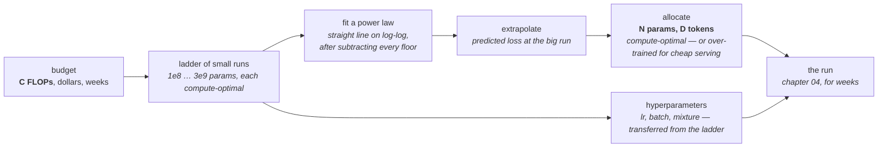

# 06 · Planning a run

**Stage:** Pretrain · **Read after:** 03, 04, 05 · **Feeds:** 11 (where the FLOPs go), 15 (what you are forecasting)
**In the twelve-ideas guide:** §5 *Scaling laws* (all: power laws, Chinchilla, the 6ND rule)

## Why this chapter exists

A frontier run costs hundreds of millions of dollars and you get one shot. This chapter is the
arithmetic that lets you choose model size, token count and hyperparameters *before* spending
that: train a ladder of small models, fit a line, extrapolate. Scaling laws are a tool here, not a
philosophy — the question is always "given `C` FLOPs, what `N` and `D`?"

It is also the chapter that turned the field from alchemy into engineering. A lab can now say
what a model 100× larger will score before training it, and be right.

## The whole chapter in one picture



Every arrow is arithmetic on measured small runs. Nothing about the big run is guessed.

## What this chapter computes

```python
plan(budget_flops) -> (N_params, D_tokens, predicted_loss)
```

```
  plan(1e23)   # using Chinchilla's published fit  L = 1.69 + 406.4/N^0.34 + 410.7/D^0.28

  budget C     best N      best D     D/N     loss      a 175B model at the same budget
  1e+23        1.46e+10    1.14e+12    78     2.005     D = 9.5e+10, loss 2.097

  and the cost of the resulting run:
  6 × N × D = 6 × 1.46e10 × 1.14e12 ≈ 1.0e23 FLOPs   ->   ~70,000 GPU-hours at 40% MFU
```

(Real output from `scaling.py`. The five constants are Chinchilla's *reported* fit; everything
derived from them is exact arithmetic.)

**Input** — a compute budget, plus a fitted scaling law from a ladder of small runs.

**Output** — how many parameters, how many tokens, and the loss you should expect. Also the
learning rate, batch size and data mixture, transferred from the small runs.

**Goal** — commit hundreds of millions of dollars to a single training run *knowing* what it
will produce.

**What it does NOT do:**

- It does **not** predict capabilities. It predicts *loss*. A smooth loss curve can hide a
  sharp jump in a benchmark — and hide a smooth one behind a thresholded metric.
- It does **not** give one answer. Chinchilla's three estimation methods disagree on the exact
  tokens-per-parameter; all agree GPT-3 was an order of magnitude too big for its data.
- It does **not** account for attention FLOPs. `6ND` counts weight matrices only; expect the
  real bill to be higher.
- It does **not** hold if the data runs out, or changes character. The law is fit on a
  distribution; leave it and the line bends.

## Before the drill list: the maths

Two ideas carry this chapter, written up in **[`essentials/`](essentials/)**:

| If this stops making sense… | Read |
| --- | --- |
| "power law", "straight on log-log", "slope", "extrapolate the ladder" | [Power laws and log-log plots](essentials/power-laws-and-log-log/) |
| `6ND`, "GPU-hours", "PFLOP/s-days", "MFU", what a run costs | [FLOPs and the units of compute](essentials/flops-and-units/) |

## Terminology

| Term | In plain language |
| --- | --- |
| **FLOP** | One floating-point multiply or add. The unit of compute. → [essentials](essentials/flops-and-units/) |
| **`6ND`** | Training FLOPs ≈ 6 × parameters × tokens. Two forward, four backward, per parameter per token. |
| **compute budget `C`** | Total FLOPs you can afford. Fixed by chips × time × utilisation. |
| **MFU** | Model FLOPs utilisation — achieved useful FLOP/s over the chip's peak. 30–50% is typical. |
| **GPU-hour** | One GPU for one hour. The billing unit. |
| **PFLOP/s-day** | 10¹⁵ FLOP/s sustained for a day. The GPT-3 paper's unit. |
| **scaling law** | An empirical power-law fit of loss against N, D or C. |
| **power law** | `y = a·xᵇ`. A straight line on log-log axes with slope `b`. → [essentials](essentials/power-laws-and-log-log/) |
| **exponent / slope** | How much you gain per 10×. Loss exponents are small (≈ −0.05 to −0.3), so each 10× buys a modest, reliable amount. |
| **intercept** | Where the line sits. An architecture change that only moves the intercept helps every size equally; one that changes the slope matters more at scale. |
| **irreducible loss `E`** | The floor the law tends to: the entropy of the text. Subtract it before fitting or the line bends. |
| **compute-optimal** | The `(N, D)` split that minimises loss for a fixed `C`. |
| **Chinchilla** | Hoffmann et al. 2022: models had been too large and under-trained; roughly 20 tokens per parameter is compute-optimal. |
| **tokens per parameter** | `D / N`. GPT-3: 1.7. Chinchilla: 20. Llama-3-8B: ~1,900. |
| **over-training** | Training far past compute-optimal on purpose, because serving cost scales with `N`, not `D`. |
| **ladder** | A series of small models trained across scales to fit the law. |
| **extrapolation** | Reading the fitted line beyond the ladder — the prediction for the big run. |
| **ablation** | Training two small variants that differ in one thing, to decide the thing. |
| **hyperparameter transfer / μP** | Parameterising the model so the learning rate tuned small still works large. |
| **emergence** | A capability appearing abruptly with scale. Sometimes real; often a thresholded metric on a smooth trend. |
| **irreducible vs. reducible** | `E` is what no model removes; `A/N^α + B/D^β` is what scale removes. |

## Files in this chapter

| File | What it is |
| --- | --- |
| [`essentials/`](essentials/) | Power laws and FLOPs, each with a runnable demo. |
| [`planning.md`](planning.md) | **The main article.** `6ND` derived and applied to Llama-3-8B; the law tabulated; the log-log fit done right and wrong; compute-optimal allocation across four budgets; why production over-trains; the ladder-and-extrapolate procedure; and the emergence arithmetic. |
| `planning.py` | Generates that article. |
| `scaling.py` | The computations, on Chinchilla's published fit. numpy. |

## Drill list

**The compute budget.** `C ≈ 6ND`: a matrix multiply is `2·rows·inner·cols` FLOPs, so one token
through `P` parameters is `2P` forward and `4P` backward. For Llama-3-8B on 15T tokens that is
`7.2×10²³` FLOPs — about 500,000 GPU-hours at 40% MFU by the rule, against a reported 1.3M. The
gap is attention (which `6ND` omits and which grows with sequence length) plus real utilisation.
`6ND` is the right first estimate and a known underestimate.

**Scaling laws.** Kaplan (2020) trained hundreds of small models and found loss falls as a power
law in N, D and C — straight lines on log-log axes over seven orders of magnitude. Fit the line
on small models, predict the big one. The law has a floor: **`E`, the irreducible loss**, which is
the entropy of language itself ([03](../03-training-objective/)).

**Fitting it right.** The article fits the same seven points twice. Subtract only `E` and the
slope is `−0.24`; subtract the data term too and it is `−0.34`, the true exponent. A constant you
did not remove bends the line. "Roughly straight on log-log" is a hypothesis; the residuals
decide. → [essentials](essentials/power-laws-and-log-log/)

**Compute-optimal allocation (Chinchilla, 2022).** Fix `C`, minimise `L(N, C/6N)` over `N`. The
parametric fit gives 50–100 tokens per parameter rising with budget; Chinchilla's other two
methods gave the famous ~20:1. The methods disagree on the number and agree on the lesson:
**GPT-3 was far too large for its data** — 175B parameters on 300B tokens is 1.7 per parameter,
and at every budget in the table a right-sized model beats that shape.

**Over-training on purpose.** Compute-optimal minimises *training* cost. Inference cost scales
with `N` and is paid forever. So production models train far past optimal: Llama-3-8B's 15T tokens
is ~1,900 per parameter, and the law says loss is still falling. Training-optimal and
deployment-optimal are different points; the industry moved to the second.

**What the law is actually for.** Train a ladder (1e8 to 3e9 parameters, say), fit, read off the
big run's loss before spending. GPT-4's report describes predicting its final loss from runs with
1,000–10,000× less compute *(reported)*. The same ladder settles design questions: try two
architectures at 100M, and if one has a better *slope*, it wins at 100B. A change that only helps
small models is discarded.

**Hyperparameter transfer.** The learning rate that works at 100M does not naively work at 100B.
μP parameterises the model so it does — tune small, transfer large. Know it exists.

**Emergence and its arithmetic.** Loss is smooth; capabilities as measured often are not. If
per-token accuracy `p` rises smoothly, a task needing 20 tokens all correct scores `p²⁰`, which
jumps from 1% to 82% as `p` goes 0.80 → 0.99. Many reported "sudden" abilities are this threshold
effect. Some are real. Either way, **the loss curve does not tell you when a skill arrives** —
the honest limit of the tool. → [15](../15-evaluation/)

**The units.** FLOPs, PFLOP/s-days, GPU-hours, tokens, parameters, dollars. Convert fluently;
every paper and vendor picks a different one. → [essentials](essentials/flops-and-units/)

## Shared prerequisites — owned here

- **Power laws and log-log plots** — [`essentials/`](essentials/power-laws-and-log-log/).
  Referenced by [05](../05-data/) (Zipf is the linguistic instance) and [11](../11-efficiency/).
- **FLOPs accounting** — [`essentials/`](essentials/flops-and-units/). Referenced by 10 and 11.

## Build it

1. Run `python3 scaling.py`. Change the budget in section 4 to your own number and read off `N`
   and `D`. Then change `E` and watch every line bend.
2. Take three real training runs of the chapter-04 model at different sizes (widen `D`), record
   final loss and FLOPs, plot on log-log axes, fit, predict a fourth, run it. Being off by 5%
   teaches you what the papers mean.
3. Read [`planning.md`](planning.md) with the code open.

## You're done when you can…

- [ ] Derive `6ND` from the cost of a matrix multiply, and say what it leaves out.
- [ ] Compute training FLOPs and GPU-hours for a named model within a factor of 2.
- [ ] Fit a power law by taking logs, and explain why the floor must be subtracted first.
- [ ] State the Chinchilla result and explain why production models deliberately violate it.
- [ ] Explain what a lab actually does with a scaling law before a big run.
- [ ] Say what scaling laws predict well (loss) and poorly (capabilities), with the `pᵏ` example.

## Q&A

*(Questions and answers accumulate here as they come up.)*

## Notes

