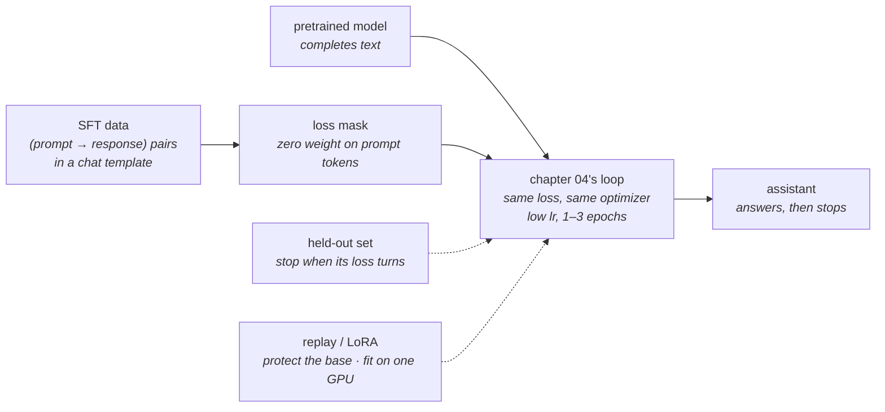

# 07 · Supervised fine-tuning

**Stage:** Post-train · **Read after:** 03, 04, 01 (chat templates) · **Feeds:** 08 (the starting policy), 09 (SFT on reasoning traces), 14 (tool-call formats)
**In the twelve-ideas guide:** §7 *Pretrain, then align* (the SFT half)

## Why this chapter exists

A pretrained model completes text; it does not answer you. Ask it a question and it may produce
three more questions, because that is what the internet looks like. Supervised fine-tuning is
[chapter 04](../04-optimization-loop/)'s loop run on a small, curated set of (prompt → ideal
response) pairs so the model learns the *format and behaviour* of an assistant. It is cheap —
hours, thousands to a few million examples, a fraction of a percent of pretraining compute — and
it is where most of a model's visible personality is first set.

It is also where a programmer first meets overfitting in anger: small data, many passes, a model
with vastly more capacity than the task.

## The whole chapter in one picture



Same architecture, same loss, same optimizer as pretraining. Only the data and the amount change.

## What this chapter computes

```python
sft(base_model, pairs: list[(prompt, response)]) -> assistant_model
```

```
  before:  <user> what color is the sky ? <assistant>  ->  '. the mat is red . the mat'
                                                            p(<eot> | ...the sky is blue) = 0.0000
  sft(base, 5 pairs, 300 steps)
  after:   what color is the sky ?    -> 'the sky is blue <eot>'    ok
           what color is the mat ?    -> 'the mat is red <eot>'     ok
           what sound is the cat ?    -> 'meow <eot>'               ok
           what sound is the dog ?    -> 'woof <eot>'               ok
           what color is the rug ?    -> 'the rug is green <eot>'   ok
                                                            p(<eot> | ...the sky is blue) = 0.9944
```

(Real output from `sft.py`, a 3,416-parameter model. Five examples, 300 steps.)

**Input** — a pretrained model, and a small set of conversations in a chat template: who said
what, with special tokens marking each turn.

**Output** — the same model with slightly moved weights, which now answers in the format it was
shown and emits an end-of-turn token when done.

**Goal** — turn a text-completer into an assistant. Teach the *shape* of a response, the *voice*,
and *when to stop*.

**What it does NOT do:**

- It does **not** add knowledge. The facts above were in the pretrained weights; SFT surfaced
  them. It cannot supply context the architecture can't carry — with a 3-token window the same
  run gets the format right and the facts wrong.
- It does **not** rank. It can imitate good answers; it cannot learn that one answer is *better*
  than another. That is [chapter 08](../08-preference-optimization/).
- It does **not** stay put. Every step toward the new examples is a step away from everything
  else the model knew — measured, and it never stops.
- It does **not** differ from pretraining in mechanism. Same loop; different data; ~0.1% the compute.

## Before the drill list: the maths

Two ideas here are not standard equipment — see **[`essentials/`](essentials/)**:

| If this stops making sense… | Read |
| --- | --- |
| "LoRA", "rank", `A @ B`, why fine-tuning fits on one GPU | [Low-rank matrices](essentials/low-rank-matrices/) |
| "held-out loss", "few epochs", "early stopping", "catastrophic forgetting" | [Overfitting and generalization](essentials/overfitting-and-generalization/) |

## Terminology

| Term | In plain language |
| --- | --- |
| **supervised fine-tuning (SFT)** | Continue training a pretrained model on (prompt → ideal response) pairs with the ordinary next-token loss. |
| **base model** | The pretrained model before any post-training. Completes text. |
| **instruction tuning** | SFT on instruction/response data specifically. Same thing, older name. |
| **chat template** | The convention for turning a conversation into one token stream: special tokens marking `<user>`, `<assistant>`, end-of-turn. → [01](../01-tokenizer/) |
| **end-of-turn token** | The token the model must learn to emit to stop. A model that "won't stop" usually has the wrong template. |
| **loss masking** | Zero weight on prompt tokens; loss only on the assistant's tokens. |
| **epoch** | One pass over the fine-tuning set. SFT uses 1–3; pretraining uses ~1 of a vastly larger set. |
| **held-out set** | Examples kept out of training, used to detect overfitting. → [essentials](essentials/overfitting-and-generalization/) |
| **overfitting** | Training loss falls, held-out loss rises. Memorising the examples. |
| **early stopping** | Stop when held-out loss turns upward. |
| **catastrophic forgetting** | The fine-tune drifting away from pretrained knowledge. Measured as pretraining loss rising during SFT. |
| **replay** | Mixing pretraining data back into fine-tuning batches to protect the base. |
| **superficial alignment** | The view that SFT changes format and style, not capability — and that a few thousand good examples suffice. |
| **distillation** | Training a small model on a large model's outputs. Reappears in [09](../09-reasoning-training/). |
| **self-instruct** | Generating instruction data with a model, then filtering it. |
| **LoRA** | Low-Rank Adaptation: freeze the weights, train a small `A @ B` beside each chosen matrix, merge afterwards. → [essentials](essentials/low-rank-matrices/) |
| **rank** | How many independent directions a matrix has. LoRA's `r` is typically 8–64. |
| **PEFT** | Parameter-efficient fine-tuning — LoRA and its relatives. |
| **QLoRA** | LoRA with the frozen base in 4-bit. Fits larger models on one GPU. |
| **adapter** | The trained LoRA weights. Small, swappable; many can share one base. |
| **optimizer state** | Adam's two moments plus the gradient, per trainable parameter, in fp32. The memory LoRA saves. |

## Files in this chapter

| File | What it is |
| --- | --- |
| [`essentials/`](essentials/) | Low-rank matrices and overfitting, each with a runnable demo. |
| [`sft.md`](sft.md) | **The main article.** Before/after on five examples, masking, the overfitting-and-forgetting table, replay, and a LoRA rank sweep — all measured. |
| `finetune.py` | Generates that article. |
| `sft.py` | The model and experiments: a 6-token-context predictor, pretraining, SFT with a chat template, masking, held-out tracking, replay, LoRA. numpy. |

## Drill list

**What changes and what doesn't.** Same architecture, same loss, same optimizer; different data
and a fraction of a percent of the compute. Capabilities come from pretraining; SFT *elicits*
them in a usable shape. The article shows a model going from `'. the mat is red . the mat'` to
five correct, terminated answers on five examples and 300 steps — and the facts were already in
its weights.

**The data.** Instruction/response pairs; multi-turn dialogues; system prompts. Sources: written
by hand, generated by a stronger model and filtered, converted from existing datasets. Quality
dominates quantity — a thousand excellent examples beat a hundred thousand mediocre ones.

**Chat format.** The template from [01](../01-tokenizer/): role tokens, turn boundaries, and the
end-of-turn token the model must learn to emit so it *stops*. `p(<eot>)` went from 0.0000 to
0.9944. Get the template wrong at inference and the model is off-distribution — most visibly by
not stopping.

**Loss masking.** Compute the loss only on assistant tokens. Unmasked training spends gradient
learning to predict the *user's question* — wasted — and drags the model further from
pretraining (2.27 vs 0.91 pretraining loss in the article).

**Hyperparameters.** Learning rate around 10⁻⁵ for real models, 1–3 epochs. Overfitting shows up
fast: the held-out turn bottoms out at step 50–100 and rises from there while training loss goes
to zero.

**Catastrophic forgetting.** Pretraining loss climbs the entire fine-tune, 0.24 → 0.98 over 3,000
steps, and never turns back. Mitigations: low learning rate, few epochs, and **replay** — mixing
pretraining data in, which at this scale recovers the base loss at no cost to the task.

**Parameter-efficient fine-tuning.** **LoRA** freezes the weights and learns a rank-*r* correction
`A @ B` beside selected matrices; `B` starts at zero so training begins exactly at the base model,
and the product merges into the weight afterwards. A rank-1 correction — under 5% of one matrix —
learns the task as well as full fine-tuning. What it saves is **optimizer memory**, not compute:
~100 GB of Adam state for an 8B model becomes under a gigabyte. One GPU instead of eight.
→ [essentials](essentials/low-rank-matrices/)

**Distillation.** Training a small model on a large model's outputs — the workhorse for small
deployed models. The reasoning version is in [09](../09-reasoning-training/).

**Where SFT stops.** It can only imitate examples. It cannot express "this answer is *better*
than that one", and it cannot improve past its data. That gap is [08](../08-preference-optimization/).

## Shared prerequisites — owned here

- **Overfitting and generalization** — [`essentials/`](essentials/overfitting-and-generalization/).
  Referenced by [15](../15-evaluation/).
- **Low-rank matrices** — [`essentials/`](essentials/low-rank-matrices/). Referenced by [11](../11-efficiency/).

## Build it

1. Run `python3 sft.py`. Then set `K = 3` at the top and run again: the format stays right and
   the facts go wrong. That one change is the whole "SFT elicits, it cannot add" lesson.
2. Add a sixth QA pair whose answer is *not* in the pretraining text. Watch whether SFT can teach it.
3. Fine-tune a small open model (1–3B) with LoRA on a few thousand instruction pairs. Before and
   after: give it a question and watch it go from continuing your text to answering it.

## You're done when you can…

- [ ] Explain, in loss terms, what SFT changes and why it needs so little data.
- [ ] Describe loss masking and the chat template, and why the model must learn to stop.
- [ ] Read the overfitting table and name the step to stop at, and why.
- [ ] Explain catastrophic forgetting and the two standard mitigations.
- [ ] Explain LoRA's low-rank update and why it saves memory but not compute.
- [ ] Say what SFT cannot do and why preference methods are needed after it.

## Q&A

*(Questions and answers accumulate here as they come up.)*

## Notes

