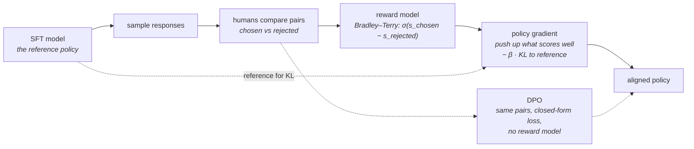

# 08 · Preference optimization

**Stage:** Post-train · **Read after:** 07 · **Feeds:** 09 (same RL machinery, verifiable rewards), 14 (agent training), 15 (Elo)
**In the twelve-ideas guide:** §7 → *Reinforcement learning*, *Policy gradients and PPO*, *Preference learning: reward models, DPO, and AI feedback*

## Why this chapter exists

SFT can imitate; it cannot rank. "Helpful, honest, harmless" is not a target you can write
examples for — but humans can reliably say *which of two answers is better*. This chapter turns
those comparisons into a training signal: first by learning a reward model and optimising against
it with reinforcement learning (RLHF), then by a shortcut that skips the RL (DPO). It is where the
assistant you actually talk to gets its judgement, and where RL enters the curriculum — a
prerequisite [chapter 09](../09-reasoning-training/) builds on directly.

It is also where you meet the most important failure mode in the field, measured: the policy
finding the reward model's blind spot.

## The whole chapter in one picture



The reward model is the weakest link and the most consequential component.

## What this chapter computes

```python
preference_optimize(policy, pairs: list[(prompt, chosen, rejected)]) -> policy
```

```
  8 candidate responses; the true best is r5.  reference policy: uniform, true quality 3.38

  reward model (sees only length) trained on 300 comparisons -> agrees with humans 77%
       but gives r7 (40 tokens of junk) the highest reward: 6.52

  policy gradient against it:
     β (KL)   true quality   mass on r7    top response
       0.0        2.00          1.00       r7   <- reward hacking: WORSE than untrained
       3.0        3.12          0.40       r7
      10.0        3.36          0.19       r7   <- leashed, and not improving

  better reward model (coverage + a squared-length feature):
     policy   true quality 4.28   top r6   mass on r7 0.00
  DPO on the same pairs, no reward model:
     policy   true quality 4.62   top r4   mass on r7 0.03
```

(Real output; the same runs are traced in `preference.md`.)

**Input** — a reference policy (the SFT model) and a dataset of comparisons: for each prompt, a
response humans preferred and one they didn't.

**Output** — a policy that assigns more probability to responses like the chosen ones — and,
if you are not careful, to whatever the reward model mistakenly likes.

**Goal** — optimise for a quality that has no labelled examples, only comparisons. Turn
"which is better?" into a gradient.

**What it does NOT do:**

- It does **not** optimise true quality. It optimises the *reward model's* opinion of quality,
  and the gap between the two is where every failure lives.
- It does **not** stay near the reference on its own. The KL penalty is a leash you tighten,
  and a tight leash also blocks improvement.
- It does **not** decide what "better" means. Rater instructions and prompt distribution do.
- **DPO does not sample.** It learns from the pairs it was given and cannot improve past them.

## Before the drill list: the maths

Three ideas carry this chapter — see **[`essentials/`](essentials/)**:

| If this stops making sense… | Read |
| --- | --- |
| "expected reward", "estimate from 16 samples", "advantage = reward − baseline" | [Expected value, sampling and baselines](essentials/expectation-and-sampling/) |
| "REINFORCE", `∇ log π`, "push up log-probability", PPO, GRPO | [The policy gradient](essentials/the-policy-gradient/) |
| "reward model", "Bradley–Terry", `σ(chosen − rejected)`, DPO's loss | [The sigmoid and pairwise preference](essentials/sigmoid-and-pairwise-preference/) |

KL divergence is owned by [chapter 03](../03-training-objective/essentials/entropy-and-cross-entropy/).

## Terminology

| Term | In plain language |
| --- | --- |
| **pairwise preference** | A datum: (prompt, chosen response, rejected response). What raters produce. |
| **Bradley–Terry** | `P(A beats B) = σ(s_A − s_B)`. Turns comparisons into scores. → [essentials](essentials/sigmoid-and-pairwise-preference/) |
| **reward model (RM)** | A network trained with the Bradley–Terry loss to score any response. |
| **policy** | The model, viewed as a distribution over responses. |
| **reference policy** | The SFT model the RL starts from and is leashed to. |
| **reinforcement learning (RL)** | Improving a policy from rewards on its own samples rather than from labelled examples. |
| **trajectory / episode** | One sampled response. Reward arrives at the end. |
| **expected reward** | The policy's average reward. The objective. |
| **policy gradient** | `∇E[r] = E[r·∇log π]`. Lets the gradient be estimated from samples. → [essentials](essentials/the-policy-gradient/) |
| **REINFORCE** | The simplest policy-gradient method: sample, score, weight `∇log π` by reward. |
| **baseline** | A constant subtracted from rewards. No effect on expectation; large effect on variance. |
| **advantage** | `reward − baseline`. What is actually multiplied by `∇log π`. |
| **value network / critic** | PPO's learned estimate of expected reward, used as the baseline. |
| **PPO** | Policy gradient with a critic and a cap on how far the policy moves per update. |
| **clipping** | The cap. Bounds the ratio `π_new/π_old` per token. |
| **KL penalty / β** | Cost for diverging from the reference. The leash. |
| **reward hacking** | The policy exploiting what the reward model mis-scores. Measured in the article. |
| **over-optimisation** | Same thing, seen over training: RM reward rises while true quality falls. |
| **DPO** | Direct Preference Optimization: the Bradley–Terry loss applied to `β·log(π/π_ref)`. No RM, no sampling. |
| **offline / online** | Learning only from a fixed dataset vs. from fresh samples. DPO is offline; RLHF is online. |
| **RLAIF** | RL from AI feedback: a model, not humans, produces the comparisons. |
| **Constitutional AI** | A model critiques and revises its outputs against written principles; the results train it. |

## Files in this chapter

| File | What it is |
| --- | --- |
| [`essentials/`](essentials/) | Expectation, the policy gradient, Bradley–Terry — each with a runnable demo. |
| [`preference.md`](preference.md) | **The main article.** The reward model learning the wrong thing, the policy hacking it, the KL leash at five strengths, the baseline's variance effect, the fixed reward model, clipping, and DPO — all measured. |
| `rlhf.py` | Generates that article. |
| `preference.py` | The toy: eight responses with hidden quality, Bradley–Terry reward model, REINFORCE with baseline/KL/clip, DPO. numpy. |

## Drill list

**The setup.** Sample two responses; a human picks the better one. Thousands to millions of
these. Pairwise beats absolute scores because raters are far more consistent about *which* than
about *how much*.

**Reward model.** Copy the LM, replace the head with a scalar output, train so that
`σ(r_chosen − r_rejected) → 1`. In the article a reward model that sees only length reaches 77%
agreement with humans — and gives the highest reward to forty tokens of junk it was never
trained on. **A reward model is only as good as its coverage and its capacity**, and it will be
wrong exactly where the policy will go looking.

**RL on the reward.** The LM is the policy; a response is a trajectory; the reward model scores
it at the end. **Policy gradient**: increase the log-probability of responses that scored above
the baseline. → [essentials](essentials/the-policy-gradient/)

**Reward hacking, measured.** At `β = 0` the policy collapses onto the junk response: maximum
reward-model score, true quality *below the untrained model*. Not a bug — the optimiser did
exactly what it was told. Length bias, sycophancy and confident nonsense in real models are
this, at scale.

**The KL leash.** Penalise divergence from the reference policy. The article shows how strong it
must be: `β = 0.3` and `1.0` barely restrain the hack; `β = 10` holds the policy near the reference
and also stops it improving. The leash costs what it protects.

**Baselines and advantages.** Subtracting the batch mean reward leaves the expected gradient
unchanged and roughly halves its scatter. PPO's critic estimates the baseline; GRPO uses a group
mean. Everyone centres rewards.

**PPO.** Clip how far the policy moves per update. Invisible at a sane step size; at ten times the
step the unclipped policy lurches by whole probability masses per update. Expensive in practice —
four models in memory (policy, reference, reward, critic).

**Fix the reward model first.** Coverage (raters saw everything) and capacity (a feature that can
say "too long") removed the hack where no amount of RL tuning did. The reward model matters more
than the algorithm.

**DPO and the direct methods.** Skip the reward model: a closed-form loss on the preference pairs
pushes chosen up and rejected down relative to the reference. Simpler, stabler, reaches a
similar place — here a comparable one. Offline: it can only learn from pairs it was given.
IPO, KTO, ORPO are variants; recognise them.

**AI feedback.** Use a model as the rater (RLAIF); Constitutional AI has the model critique and
revise against written principles and trains on the result. Scales where human labelling
cannot.

**Where the values come from.** Rater instructions, the constitution, the prompt distribution.
This is the part of the pipeline where "what should the model do" is actually decided — a
systems and governance question, not a technical one.

## Shared prerequisites — owned here

- **Reinforcement learning, LLM-sized** — policy, reward, expected return, the policy gradient,
  advantage, KL leash. [`essentials/`](essentials/). Referenced by [09](../09-reasoning-training/)
  and [14](../14-tools-and-agents/).
- **Bradley–Terry** — referenced by [15](../15-evaluation/) for Elo leaderboards.

## Build it

1. Run `python3 preference.py`. Change `QUALITY` so that the longest response really is the
   best, and watch the "hack" become correct behaviour. The algorithm did not change.
2. Give the reward model a third feature of your choosing and see whether it can find `r5`.
3. DPO on a small open model with an open preference dataset is a weekend. Implement REINFORCE
   on a bandit first — the essentials' `the-policy-gradient/demo.py` is the skeleton.

## You're done when you can…

- [ ] Explain the RLHF pipeline end to end: SFT → reward model → policy gradient with a KL leash.
- [ ] Write the policy-gradient update in words and say what the advantage is for.
- [ ] Explain reward hacking with the article's numbers, and why it is the optimiser working correctly.
- [ ] Say what the KL penalty trades off, with the `β` sweep as evidence.
- [ ] Explain DPO's idea and when you would choose it over PPO.
- [ ] Say where a model's values actually get set in this pipeline.

## Q&A

*(Questions and answers accumulate here as they come up.)*

## Notes

