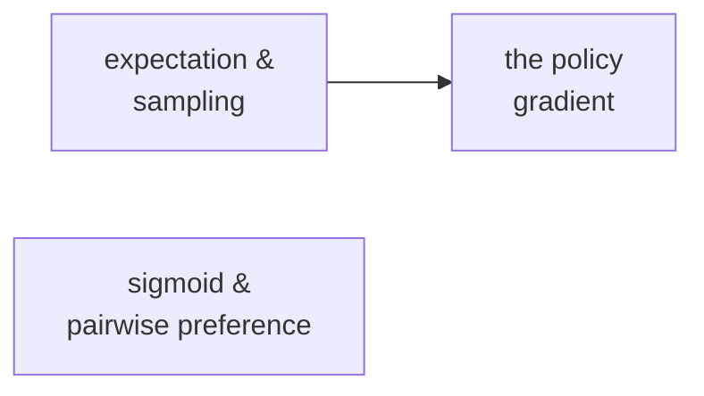

# Essentials — the maths chapter 08 assumes

Chapter 08 is where reinforcement learning enters, and three ideas carry it:

| Article | Read it when you hit… |
| --- | --- |
| [Expected value, sampling and baselines](./expectation-and-sampling/) | "expected reward", "estimate from 16 samples", "advantage = reward − baseline" |
| [The policy gradient](./the-policy-gradient/) | "REINFORCE", "push up log-probability", `∇ log π`, PPO, GRPO |
| [The sigmoid and pairwise preference](./sigmoid-and-pairwise-preference/) | "reward model", "Bradley–Terry", `σ(chosen − rejected)`, DPO's loss |

KL divergence — the leash — is owned by
[chapter 03](../../03-training-objective/essentials/entropy-and-cross-entropy/).

## How this folder is laid out

```text
essentials/
  README.md                       this index
  expectation-and-sampling/
    README.md                     the article
    demo.py                       prints the numbers the article quotes
  the-policy-gradient/
  sigmoid-and-pairwise-preference/
```

```bash
cd the-policy-gradient && python3 demo.py
```

numpy; deterministic.

## Suggested order

Expectation → policy gradient (the second builds on the first). Sigmoid is independent.



## Owned here, used after

Chapter 09 uses the policy gradient directly (GRPO). Chapter 14 uses it for agent training.
Chapter 15 uses Bradley–Terry for Elo leaderboards.
