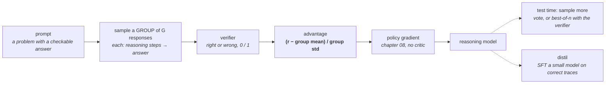

# 09 · Reasoning training

**Stage:** Post-train · **Read after:** 08 · **Feeds:** 10 (test-time compute), 14 (agents are reasoning + tools)
**In the twelve-ideas guide:** §9 *Reasoning and test-time compute* (all drill-downs)

## Why this chapter exists

Until recently a model answered in one pass: whatever "thinking" happened had to fit inside a
single forward computation per token. Reasoning models change that by writing out intermediate
steps before answering — and, critically, by *training* that habit with reinforcement learning
where the reward is **checkable**: the maths answer is right, the code passes its tests. It is
[chapter 08](../08-preference-optimization/)'s RL with a reward you do not have to learn, and it
opened a second scaling axis: spend more compute at inference, from the same model, and get
better answers.

This chapter also contains the curriculum's most instructive failed experiment. The first version
of the toy showed chain of thought buying *nothing* — and the reason why is the actual lesson.

## The whole chapter in one picture



No reward model anywhere in the loop. That absence is the point.

## What this chapter computes

```python
rlvr(policy, problems, verifier) -> policy      # RL with verifiable rewards, GRPO
```

```
  problems: a start token, and a hidden rule applied K times.  reward = 1 iff all K steps right.

  K=6 (4,096 possible chains), same GRPO recipe:
    GRPO steps   one-shot   step-by-step
             0     0.001        0.002
           200     0.000        0.000
           400     0.334        0.999      <- steps are reusable: the rule is 16 numbers

  control, K=6, chains with NO shared rule:
           400     0.332        0.031      <- decomposition buys nothing; the shared table hurts

  test-time compute, exact binomial, given single-sample accuracy p:
    p=0.3  n=15   majority 0.050   best-of-n 0.995
    p=0.9  n=15   majority 1.000   best-of-n 1.000
```

(Real output from `rlvr.py`.)

**Input** — a policy, a set of problems, and a function that says whether an answer is correct.

**Output** — a policy that writes out steps and gets more of them right, on problems the verifier
can score.

**Goal** — improve at tasks with a checkable answer by sampling, checking, and reinforcing what
checked out. No human labels, no reward model.

**What it does NOT do:**

- It does **not** make chain of thought a search trick. Measured: with no recurring structure,
  step-by-step is *worse*. It helps because steps recur and transfer.
- It does **not** work without a verifier. Where nothing can check the answer you are back to
  learned rewards and their blind spots.
- It does **not** learn from prompts it always gets right or always gets wrong. Zero signal
  either way; only frontier prompts teach.
- It does **not** guarantee the written steps are the real computation. Faithfulness is not
  free.

## Before the drill list: the maths

Two small pieces of arithmetic — see **[`essentials/`](essentials/)**:

| If this stops making sense… | Read |
| --- | --- |
| `pᵏ`, "20 steps at 90%", "best-of-n", "majority vote", the binomial | [Compounding probabilities](essentials/compounding-probabilities/) |
| GRPO's `(r − mean)/std`, "no critic", "frontier prompts" | [Z-scores and group normalisation](essentials/z-scores-and-group-normalisation/) |

The policy gradient itself is owned by [chapter 08](../08-preference-optimization/essentials/the-policy-gradient/).

## Terminology

| Term | In plain language |
| --- | --- |
| **chain of thought (CoT)** | Writing intermediate steps before the answer. Each step is another forward pass and another chance to reuse a learned sub-skill. |
| **verifiable reward** | A reward computed by a checker — exact match, unit tests, a proof assistant — not by a learned model. |
| **RLVR** | RL with verifiable rewards. Chapter 08's machinery with a checker in place of a reward model. |
| **GRPO** | Group Relative Policy Optimization: sample a group per prompt, advantage = z-scored reward within the group. No critic. → [essentials](essentials/z-scores-and-group-normalisation/) |
| **group** | The `G` responses sampled for one prompt. Typically 8–64. |
| **advantage** | `(reward − group mean) / group std`. What gets multiplied by `∇ log π`. |
| **critic / value network** | PPO's learned baseline. GRPO removes it — the group mean does its job. |
| **frontier prompt** | One the model solves sometimes. The only kind with non-zero advantage. |
| **cold start** | A little SFT on good reasoning traces before RL, so RL has something to reinforce. |
| **distillation** | SFT a fresh (usually smaller) model on the RL-trained model's correct traces. |
| **test-time compute** | Spending more inference to get a better answer: longer reasoning, more samples, search. |
| **self-consistency / majority vote** | Sample several answers, return the most common. Helps only if `p > 0.5`. |
| **best-of-n** | Sample several, keep one the verifier accepts. Always helps; needs a verifier. |
| **pass@k** | Probability at least one of `k` samples is correct. `1 − (1−p)ᵏ` under independence. |
| **inference-time scaling** | Accuracy rising smoothly with test-time compute — the second scaling axis. |
| **backtracking** | Noticing a wrong step and revising it. Appears in RL-trained models without being taught. |
| **faithfulness** | Whether the written steps are the computation that produced the answer. Not guaranteed. |
| **reward hacking (here)** | Only possible against the checker itself — e.g. a test suite with a hole. |

## Files in this chapter

| File | What it is |
| --- | --- |
| [`essentials/`](essentials/) | Compounding probabilities and z-scores, each with a runnable demo. |
| [`reasoning.md`](reasoning.md) | **The main article.** The step-by-step vs one-shot comparison at two depths, the control that shows when CoT does *not* help, GRPO's advantage, the test-time compute table, compounding, and distillation. |
| `reasoning.py` | Generates that article. |
| `rlvr.py` | The toy: a rule-following chain task, two policies, a verifier, GRPO, distillation. numpy. |

## Drill list

**Chain of thought.** Prompting the model to reason step by step improves accuracy, and the
reason is worth getting exactly right. In [02](../02-transformer-forward-pass/)'s terms each
emitted token is another forward pass — more serial computation. In this chapter's terms,
intermediate steps are **reusable sub-computations**: a step learned on one problem transfers to
every other problem that contains it. Measured: with a shared rule, step-by-step is solved at
`K=6` while one-shot has found a third of the answers; with *no* shared rule, step-by-step is
worse. CoT is transfer, not search.

**Verifiable rewards.** Maths with a known answer, code with tests, puzzles with a checker. Reward
is 1 or 0, from a function. No reward model, so no reward-model blind spot — the only thing to
hack is the checker. This is the whole difference from [08](../08-preference-optimization/) and
why maths and code led.

**GRPO.** Sample a group of responses per prompt, score them, and use `(r − mean)/std` within the
group as the advantage. The group mean replaces PPO's critic; the std puts easy and hard prompts
on one scale. All-right and all-wrong groups carry no signal, so pipelines filter for **frontier
prompts**. KL to the reference and clipping remain, as in 08.

**Cold start and distillation.** A little SFT on good traces first, so RL has something to
reinforce. Afterwards, sample correct traces from the trained model and SFT a fresh one on them —
the student matches the teacher in the article, with no RL at all. This is how most small
reasoning models are made.

**Test-time compute.** Longer thinking; **majority vote** (only helps above `p = 0.5`, and
amplifies whichever side you are on); **best-of-n with a verifier** (always helps — one right
sample suffices); search over partial solutions. Exact binomial arithmetic in the article. This
is the second scaling axis, and [10](../10-inference-and-decoding/) covers the serving side.

**Compounding.** `0.9¹⁶ ≈ 0.19`; `0.99¹⁶ ≈ 0.85`. Long derivations demand per-step reliability,
and much of reasoning training is raising that number — plus learning to backtrack, which
appears untaught.

**What generalises.** Reasoning trained on maths and code transfers partially to other domains.
Where no verifier exists — writing, judgement — you are back to learned rewards.

**Faithfulness.** The written chain is not guaranteed to be the real computation. Evidence, not
proof; this matters for trusting explanations and for safety monitoring.

## Shared prerequisites — owned here

- **Compounding probabilities and the binomial** — [`essentials/`](essentials/compounding-probabilities/).
  Referenced by [10](../10-inference-and-decoding/) and [15](../15-evaluation/) (pass@k).
- **Group normalisation / z-scores** — [`essentials/`](essentials/z-scores-and-group-normalisation/).

## Build it

1. Run `python3 rlvr.py`. Change `RULE` and watch step-by-step relearn it; change `A` to 8 and
   watch one-shot's haystack grow.
2. Give the verifier a bug — accept any chain whose *last* step is right — and watch the policy
   find it. That is the only reward hacking this method allows, and it is real.
3. GRPO on a 1–3B open model with GSM8K-style problems and an exact-match checker runs on one GPU
   in hours. Log accuracy and response length per step; you will see both climb.

## You're done when you can…

- [ ] Explain why chain of thought helps, using the shared-rule result *and* the control.
- [ ] Write GRPO's advantage and say why no critic is needed and why frontier prompts matter.
- [ ] Describe RLVR and say exactly what it removes compared to RLHF.
- [ ] Compute majority-vote and best-of-n accuracy from `p` and `n`, and say when each helps.
- [ ] State `0.9¹⁶` and what it implies for training.
- [ ] Say where verifiable rewards run out and what you fall back to.

## Q&A

*(Questions and answers accumulate here as they come up.)*

## Notes

