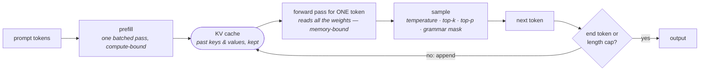

# 10 · Inference and decoding

**Stage:** Run the model · **Read after:** 02, 03 · **Feeds:** 11 (making it fast), 14 (the agent loop is decoding in a loop)
**In the twelve-ideas guide:** §6 *In-context learning* (prompting; ICL as the exploited phenomenon), §9 → *Inference-time scaling and search*

## Why this chapter exists

Training builds a function from a prefix to a next-token distribution. Everything you experience
as "using a model" — generation, temperature, streaming, prompts, few-shot examples, system
prompts — is a loop wrapped around that function at serving time, plus the sampling rule that
picks one token from the distribution. This is the part of the stack you touch daily as a
programmer, and where most API parameters get their meaning.

It is also where a single hardware fact — decode is memory-bound — explains batching, the KV
cache, GQA, quantization and the price list.

## The whole chapter in one picture



Everything to the right of prefill happens once per generated token.

## What this chapter computes

```python
generate(model, prompt_ids, max_tokens, temperature, top_p) -> token_ids
```

```
  prompt ids   [55, 30, 32, 28, 0, 25, 32, 10]
  greedy       [59, 12, 41, 14, 44]                      5 tokens = 5 forward passes

  KV cache, 40 tokens:  recompute-all 1,138,560 attention multiply-adds   cached 36,736   (31x)
                        identical output: True

  Llama-3-8B, bf16, one H100:  16.1 GB of weights, 4.8 ms per full read
                               -> one sequence cannot exceed ~209 tokens/s
                               -> KV cache at 8k context: 1.07 GB per sequence

  sampling the same distribution:   greedy p(top)=1.000   T=0.5 -> 0.188   T=1 -> 0.071   T=2 -> 0.036
```

(Real output from `decoding.py`.)

**Input** — a trained model, a prompt as token ids, and decoding settings.

**Output** — a list of token ids, one appended per loop iteration, until a stop condition.

**Goal** — run the forward pass repeatedly, as cheaply as possible, and choose one token per step
according to a policy you control.

**What it does NOT do:**

- It does **not** change the model. Temperature, top-p and the rest reshape or truncate the
  distribution the model produced; they teach it nothing.
- It does **not** run faster by thinking less. Each output token costs a full weight read; the
  only levers are batching, caching, smaller weights, and drafting.
- It is **not** the source of "non-determinism". Same weights, same prompt, greedy decoding →
  same output. Randomness enters at the sampling step, by choice.
- It does **not** need the model to have seen your task. Few-shot examples in the prompt work
  because of in-context learning — a property of the pretrained weights, exploited here.

## Before the drill list: the maths

| If this stops making sense… | Read |
| --- | --- |
| "pick a token", temperature, top-k, top-p, "why is the output random?" | [Sampling from a distribution](essentials/sampling-from-a-distribution/) |
| speculative decoding's `(1 − qᵏ⁺¹)/(1 − q)`, "samples until one passes" | [Geometric series and expected tries](essentials/geometric-series-and-expected-tries/) |

## Terminology

| Term | In plain language |
| --- | --- |
| **autoregressive loop** | Forward pass → pick a token → append → repeat. One pass per generated token. |
| **prefill** | Processing the whole prompt in one batched pass. Compute-bound. Sets time-to-first-token. |
| **decode** | Generating tokens one at a time. Memory-bound: every step reads all the weights. |
| **time to first token (TTFT)** | Prefill latency. |
| **tokens per second** | Decode throughput. Capped by weight-read bandwidth for a single sequence. |
| **KV cache** | Stored keys and values of past tokens, so attention for a new token is `O(T)` not `O(T²)`. Legal because of the causal mask. |
| **paged attention** | Managing the KV cache in fixed blocks, like virtual memory. vLLM's core idea. |
| **prefix caching** | Sharing the KV cache across requests with the same prompt prefix. |
| **GQA** | Grouped-query attention: fewer KV heads → a smaller cache. → [02](../02-transformer-forward-pass/) |
| **memory-bound** | Limited by how fast data moves, not by arithmetic. Decode with batch 1 is ~1 FLOP per byte. → [11](../11-efficiency/) |
| **continuous batching** | Serving many sequences per forward pass so one weight read yields many tokens. |
| **greedy / argmax** | Always the most probable token. Deterministic; loops. |
| **temperature** | Divide logits by `T` before softmax. `<1` sharpens, `>1` flattens. → [essentials](essentials/sampling-from-a-distribution/) |
| **top-k / top-p** | Truncate the tail by count or by probability mass, then renormalise. |
| **repetition penalty** | Down-weight tokens already emitted. A patch for greedy's loops. |
| **stop sequence / end-of-turn** | What ends the loop. A model that "won't stop" usually has a template mismatch. |
| **prompt / system prompt / few-shot** | All just prefix tokens. The model has no other input channel. |
| **in-context learning** | A pretrained model picking up a task from examples in the prompt, with no weight update. Exploited every time you paste an example. |
| **constrained / structured decoding** | Masking illegal tokens to `−∞` so output must match a grammar. "JSON mode". |
| **speculative decoding** | A small draft proposes `k` tokens; the big model verifies in one pass. Same distribution, fewer passes. → [essentials](essentials/geometric-series-and-expected-tries/) |
| **test-time compute** | Sampling more, thinking longer, or searching — the serving side of [09](../09-reasoning-training/). |

## Files in this chapter

| File | What it is |
| --- | --- |
| [`essentials/`](essentials/) | Sampling and geometric series, each with a runnable demo. |
| [`inference.md`](inference.md) | **The main article.** The loop, the cache measured, prefill vs decode arithmetic, cache size, the sampling table, greedy loops, speculative decoding, constrained output. |
| `inference.py` | Generates that article. |
| `decoding.py` | A one-layer attention model with and without a KV cache, sampling strategies, cost arithmetic, a grammar mask. numpy. |

## Drill list

**The loop.** Forward pass → distribution → pick → append → repeat until a stop token or length
cap. One forward pass per output token; that is why output is slow and priced above input.

**Prefill vs decode.** The prompt goes through in one batched, compute-bound pass; each output
token is a batch-of-one, memory-bound pass that must read every weight. Llama-3-8B's 16 GB of
bf16 weights takes 4.8 ms to stream from an H100's memory → ~209 tokens/s for one sequence,
however fast the arithmetic. Time-to-first-token is prefill; tokens/s is decode.

**The KV cache.** Past keys and values never change (causal mask), so keep them: 31× fewer
attention operations for 40 tokens, identical output, `O(T)` per token instead of `O(T²)`. Not
free: 128 KB per token for Llama-3-8B, 1 GB per 8k-token sequence, 34 GB for 32 users — and
fourfold that without GQA. Paged attention and prefix caching manage it.

**Sampling.** Greedy loops (5 distinct tokens in 30, in the article). Temperature divides logits
before softmax; top-k and top-p truncate then renormalise. **Randomness is a decoding choice.**
Batching numerics add a little non-determinism in practice; the model itself is a function.

**Stopping.** End-of-turn tokens learned in [07](../07-supervised-fine-tuning/), stop sequences,
max tokens. "Won't stop" is almost always a template mismatch.

**Prompting and in-context learning.** Zero-shot, few-shot, instructions, system prompts — all
prefix tokens. The model has one input channel. That few-shot examples work at all is
**in-context learning**, a property of large pretrained models (induction heads copy patterns
from earlier in the context) that you exploit rather than train.

**Structured output.** Mask illegal tokens to `−∞` before softmax and the output *must* match the
grammar. That is JSON mode and function-call formatting → [14](../14-tools-and-agents/).

**Batching and serving.** One weight read can serve many sequences; throughput scales with batch
until compute catches up. Continuous batching, paged KV memory, throughput vs latency. Detail in
[11](../11-efficiency/).

**Speculative decoding.** Draft `k` tokens with a small model, verify in one big-model pass; at
90% acceptance and `k = 5`, 4.7 tokens per pass with the same output distribution.

**Spending compute at inference.** Longer reasoning, sample-and-vote, best-of-n with a verifier,
search. The serving side of [09](../09-reasoning-training/).

## Shared prerequisites — owned here

- **Sampling mechanics** — [`essentials/`](essentials/sampling-from-a-distribution/).
- **Geometric series** — [`essentials/`](essentials/geometric-series-and-expected-tries/).

## Build it

1. Run `python3 decoding.py`. Set `cached=False` on a 500-token generation and feel the quadratic.
2. Write `generate()` yourself over a small open model: greedy, temperature, top-p; then add a KV
   cache and time it before and after. nanoGPT's `generate()` is the reference.
3. Implement the grammar mask for a real JSON schema of your own and try to make the model
   produce invalid output. You cannot.

## You're done when you can…

- [ ] Write the generation loop from memory and explain the cost of each part.
- [ ] Explain the KV cache, why the causal mask makes it legal, and compute its size for a model.
- [ ] Explain why decode is memory-bound and what that implies for batching.
- [ ] Say exactly what temperature and top-p do, with a four-token example.
- [ ] Explain in-context learning and why it needs no training.
- [ ] Diagnose "won't stop", "repeats itself", and "slow first token" to the right cause.

## Q&A

*(Questions and answers accumulate here as they come up.)*

## Notes

