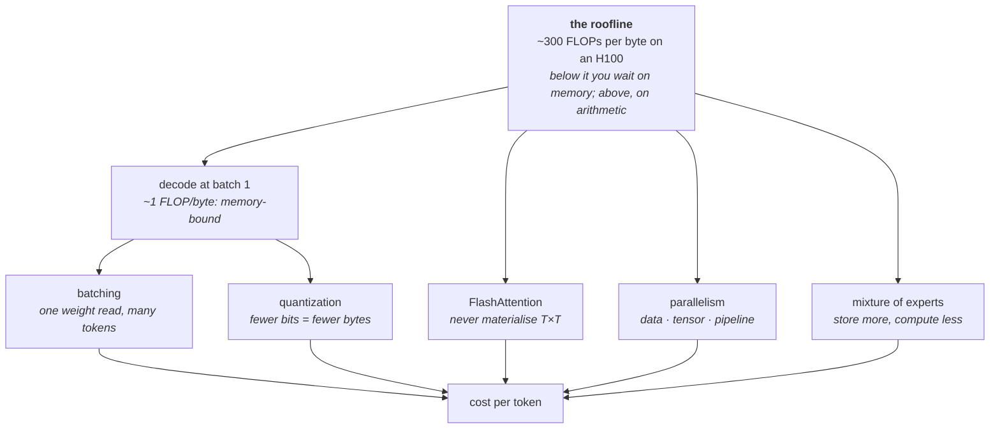

# 11 · Efficiency

**Stage:** Run (and train) the model · **Read after:** 02, 04, 10 · **Feeds:** 06 (utilisation), 12 (long context is an efficiency problem)
**In the twelve-ideas guide:** §8 *Hardware–algorithm co-design* (all: mixed precision & quantization, FlashAttention, three parallelisms, MoE & KV cache)

## Why this chapter exists

The maths in [chapter 02](../02-transformer-forward-pass/) has not changed since 2017; the cost
of running it has fallen by orders of magnitude. All of that came from fitting the same
computation to the hardware: fewer bits, kernels that respect the memory hierarchy, splitting
work across chips, and architectures that don't use every parameter for every token. This is the
systems-programming chapter, and as a programmer it will feel the most familiar — caches,
bandwidth, parallel decomposition. What is new is how completely one number, FLOPs per byte,
explains the field.

## The whole chapter in one picture



Every technique is a way of moving fewer bytes per useful FLOP.

## What this chapter computes

```python
estimate(model, hardware, batch) -> (tokens_per_second, memory_needed, cost_per_million_tokens)
```

```
  Llama-3-8B, one H100 (990 TFLOP/s bf16, 3.35 TB/s):

  ridge point                              296 FLOPs / byte
  decode, batch 1:  16.1 GB weights / 3.35 TB/s = 4.8 ms   ->  209 tok/s, ~1 FLOP/byte, memory-bound
  decode, batch 32:                                         -> 6,675 tok/s total, 209 per user

  int8 weights   8.0 GB   output error 0.008
  int4, group 32 4.0 GB   output error 0.099          (per-row int4: 0.145 — outliers)

  attention scores at 128k context: 34 GB per head materialised;  ~67 MB tiled
```

(Real output from `efficiency.py`; the H100 figures are spec-sheet numbers.)

**Input** — a model's shape (parameters, layers, heads, precision), a chip's peak FLOP/s and
memory bandwidth, and a batch size.

**Output** — where the bottleneck is, how fast it can go, how much memory it needs, and what a
token costs.

**Goal** — reason about serving and training cost from first principles, before touching a GPU.

**What it does NOT do:**

- It does **not** change the model's outputs (quantization aside). Same weights, same maths,
  different bytes moved.
- It does **not** get around the memory wall for one user. A single sequence cannot decode
  faster than one weight read per token, however fast the arithmetic.
- It does **not** make attention cheaper in FLOPs. FlashAttention cuts *memory*; the arithmetic
  is unchanged.
- It does **not** give MoE's knowledge for free. Total parameters must all be resident.

## Before the drill list: the maths

| If this stops making sense… | Read |
| --- | --- |
| "memory-bound", "arithmetic intensity", "FLOPs per byte", why batch size matters | [The roofline](essentials/roofline-and-arithmetic-intensity/) |
| "scale", "group size", why int4 works and int2 doesn't, outliers | [Quantization arithmetic](essentials/quantization-arithmetic/) |

Floating-point formats are owned by [chapter 04](../04-optimization-loop/essentials/floating-point/);
FLOPs and units by [chapter 06](../06-planning-a-run/essentials/flops-and-units/).

## Terminology

| Term | In plain language |
| --- | --- |
| **roofline** | The two speed limits — arithmetic and memory bandwidth — and which one binds. → [essentials](essentials/roofline-and-arithmetic-intensity/) |
| **arithmetic intensity** | FLOPs performed per byte moved. Decides which limit you hit. |
| **ridge point** | Peak FLOP/s ÷ bandwidth. ~300 on an H100. Below it: memory-bound. |
| **memory-bound / compute-bound** | Waiting on data vs waiting on arithmetic. |
| **HBM** | The GPU's main memory. Its bandwidth is the number that matters for decode. |
| **MFU** | Model FLOPs utilisation. 30–50% is typical. → [06](../06-planning-a-run/) |
| **continuous batching** | Serving many sequences per forward pass; one weight read yields many tokens. |
| **quantization** | Storing weights in fewer bits: scale, round to integers, keep the scale. → [essentials](essentials/quantization-arithmetic/) |
| **group size** | How many weights share one scale. Smaller groups tolerate outliers; cost extra bits. |
| **outlier** | A rare large weight that stretches a shared scale and wastes precision on the rest. |
| **GPTQ / AWQ / GGUF** | Quantization methods: error-compensating rounding; pre-scaling outlier channels; a file format with k-quant groups. |
| **FlashAttention** | Compute attention in tiles that fit on-chip; never store the `T×T` matrix; recompute in backward. Exact. |
| **kernel fusion** | Doing several operations in one pass over memory instead of writing intermediates out and reading them back. |
| **data parallel** | Copy the model, split the batch, all-reduce gradients. ZeRO/FSDP shard the copies. |
| **tensor parallel** | Split individual matrices across GPUs; exchange activations every layer. Needs NVLink. |
| **pipeline parallel** | Different layers on different GPUs; micro-batches fill the bubble. |
| **all-reduce** | Every device ends with the sum of everyone's tensor. The collective behind data and tensor parallelism. |
| **3D parallelism** | Data + tensor + pipeline combined. How frontier runs are laid out. |
| **mixture of experts (MoE)** | Several MLPs per layer; a router sends each token to a few. Total params ≫ active params. |
| **active parameters** | The ones a token actually passes through. Sets FLOPs per token. |
| **load-balancing loss** | Extra term keeping the router from sending everything to one expert. |
| **KV-cache economics** | GQA, cache quantization, paging, prefix sharing. → [10](../10-inference-and-decoding/) |
| **speculative decoding** | Draft cheaply, verify in one pass. → [10](../10-inference-and-decoding/) |

## Files in this chapter

| File | What it is |
| --- | --- |
| [`essentials/`](essentials/) | The roofline and quantization arithmetic, each with a runnable demo. |
| [`efficiency.md`](efficiency.md) | **The main article.** Roofline table, tokens/s vs batch, quantization error by format and group size, attention memory with and without tiling, communication per parallelism, MoE shapes, cost per token. |
| `systems.py` | Generates that article. |
| `efficiency.py` | The arithmetic and small measurements. numpy. |

## Drill list

**The bottleneck is memory, not arithmetic.** An H100 does ~300 FLOPs for every byte it can
fetch. Decoding one token for one user does about one FLOP per byte — the weight matrix is read
and used once. Prefill is compute-bound; decode is memory-bound. Nearly everything below is "move
fewer bytes per useful FLOP". → [essentials](essentials/roofline-and-arithmetic-intensity/)

**Batching.** The same weight read serves every sequence in the batch, so throughput scales
almost linearly with batch size until compute catches up — 209 tok/s at batch 1, 6,675 at
batch 32, same per-user speed. Continuous batching keeps the batch full as requests come and go.

**Precision and quantization.** Training: bf16 activations with fp32 master weights
([04](../04-optimization-loop/)); fp8 on newer chips. Inference: int8 is nearly free; int4 needs
per-group scales because one outlier weight otherwise wastes the levels for its whole row —
measured, error falls from 0.145 to 0.099 at group 32 — and GPTQ/AWQ recover more. int2 is
destruction. Judge by perplexity, not per-layer error. → [essentials](essentials/quantization-arithmetic/)

**FlashAttention.** The `T×T` score matrix is 34 GB per head at 128k context if you build it.
Don't: stream K and V through on-chip memory in blocks, keep a running softmax, recompute in the
backward pass. Same maths, exact result, memory linear in `T`. The canonical example of designing
the algorithm around the memory hierarchy.

**Parallelism.** Data parallel sends gradients the size of the model every step; tensor parallel
sends activations every layer and must stay inside a node; pipeline parallel sends little and
idles while the bubble fills. Sharding (ZeRO/FSDP) cuts data-parallel memory. Real runs combine
them — 3D parallelism — and the communication bill is what you are always trading against.

**Mixture of experts.** Replace each MLP with N experts and a router picking k per token. Total
parameters up several-fold, compute per token unchanged. Memory-hungry, needs a balancing loss,
and shifts where the bottleneck sits.

**KV-cache economics.** GQA, cache quantization, paged attention, prefix sharing. Detail in
[10](../10-inference-and-decoding/); the bridge to [12](../12-context-and-knowledge/).

**Kernels and compilers.** Fused kernels, CUDA graphs, `torch.compile`, Triton. Almost every op
other than a big matmul is memory-bound, so fusing them — never writing the intermediate — is
where the last 2× lives.

**Measuring it.** MFU, tokens/s, $/M tokens. The article's cost line is a division of the numbers
above by an assumed price and utilisation; those two assumptions are what change.

## Shared prerequisites — owned here

- **The roofline model** — [`essentials/`](essentials/roofline-and-arithmetic-intensity/). Referenced by 10 and 12.
- **Quantization arithmetic** — [`essentials/`](essentials/quantization-arithmetic/).

## Build it

1. Run `python3 efficiency.py`. Change the batch size in section 2 until compute binds; change
   the group size in section 3 until int4 stops improving.
2. Profile one forward pass of a small model with the PyTorch profiler; find where the time
   goes. Then quantize it to int8 and int4 and measure perplexity and tokens/s.
3. Read the FlashAttention paper's algorithm box with section 4's table beside it.

## You're done when you can…

- [ ] Compute a chip's ridge point and say whether a given matmul is memory- or compute-bound.
- [ ] Explain why one sequence cannot decode faster than one weight read, and what batching does.
- [ ] Explain why int4 needs group scales, with the outlier argument.
- [ ] Say what FlashAttention changes (memory) and what it does not (FLOPs, results).
- [ ] Describe the three parallelisms and what each one communicates.
- [ ] Explain MoE's active-vs-total distinction and its costs.
- [ ] Estimate cost per million tokens for a model on a chip, stating your assumptions.

## Q&A

*(Questions and answers accumulate here as they come up.)*

## Notes

