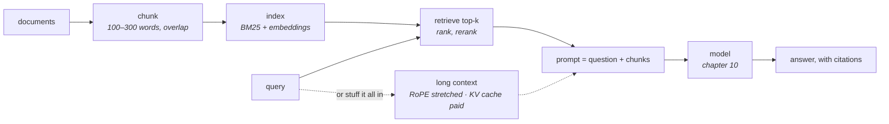

# 12 · Context and knowledge

**Stage:** Run the model · **Read after:** 02, 10, 11 · **Feeds:** 14 (agents need memory and retrieval)
**In the twelve-ideas guide:** §11 *Long context, retrieval and memory* (all), §2 *Embeddings* (as a product), §4 → *Positional encoding*

## Why this chapter exists

A model's weights know what was in the training data, frozen at a date. Everything else — your
codebase, today's news, the last conversation — has to arrive through the context window. This
chapter is the two ways to get it there: make the window bigger, or retrieve the right pieces
into it. It is also where embeddings stop being an internal detail of
[chapter 02](../02-transformer-forward-pass/) and become a product you call.

The measurements here run on real text — the curriculum's own field guide — because retrieval's
failure modes only show up on real documents.

## The whole chapter in one picture



Every arrow has a failure mode, and most of them are silent.

## What this chapter computes

```python
retrieve(query, index, k) -> chunks
answer = generate(prompt(question, chunks))          # chapter 10
```

```
  corpus: the 10,877-word field guide -> 121 chunks of ~120 words

  question                                                        BM25 rank   TF-IDF rank
  why divide attention scores by the square root of the dimension        2           2
  how many tokens per parameter did Chinchilla recommend                 1           1
  what does the KV cache store and why is GQA used                       1           1

  one question:      whole guide in prompt 14,140 tok   vs   3 chunks 468 tok
  10,000 questions:                    141,400,000 tok   vs        4,680,000 tok   (30x)

  RoPE, identical tokens 32,000 apart:  trained scale 0.140   positions ÷ 4  -0.006  (= trained at 8,000)
```

(Real output from `retrieval.py` on real text.)

**Input** — a question, and a corpus too large or too fresh to be in the weights.

**Output** — the handful of passages most likely to answer it, placed in the prompt; and a
model answering from them rather than from memory.

**Goal** — separate what a model *knows* from *when it was trained*. Give it your data, current
data, private data, without retraining.

**What it does NOT do:**

- It does **not** guarantee the answer is in the retrieved chunks. Measured: one of three
  correct chunks ranked second. Retrieval misses are silent.
- It does **not** understand the query. Keyword retrieval needs the words to match; embedding
  retrieval needs training to have put the concepts together.
- It does **not** change the weights. "Memory" here is retrieval and prompting, not learning.
- Long context does **not** come free — a linear KV cache and a position code that had to be
  stretched.

## Before the drill list: the maths

| If this stops making sense… | Read |
| --- | --- |
| "BM25", "keyword retrieval", why 'the' weighs nothing, "hybrid" | [TF-IDF and BM25](essentials/tf-idf-and-bm25/) |
| "vector database", "HNSW", "approximate nearest neighbour", "recall" | [Nearest-neighbour search](essentials/nearest-neighbour-search/) |

Cosine similarity is owned by [chapter 02](../02-transformer-forward-pass/essentials/vectors-and-dot-products/);
rotation and RoPE by [chapter 02](../02-transformer-forward-pass/essentials/rotation-and-rope/).

## Terminology

| Term | In plain language |
| --- | --- |
| **context window** | The maximum number of tokens the model can attend over in one call. |
| **knowledge cutoff** | The date after which the training data stops. The weights know nothing later. |
| **retrieval-augmented generation (RAG)** | Fetch relevant text, put it in the prompt, generate from it. |
| **chunk** | A passage of a document, the unit that gets indexed and retrieved. |
| **overlap** | Words shared between adjacent chunks so a sentence is not cut in half at a boundary. |
| **embedding model** | A network mapping a text to one vector so similar texts are near. Trained contrastively ([13](../13-multimodality/)). |
| **dense retrieval** | Retrieval by embedding similarity. |
| **sparse / keyword retrieval** | Retrieval by word overlap — BM25. → [essentials](essentials/tf-idf-and-bm25/) |
| **hybrid retrieval** | Both, with results merged. |
| **reranker / cross-encoder** | A model that reads query and chunk together and rescores the shortlist. Slower, better. |
| **recall@k** | Whether the answering chunk is in the top k. The number to measure. |
| **vector database / ANN index** | A structure returning approximate nearest neighbours without scanning everything. → [essentials](essentials/nearest-neighbour-search/) |
| **HNSW** | The dominant ANN index: a navigable graph of neighbours. |
| **needle in a haystack** | A test: plant a fact deep in a long context and ask for it. |
| **lost in the middle** | Models attend less reliably to facts in the middle of a long context. |
| **RoPE scaling / position interpolation** | Dividing positions so a long context looks like the training length. → [02 essentials](../02-transformer-forward-pass/essentials/rotation-and-rope/) |
| **NTK-aware / YaRN** | Stretching slow and fast RoPE frequencies by different amounts. |
| **prefix caching** | Reusing the KV cache for a shared prompt prefix across calls. → [10](../10-inference-and-decoding/) |
| **grounding** | Answering from provided text rather than from memory. |
| **citation** | Pointing at the chunk an answer came from, so it can be checked. |
| **memory (product feature)** | Retrieval over past sessions plus model-written notes. Not weight updates. |

## Files in this chapter

| File | What it is |
| --- | --- |
| [`essentials/`](essentials/) | BM25 and nearest-neighbour search, each with a runnable demo. |
| [`context.md`](context.md) | **The main article.** Three real questions against the field guide with the answering chunk's rank, keyword vs meaning, chunk size, the long-context-vs-RAG arithmetic, cache size, RoPE stretching, ANN. |
| `context.py` | Generates that article. |
| `retrieval.py` | Chunking, BM25, TF-IDF cosine, rank measurement, RoPE stretch proxy. Reads `../twelve-ideas-behind-modern-ai.md`. numpy. |

## Drill list

**Why long context was hard.** Quadratic attention (tiled away by FlashAttention), a KV cache
linear in `T` (131 GB per sequence at a million tokens for Llama-3-8B — not tile-able), and
positional encodings never trained past the training length.

**Position and extrapolation.** RoPE encodes position as a rotation angle. A model trained to 8k
has seen angles up to `θ·8000`; at 32k the fast pairs have spun into unseen territory. Divide
positions by 4 and 32k looks like 8k did — measured, the two proxies match — then a short
fine-tune settles it. That is *position interpolation*; NTK-aware and YaRN refine which
frequencies stretch.

**Long-context training.** Staged length increase, long-document data, sequence parallelism to
fit it. Then the honest question: does the model *use* the context? Needle-in-a-haystack tests,
"lost in the middle", degradation at length ([15](../15-evaluation/)).

**Embeddings as a product.** A model that maps a text to one vector such that similar texts are
near; trained contrastively ([13](../13-multimodality/)). Query by cosine. The chapter's TF-IDF
index has the same geometry without the training — and shows exactly where training matters.

**Retrieval-augmented generation.** Chunk → embed → index → embed the query → top-k → prompt →
generate. Each arrow fails:
- *chunking* — 40-word chunks hit precisely with no context; 400-word chunks cost 10× the
  tokens; 100–300 with overlap, split on structure.
- *retrieval* — measured: one of three answering chunks ranked second. Keyword and embedding
  retrieval fail differently; run both and rerank.
- *prompt assembly* — the model may ignore or hallucinate over retrieved text; cite chunks.
- *evaluation* — measure recall@k separately from answer quality.

**Long context versus RAG.** One question: stuff it in. Ten thousand: retrieve, at ~30× lower
cost. A million documents: only retrieval fits. Prefix caching narrows the gap; the current
answer is both.

**Approximate nearest neighbour.** A billion vectors cannot be scanned per query. LSH, IVF, HNSW
touch a fraction and return nearly the right neighbours — *because embeddings cluster*.

**Memory across sessions.** Retrieval over past conversations, notes the model writes to itself,
summaries. Useful, and not learning: it forgets what is not written and cannot generalise across
sessions the way a weight update would.

**Knowledge cutoff, grounding, citations.** What the weights cannot know; how to make the model
say so and show its sources.

## Shared prerequisites — owned here

- **TF-IDF and BM25** — [`essentials/`](essentials/tf-idf-and-bm25/).
- **Nearest-neighbour search** — [`essentials/`](essentials/nearest-neighbour-search/). Referenced by [13](../13-multimodality/).

## Build it

1. Run `python3 retrieval.py`. Write three questions of your own about the field guide and check
   where the answering chunk ranks. Then break one on purpose — paraphrase every keyword — and
   watch BM25 lose it.
2. Swap the TF-IDF index for a real embedding model (any small open one) and re-run the
   keyword-vs-meaning question. That difference is what training buys.
3. Build a RAG pipeline over this repository's `knowledge/` folder. Ask it things you know the
   answers to; inspect which chunks came back and why the wrong ones did.

## You're done when you can…

- [ ] Explain why RoPE can be stretched and what has to be fine-tuned afterwards.
- [ ] Draw the RAG pipeline and name the failure at each arrow.
- [ ] Explain what an embedding model is trained to do and how it differs from a TF-IDF vector.
- [ ] Argue long-context vs retrieval for a concrete case with token numbers.
- [ ] Say why ANN works on embeddings and fails on random vectors.
- [ ] Say what "memory" means in a shipped product and what it does not.

## Q&A

*(Questions and answers accumulate here as they come up.)*

## Notes

