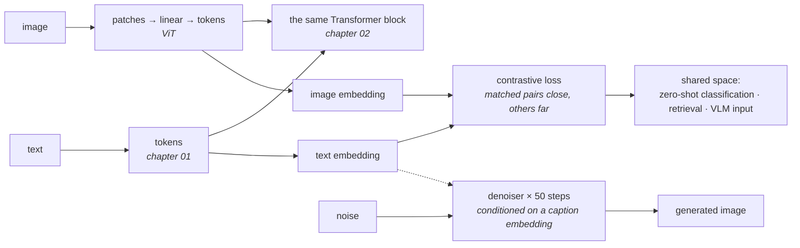

# 13 · Multimodality

**Stage:** Run (and train) the model · **Read after:** 02, 03, 12 · **Feeds:** 14 (computer use is vision + tools)
**In the twelve-ideas guide:** §10 *Multimodality through a shared token space* (all: ViT patches, CLIP, InfoNCE, diffusion)

## Why this chapter exists

The Transformer does not know it is reading text; it mixes vectors. So anything you can turn into
a sequence of vectors — image patches, audio frames, video — the same block can consume, and the
same next-token loop can produce. This chapter is the three moves that made that real:
tokenizing other modalities, aligning them with text, and generating in the reverse direction.
Each is measured on a toy small enough to see through.

## The whole chapter in one picture



One block reads everything; one loss aligns the spaces; one regression generates.

## What this chapter computes

```python
tokens   = embed_image(pixels)                           # [n_patches, d_model]
loss     = infonce(image_embeddings, text_embeddings)    # align two encoders
image    = denoise(noise, caption_embedding, steps=50)   # diffusion sampling
```

```
  224x224x3 photo, patch 16  ->  196 patches of 768 numbers  ->  196 tokens

  contrastive training, 4 synthetic classes:
     zero-shot accuracy on fresh images:  before 0.268   after 0.998   (chance 0.25)

  diffusion on two 2-D clusters:
     denoising MSE  1.29 -> 0.28 over 3,000 steps
     samples from noise land at -1.82 / 1.73 (data -2.01 / 2.02), split 0.51 / 0.49
```

(Real output from `multimodal.py`.)

**Input** — pixels, waveforms, frames: anything with a regular structure you can cut into pieces.

**Output** — tokens the language model can read alongside text; a shared embedding space where
images and captions are comparable; and, going the other way, new images from noise.

**Goal** — extend one architecture and one training recipe to every modality, rather than build
a separate system per sense.

**What it does NOT do:**

- It does **not** need a new architecture. Patchify, project, add positions, done.
- It does **not** train a classifier for zero-shot. Nearest caption *is* the classifier.
- It does **not** generate for free. Fifty denoising steps is fifty forward passes.
- **In-batch accuracy is not the metric.** With few classes it plateaus while the space is
  learned correctly; judge by zero-shot or retrieval.

## Before the drill list: the maths

| If this stops making sense… | Read |
| --- | --- |
| "CLIP", "InfoNCE", "in-batch negatives", why batch size matters | [The contrastive loss](essentials/contrastive-loss-infonce/) |
| "diffusion", "noise schedule", `ᾱ`, "predict the noise" | [Gaussian noise and denoising](essentials/gaussian-noise-and-denoising/) |

## Terminology

| Term | In plain language |
| --- | --- |
| **patch** | A small square of an image (16×16 pixels), flattened into a vector. The image's "token". |
| **Vision Transformer (ViT)** | Patches → linear projection → positions → the standard Transformer. |
| **patch embedding** | The one learned matrix mapping a flattened patch to `d_model`. |
| **image tokens** | A photo is a few hundred to a few thousand of them. Its cost in context. |
| **encoder** | A network producing one embedding per input. Image encoder, text encoder. |
| **contrastive learning** | Train so matched pairs are near and mismatched pairs far. → [essentials](essentials/contrastive-loss-infonce/) |
| **InfoNCE** | The contrastive loss: softmax over the batch, cross-entropy against the diagonal. |
| **in-batch negatives** | Everyone else's caption is a wrong answer for your image. Free negatives. |
| **CLIP** | Contrastive Language–Image Pretraining. Two encoders, one shared space, 400M pairs. |
| **zero-shot classification** | Embed the image, embed a caption per class, pick the nearest. No training. |
| **vision-language model (VLM)** | Image tokens projected into a language model's input alongside text. |
| **projector** | The small network mapping image-encoder output into the LM's embedding space. |
| **native multimodal** | One model trained on all modalities as tokens from the start. |
| **spectrogram** | Audio as an image: frequency over time. |
| **audio codec tokens** | Discrete tokens for sound; speech generation is next-token prediction over them. |
| **diffusion** | Generate by iteratively removing noise, starting from pure noise. → [essentials](essentials/gaussian-noise-and-denoising/) |
| **noise schedule** | How much noise each forward step adds; `ᾱ_t` is how much signal survives to step `t`. |
| **denoiser / ε-prediction** | The network trained by MSE to predict the noise added. |
| **latent diffusion** | Diffusion in a compressed latent space so images are small tensors. |
| **classifier-free guidance** | How hard the sampler follows the caption. |
| **token explosion** | Video at 256 tokens/frame, 24 fps: 61,440 tokens per 10 seconds. |

## Files in this chapter

| File | What it is |
| --- | --- |
| [`essentials/`](essentials/) | InfoNCE and Gaussian noise, each with a runnable demo. |
| [`multimodal.md`](multimodal.md) | **The main article.** Patch arithmetic, contrastive training with before/after zero-shot, the diffusion toy from schedule to samples, audio/video counts. |
| `vision.py` | Generates that article. |
| `multimodal.py` | Patchify, a CLIP-style contrastive trainer, zero-shot, a 2-D diffusion model with hand-written gradients. numpy. |

## Drill list

**Images as tokens.** Cut into 16×16 patches, flatten, project to `d_model`, add positions —
[chapter 02](../02-transformer-forward-pass/) applies unchanged. 196 tokens at 224×224; 5,000+
for a large photo. Why this beat convolutions at scale, and why token count is the cost.

**Contrastive alignment (CLIP).** Two encoders, one shared space. InfoNCE: an `N×N` similarity
matrix per batch, softmax each row, cross-entropy against the diagonal — the other items are the
negatives, for free. Measured: zero-shot accuracy 0.27 → 0.998 while in-batch accuracy plateaus
at the four-class collision floor. Batch size and data scale are the levers.

**Zero-shot classification.** Nearest class caption wins. No classifier trained; any captions
you can write become one. Also the retrieval half of [12](../12-context-and-knowledge/).

**Vision-language models.** Image encoder → projector → image tokens spliced into the LM's
input; train the projector (and often the LM) on captions and interleaved documents. Versus
native: everything as tokens from day one.

**Audio.** Spectrogram frames or codec tokens. Whisper as encoder–decoder; speech generation as
next-token over audio codes. One second of 16 kHz audio is 98 frames.

**Diffusion.** Train: add noise on a schedule, predict it, MSE. Generate: from noise, subtract
predicted noise 50–1000 times. Measured on two 2-D clusters: samples land on the data. Latent
diffusion, classifier-free guidance, and why each step is a forward pass.

**Video.** Images over time; 61,440 tokens for ten seconds at 256/frame. The token explosion and
what is done about it.

**Evaluation.** Grounding, hallucinated details, OCR and chart reading — [15](../15-evaluation/).

## Shared prerequisites — owned here

- **InfoNCE** — [`essentials/`](essentials/contrastive-loss-infonce/). Referenced by [12](../12-context-and-knowledge/).
- **Gaussian noise and the diffusion schedule** — [`essentials/`](essentials/gaussian-noise-and-denoising/).

## Build it

1. Run `python3 multimodal.py`. Raise the number of classes to 16 and watch in-batch accuracy
   and zero-shot accuracy move together.
2. Use an open CLIP to zero-shot classify a folder of your photos with captions you write.
3. Change the diffusion data to three clusters and re-sample. Then cut the steps to 10 and see
   what breaks.

## You're done when you can…

- [ ] Explain how an image becomes a sequence the Transformer reads, and its token cost.
- [ ] Write InfoNCE and explain why it is cross-entropy in disguise.
- [ ] Say why in-batch accuracy can plateau while the embedding space is learned correctly.
- [ ] Describe how a VLM splices image tokens into a text model.
- [ ] Explain diffusion's training task and sampling loop in two sentences each.

## Q&A

*(Questions and answers accumulate here as they come up.)*

## Notes

