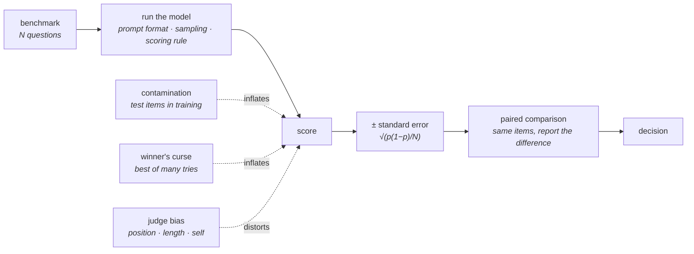

# 15 · Evaluation

**Stage:** Measure · **Read after:** 03, 06 · **Feeds:** every decision in 05–14
**In the twelve-ideas guide:** *not covered* — this chapter is the missing one

## Why this chapter exists

Every choice in the pipeline — data mixture, architecture change, RL recipe, quantization level —
is made by measuring something. Loss is exact but measures only prediction on the training
distribution; what you care about (does it code, does it reason, is it safe) needs benchmarks,
and benchmarks lie in specific, well-understood ways. Without this chapter you cannot read a
model release, compare two models, or know whether your own fine-tune helped.

For a programmer this is the chapter most likely to change how you read every number you see
from now on. The simulations are small and the effects are large.

## The whole chapter in one picture



Three arrows push every published number upward. Know their size.

## What this chapter computes

```python
evaluate(model, benchmark) -> (score, standard_error)
compare(model_a, model_b, same_items=True) -> (difference, standard_error)
```

```
  true accuracy 0.70, N = 200:  observed 0.635 .. 0.760 (95%)      SE 0.032

  two models 2 points apart, N = 200:  worse one scores higher 30.7% of the time
  same two, paired on the same items, correlation 0.9:  better one wins 85.2%

  ten identical variants, report the best:  +4.9 points of pure selection bias
  30% of test items leaked into training:   0.60 -> 0.72 measured
  judge with 60% position bias:  A wins 61.6% shown first, 50.2% with positions alternated
```

(Real output from `evaluation.py` — simulations, exact by construction.)

**Input** — a model, a set of questions with a scoring rule, and the choices you made getting
there (prompt format, sampling, how many variants you tried).

**Output** — a number, and the interval it lives in. Without the second, the first is not
information.

**Goal** — decide whether something is better, with a known chance of being wrong.

**What it does NOT do:**

- A score does **not** stand alone. Without `N` and the scoring rule it cannot be compared to
  another.
- A 2-point gap on hundreds of questions does **not** mean anything — unless paired on the same
  items.
- The best of ten tries is **not** better. It is the best of ten noisy draws.
- A judge model is **not** neutral. It prefers position one, longer text, and its own style —
  measurably.

## Before the drill list: the maths

| If this stops making sense… | Read |
| --- | --- |
| "± 2 SE", "is a 2-point gap real?", "how many questions" | [Standard error and confidence intervals](essentials/standard-error-and-confidence-intervals/) |
| "tried ten prompts", "selection bias", "hold out a test set" | [Multiple comparisons and the winner's curse](essentials/multiple-comparisons-and-the-winners-curse/) |

Bradley–Terry is owned by [08](../08-preference-optimization/essentials/sigmoid-and-pairwise-preference/);
the binomial and pass@k by [09](../09-reasoning-training/essentials/compounding-probabilities/).

## Terminology

| Term | In plain language |
| --- | --- |
| **benchmark** | A fixed set of questions with a scoring rule. MMLU, GSM8K, HumanEval, SWE-bench, … |
| **held-out / test set** | Questions the model was not trained on and you have not tuned against. |
| **validation set** | Questions you tune against. Must be separate from test. |
| **standard error** | `√(p(1−p)/N)`: typical distance of a score from the truth. → [essentials](essentials/standard-error-and-confidence-intervals/) |
| **confidence interval** | Score ± 2 SE. Catches the truth ~95% of the time. |
| **paired comparison** | Both models on the same items; report the difference. Far tighter than two scores. |
| **winner's curse** | The best of many noisy tries overstates the truth. → [essentials](essentials/multiple-comparisons-and-the-winners-curse/) |
| **multiple comparisons** | Many tests, each read as if alone. False positives multiply. |
| **contamination** | Test items present in training data. Inflates scores linearly with leakage. |
| **decontamination** | Removing overlap by n-gram match. Porous. → [05](../05-data/) |
| **few-shot / zero-shot / CoT** | Scoring conditions that change the number. Two labs' "MMLU" are rarely the same test. |
| **exact match / pass@k** | Scoring rules. pass@k: at least one of `k` samples correct; use the unbiased estimator. |
| **perplexity** | `exp(loss)`. Comparable only with the same tokenizer and data. → [03](../03-training-objective/) |
| **capability vs propensity** | Can it (best of n, with prompting) vs does it (default behaviour). |
| **LLM-as-judge** | A model grading outputs against a rubric. Cheap, scalable, biased. |
| **position / length / self-preference bias** | The judge's measurable biases. Swap, control, calibrate. |
| **Bradley–Terry / Elo** | Ratings from pairwise votes. What leaderboards fit. → [08 essentials](../08-preference-optimization/essentials/sigmoid-and-pairwise-preference/) |
| **Chatbot Arena** | A human-preference leaderboard. Read its intervals, not its ranks. |
| **saturation** | Everyone near 100%. The benchmark has stopped discriminating. |
| **red-teaming** | Adversarial evaluation for safety and robustness. |
| **model card** | A release's self-report. Which numbers are comparable, which are cherry-picked, what is missing. |

## Files in this chapter

| File | What it is |
| --- | --- |
| [`essentials/`](essentials/) | Standard error and multiple comparisons, each with a runnable demo. |
| [`evaluation.md`](evaluation.md) | **The main article.** Score noise by `N`, when a gap is real, paired comparison, the winner's curse, contamination arithmetic, judge position bias, leaderboard fits, pass@k. |
| `measure.py` | Generates that article. |
| `evaluation.py` | The simulations. numpy. |

## Drill list

**Loss and perplexity** ([03](../03-training-objective/)) as the primary training signal. What
they measure; comparable only with the same tokenizer and data; a lower loss does not guarantee
a better assistant.

**A score is a proportion with a known spread.** `SE = √(p(1−p)/N)`. ± 6 points at `N = 200`,
± 1 at 10,000. Simulation matches the formula to three decimals. Ask for `N` before believing
anything.

**When is a gap real?** Two models 2 points apart on 200 independent questions: the worse one
wins 31% of the time. Paired on the same items with correlated errors, the better one wins 85%.
**Always compare on the same items and report the paired difference.**

**The winner's curse.** Ten identical variants, report the best: +4.9 points from nothing, and it
beats an honest run of a truly-better model three times in four. Select on validation, report on
a test set you touch once. Twenty ablations at 5% significance: one passes by chance.

**Benchmarks.** MMLU and successors, GSM8K/MATH/AIME, HumanEval/SWE-bench, GPQA/ARC, long
context, agentic tasks. For each: what it tests, how it is scored, what saturates it. **Scoring
details move the number**: few-shot vs zero-shot, CoT or not, exact match vs pass@k, temperature,
prompt format.

**Contamination.** Leakage inflates scores linearly: 30% leaked, 60% → 72%. Decontamination by
n-gram overlap is porous. Fresh private test sets exist for this reason and age for the same one.

**Human preference and leaderboards.** Pairwise votes → Bradley–Terry ratings, the same fit as a
reward model. Ratings converge with matches; early gaps are noise. Read intervals, not ranks.

**LLM-as-judge.** Cheap and biased: position (60% for first, detected by swapping), length,
self-preference. Randomise, control, calibrate against human labels.

**pass@k.** `1 − C(n−c, k)/C(n, k)`, not `1 − (1−c/n)ᵏ`. Without replacement.

**Capability vs propensity.** Can it, with best-of-n and prompting, vs does it by default.
Safety evaluations, refusals, jailbreak robustness, red-teaming.

**Agentic evaluation.** Success over tasks × runs, cost, wall-clock, irreversible actions. High
variance; one number hides everything ([14](../14-tools-and-agents/)).

**Evaluating your own fine-tune.** Hold out before training; a small suite of the cases you care
about; before and after, paired; watch for regressions elsewhere ([07](../07-supervised-fine-tuning/)).
This is the part you will actually do.

## Shared prerequisites — owned here

- **Standard error and confidence intervals** — [`essentials/`](essentials/standard-error-and-confidence-intervals/).
  Referenced by [06](../06-planning-a-run/) (small-run ablations) and [07](../07-supervised-fine-tuning/).
- **Multiple comparisons** — [`essentials/`](essentials/multiple-comparisons-and-the-winners-curse/).

## Build it

1. Run `python3 evaluation.py`. Change `N` in section 2 until a 2-point gap is reliable; note the
   number.
2. Take two open models and 200 questions from any public benchmark. Score them with two prompt
   formats each. Compute the standard errors. Notice that the format change is often larger than
   the model change.
3. Read the last three model releases you saw. For each headline number, find `N`, the scoring
   rule, and whether the comparison was paired.

## You're done when you can…

- [ ] Compute a standard error for a benchmark score and say whether a 2-point gap is meaningful.
- [ ] Explain why paired comparison is tighter and how much, with the correlation table.
- [ ] Explain the winner's curse and what a held-out test set is for.
- [ ] Explain contamination's arithmetic and why decontamination is porous.
- [ ] Name three judge biases and how to detect each.
- [ ] Design a before/after evaluation for a fine-tune of your own.

## Q&A

*(Questions and answers accumulate here as they come up.)*

## Notes

