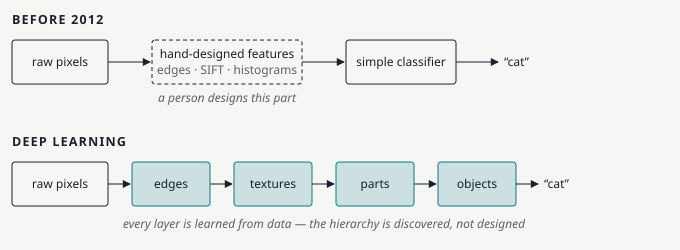
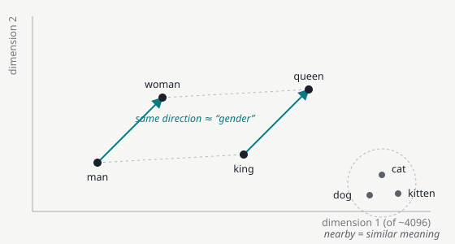
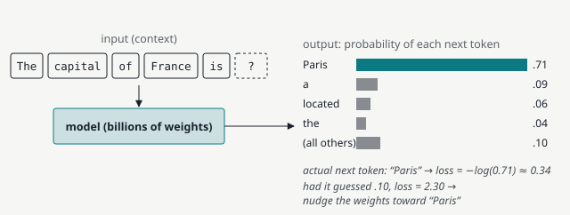
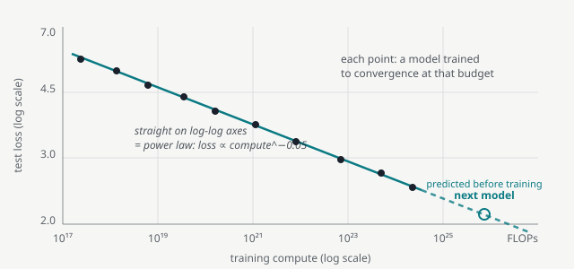
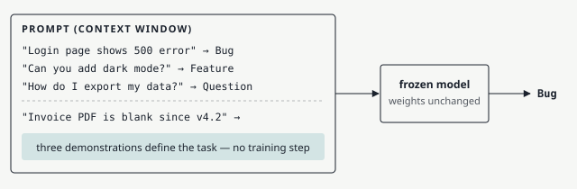
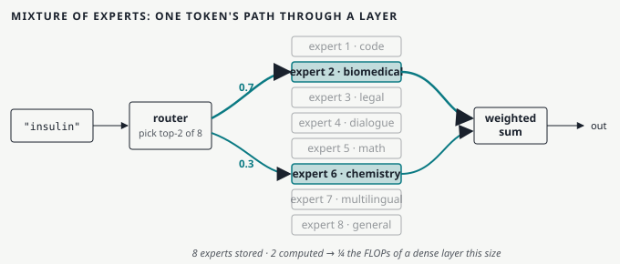
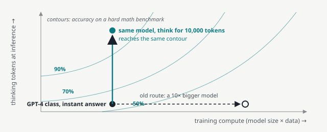
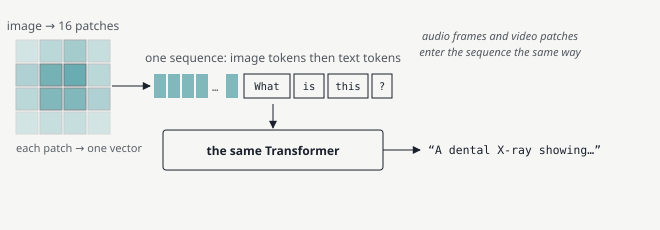
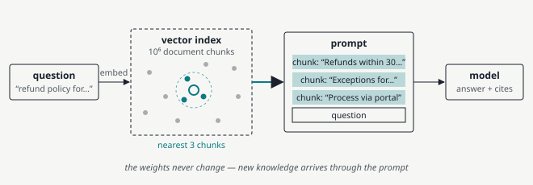

# Twelve Ideas Behind Modern AI

*A field guide for engineers who aren't ML specialists*

> *The concepts that turned a decade of research into GPT-4, Claude, Gemini and the agents built on them — each one explained, illustrated, and unpacked down to the ideas it rests on.*

> **Local copy.** Converted from the Claude artifact `2204c00f-c7fc-426c-ac2a-c084942bdddd`.
> The original rendering is kept verbatim alongside this file as
> `twelve-ideas-behind-modern-ai.html`; figures are extracted to `figures/` as
> standalone light/dark SVGs.

---

Almost nothing in a modern language model is individually new. Attention, reinforcement learning, self-supervision, even the idea of predicting the next word were all known before 2017. What produced today's systems was a particular *stack* of ideas that happened to fit together and to keep working as they were scaled up. This guide walks through the twelve that carry the most weight, in roughly the order they became load-bearing.

Each concept follows the same shape: a one-line version, a fuller explanation with a picture, a worked example, and then the ideas it depends on. Those prerequisites are colored by depth so you can skip them if you already know them, or follow them two levels down if you don't.

**Reading the drill-downs.** Each concept is followed by the ideas it rests on: `###  ↳ Depends on` is the first level, `#### ↳↳ Which depends on` the second. Skip them if you know them; follow them down if you don't.

---

## 1. Representation learning: let the network find its own features

`Foundation`

> **In one line** — Instead of humans deciding what to measure in the data, the model learns the measurements — and given enough data, the learned ones win.

Before 2012, building a vision or speech system meant a specialist spending months designing *features*: edge detectors, color histograms, phoneme templates. A relatively simple classifier then ran on top of those hand-made measurements. The deep-learning bet was that a many-layered network, fed raw pixels or raw audio, could learn better measurements than any human would design, provided it saw enough examples. AlexNet's 2012 ImageNet result (a 10-point jump in accuracy over the best hand-engineered system) settled the argument, and every later idea in this guide assumes it.

What makes this work is *depth*: each layer builds slightly more abstract features out of the previous layer's. In a vision network the first layer learns edges and color blobs, the next combines them into textures and corners, the next into parts like eyes or wheels, and eventually whole objects. Nobody programmed that hierarchy; it fell out of training. Language models do the same with text, building from characters to words to phrases to the structure of an argument.



*The shift from human-designed features to learned ones. The teal layers are all trained end-to-end; nobody specifies what “textures” or “parts” should mean.*

> **Example**
>
> Ask a spam filter from 2005 how it decides, and the answer is a list a human wrote: presence of the word “free”, ratio of capital letters, number of links. Ask a modern model, and there is no list. It has learned thousands of intermediate features — some of which correspond to things like “urgent tone” or “mismatched sender domain” — and combines them in ways nobody wrote down. The cost is interpretability; the benefit is that the features keep improving as long as you keep adding data.

### ↳ Depends on: Neural networks and backpropagation

A neural network is a stack of layers, each one a matrix multiplication followed by a simple non-linear squashing function (a *ReLU* just clips negatives to zero). Stacking linear-then-nonlinear steps is what lets the network represent arbitrarily complicated functions. The parameters are the numbers in those matrices — “weights” — and there can be billions of them.

*Backpropagation* is the algorithm that tells each weight how it should change to reduce the error. It is the chain rule from calculus applied mechanically backwards through the layers: compute the output, compare it to the right answer, then propagate “blame” back so every weight learns its share of responsibility. It is cheap (about the cost of two forward passes) and it is the reason deep networks are trainable at all.

> **Intuition**
>
> Imagine a factory line where the final product is slightly wrong. Backprop is the manager walking the line backwards, telling each station “you contributed this much to the defect — adjust by this much.” Do that a few million times and the line produces the right product.

#### ↳↳ Which depends on: Gradient descent

Once backprop has computed, for every weight, the direction that would reduce the error, gradient descent takes a small step in that direction. Repeat. The “learning rate” is the step size: too big and training oscillates or explodes, too small and it takes forever. In practice models use *stochastic* gradient descent — estimating the direction from a small random batch of examples rather than the whole dataset — plus refinements like Adam that adapt the step size per weight. Every model in this guide, from AlexNet to GPT-5, is trained this way. The whole of deep learning is “define a loss, take its gradient, step downhill, repeat.”

### ↳ Depends on: GPU parallelism

A layer is a matrix multiplication, and a matrix multiplication is millions of independent multiply-adds. Graphics cards were built to do exactly that for pixels, so in 2009–2012 researchers discovered they could train networks 10–50× faster on gaming GPUs than on CPUs. AlexNet was trained on two consumer GTX 580s. That accident of hardware history is why deep learning became practical when it did, and why NVIDIA became the most valuable company in the world. Concept 8 returns to how the hardware and the algorithms have been co-designed since.

---

## 2. Embeddings: meaning as geometry

`Foundation`

> **In one line** — Every word, image patch, or document becomes a point in a high-dimensional space where distance means similarity and direction means relationship.

Computers store words as arbitrary IDs: “cat” might be token 7,214 and “kitten” token 30,877, with nothing connecting them. An embedding replaces each ID with a vector — a list of a few hundred to a few thousand numbers — chosen so that words used in similar contexts end up near each other. “Cat” and “kitten” become neighbors; “cat” and “carburetor” do not.

The surprising part, discovered with word2vec in 2013, is that *directions* in this space carry meaning too. The vector from “man” to “woman” is roughly the same as the vector from “king” to “queen”, so `king − man + woman ≈ queen`. Nobody built that in; it emerged from the training objective. Modern models are, at bottom, enormous machines for constructing such representations and transforming them layer by layer — the “hidden state” flowing through a Transformer is just an embedding that gets progressively enriched with context.



*A two-dimensional cartoon of a space that really has thousands of dimensions. Similar concepts cluster; consistent relationships appear as parallel arrows.*

> **Example: the same idea powers search**
>
> Embed every paragraph in your documentation, then embed a user's question with the same model. The paragraphs whose vectors are closest to the question's vector are the relevant ones — even if they share no keywords. A query for “my app crashes when I rotate the phone” will land near a paragraph titled “Handling orientation changes” because both live in the same region of meaning-space. This is semantic search, and it is the retrieval half of RAG (Concept 11).

### ↳ Depends on: Vector spaces and cosine similarity

A vector is just an ordered list of numbers, and a space of vectors has a natural notion of distance. For embeddings the usual measure is *cosine similarity*: the cosine of the angle between two vectors, which is 1 when they point the same way, 0 when they are perpendicular (unrelated), and −1 when opposite. It ignores length and cares only about direction, which suits embeddings because a word's frequency tends to inflate its vector's length without changing its meaning.

```
cos(a, b) = (a · b) / (|a| · |b|)

cos(embed("cat"), embed("kitten"))     ≈ 0.85
cos(embed("cat"), embed("carburetor")) ≈ 0.08
```

High-dimensional spaces behave counter-intuitively — there is enormous room, so you can have thousands of directions that are all nearly perpendicular to one another. That is why a 4,096-number vector can encode far more than 4,096 distinct features: the model packs many concepts into overlapping directions, a phenomenon called superposition.

### ↳ Depends on: word2vec and the distributional hypothesis

The linguistic idea behind all of this is old: “You shall know a word by the company it keeps” (Firth, 1957). Words that appear in similar contexts have similar meanings. word2vec (Mikolov et al., 2013) turned that into a tiny neural network with one job: given a word, predict the words around it (the “skip-gram” objective). The embedding is the network's internal representation of the input word. Because the network must place “cat” and “kitten” close together to make similar predictions about their neighbors (“purrs”, “fur”, “meows”), similarity emerges automatically.

Modern LLMs no longer train separate word2vec-style embeddings; the embedding table is learned jointly with everything else, and the useful representations are the contextual ones inside the network. But the principle — meaning from context, encoded as geometry — is unchanged.

#### ↳↳ Which depends on: Negative sampling

Predicting “which of 100,000 vocabulary words appears next to this one” requires scoring all 100,000 candidates for every training example — far too slow in 2013. Negative sampling replaces that with a cheap binary question: “is this word pair real or randomly generated?” For each real pair like (cat, purrs), the model is also shown a handful of fake pairs like (cat, spreadsheet) and trained to tell them apart. Five or ten negatives per positive is enough. The trick — turn an expensive many-way classification into a few cheap yes/no judgements — recurs throughout ML, including in the contrastive training behind CLIP (Concept 10).

---

## 3. Self-supervised next-token prediction

`The training signal`

> **In one line** — Predicting the next word in ordinary text is a free, unlimited training signal — and doing it well forces a model to learn grammar, facts, reasoning, and a model of the world.

Supervised learning needs labels: a human marks each image “cat” or “dog”, each sentence “positive” or “negative”. Labels are expensive, so labeled datasets are small. The insight behind GPT is that text already contains its own labels. Take any sentence, hide the last word, and you have a training example: input “The capital of France is”, correct answer “Paris”. The internet provides trillions of these for free. This is *self-supervised* learning — the supervision comes from the data's own structure.

The task sounds trivial and turns out to be bottomless. To predict the next token well across all of human writing, a model has to learn spelling, then grammar, then facts (“Paris”), then style, then arithmetic (to finish “17 × 23 =”), then the logical structure of arguments (to finish a proof), then theory of mind (to finish dialogue). Each capability is just a way of lowering the prediction error on some slice of text. The model is never told to learn any of it; it learns whatever helps.



*One training step. The model outputs a probability for every token in its vocabulary; the loss punishes it in proportion to how little probability it gave the token that actually came next.*

> **Example: why “just predicting text” includes reasoning**
>
> Consider the training document: *“Alice has 3 apples and buys 4 more. She now has”* followed by *“7”*. The only way to reliably lower the loss on millions of documents like this is to actually add. Now consider a detective novel that ends with the culprit's name. To predict that name from the preceding 300 pages, the model must track clues, motives, and alibis. Text is written by people using their intelligence; predicting it well requires reconstructing a good chunk of that intelligence.

### ↳ Depends on: Tokenization

Models don't see characters or words; they see *tokens*, chunks somewhere in between. Common words are one token; rare words are split into pieces; code and non-English text tend to fragment more. A typical vocabulary has 50,000–250,000 tokens. Tokenization matters practically: it is why models are charged per token, why they sometimes struggle to count letters in a word (they never saw the letters individually), and why a long variable name costs more than a short one.

| Text | Tokens | Count |
| --- | --- | --- |
| The capital of France | `The` `·capital` `·of` `·France` | 4 |
| antidisestablishment | `ant` `idis` `establish` `ment` | 4 |
| getUserById | `get` `User` `By` `Id` | 4 |
| 牙科诊所 | `牙` `科` `诊` `所` | 4 (often more) |

#### ↳↳ Which depends on: Byte-pair encoding (BPE)

BPE builds the vocabulary from data. Start with individual bytes as the only tokens. Scan the training corpus, find the most frequent adjacent pair (say `t`+`h`), and merge it into a new token `th`. Repeat: `th`+`e` → `the`, and so on, for tens of thousands of merges. Frequent strings become single tokens; rare ones stay fragmented. Because it bottoms out at bytes, any input can be tokenized — there is never an “unknown word.” The same merges applied in reverse turn the model's output tokens back into text.

### ↳ Depends on: Softmax and cross-entropy loss

The model's last layer produces one raw score (a “logit”) per vocabulary token. *Softmax* turns those scores into probabilities: exponentiate each and divide by the sum, so they are all positive and add to 1. *Cross-entropy* then measures how surprised the model was by the real next token: −log(probability it assigned). Assigning 0.71 to the right answer costs 0.34; assigning 0.01 costs 4.6. Averaged over a dataset this is the “loss” you see plotted on every training curve, and it is exactly the quantity the scaling laws in Concept 5 are about.

A useful way to think of the loss: it is the number of bits the model needs to encode the text. A lower loss means a better compressor. Many researchers take this literally — to compress human writing well you must understand it, so “build a good compressor of the internet” and “build an intelligence” become the same engineering problem.

---

## 4. Attention and the Transformer

`The architecture`

> **In one line** — Let every token look directly at every other token and decide what to borrow from it — all in parallel. One simple block, stacked dozens of times, scales from millions to trillions of parameters without redesign.

Before 2017, language models read text one token at a time with a recurrent network, carrying a fixed-size summary forward. Two problems: information from 500 tokens back had to survive 500 compression steps, and the sequential dependency meant GPUs sat mostly idle. *Attention* solves both. For each token, the model computes a weighted mixture of all the other tokens' representations, with weights that depend on relevance. The pronoun “it” can reach back and pull information straight from “the trophy” with no intermediate steps, and because every token's mixture is computed independently, the whole sequence is processed at once.

The Transformer (Vaswani et al., “Attention Is All You Need”) is the architecture that made attention the *only* mixing mechanism. A block consists of an attention layer (tokens exchange information) followed by a feed-forward layer (each token is processed on its own — this is where most of the “knowledge” is stored), with residual connections and normalization holding it together. Stack 30–100 of these blocks and you have GPT. The design's real virtue is its indifference to scale: the same block used at 100 million parameters works at a trillion, and works for pixels and audio as well as text.


*Left: attention as a soft lookup — “it” assigns most of its weight to “trophy” because of “too big”. Right: the block that is repeated to build the whole model; the vertical lines on the left edge are residual connections that let information skip a sublayer.*

> **Example: why attention and not something cleverer**
>
> Attention is O(n²) in sequence length — every token looks at every other — and researchers have proposed dozens of cheaper alternatives. Almost none displaced it. The reason is that attention's cost is spent in exactly the operation GPUs are best at (large matrix multiplies), it has no sequential bottleneck, and it makes long-range lookups trivially easy. Simplicity that maps well to hardware beat theoretical efficiency. That pattern — pick the design that scales cleanly, not the one that is cleverest at small size — is a recurring lesson of the field.

### ↳ Depends on: Query, key, value

Attention is a soft version of a dictionary lookup. Each token produces three vectors from its embedding via learned matrices: a *query* (“what am I looking for?”), a *key* (“what do I contain?”), and a *value* (“what information do I hand over if selected?”). A token's query is compared against every other token's key; the match scores are turned into weights; the output is the weighted sum of the values.

```
scores  = Q · Kᵀ / √d          # how well each query matches each key
weights = softmax(scores)      # rows sum to 1
output  = weights · V          # blend the values
```

“Multi-head” attention simply runs this several times in parallel with different learned matrices, so one head can track grammatical agreement while another tracks coreference and another tracks which function a variable was defined in. Interpretability research has found heads that do recognizably specific jobs.

#### ↳↳ Which depends on: Dot products as similarity, softmax as soft selection

The dot product of two vectors is large when they point the same way, so `q · k` is a similarity score between what a token wants and what another token has — the same geometry as Concept 2. Dividing by √d (the vector dimension) keeps the scores from growing so large that softmax saturates into a hard one-hot pick. Softmax, met in Concept 3, then converts scores into a probability-like weighting. The result is differentiable, which is the whole point: a hard “pick the single most relevant token” could not be trained by gradient descent, but a soft blend can. Nearly every mechanism in deep learning follows this recipe — replace a discrete choice with a smooth weighting so gradients can flow.

### ↳ Depends on: Positional encoding

Attention on its own is order-blind: “dog bites man” and “man bites dog” produce the same set of query/key/value vectors. Position has to be injected. The original Transformer added a fixed sine-wave pattern to each embedding; modern models use *rotary position embeddings* (RoPE), which rotate the query and key vectors by an angle proportional to position, so the dot product between two tokens naturally depends on their relative distance. RoPE is also what makes it possible to stretch a model's context window after training (Concept 11).

### ↳ Depends on: Residual connections and normalization

Stacking 100 layers used to be impossible — gradients faded to nothing on the way back. Two fixes from 2015–16 made depth routine. *Residual connections* (ResNet) have each layer compute a *correction* that is added to its input, rather than replacing it: `x + f(x)`. The gradient can then flow straight through the addition, and a layer that learns nothing useful simply passes its input along. *Layer normalization* rescales the activations at each layer to a stable range so that no layer sees wildly drifting inputs. Together they make a Transformer a “residual stream” — a running vector that each block reads from and writes small updates to, which is also why it is possible to skip or reorder blocks and still get sensible output.

---

## 5. Scaling laws

`Engineering, not alchemy`

> **In one line** — Model quality improves as a smooth, predictable power law in parameters, data and compute — so you can forecast a model's performance before spending the money to train it.

In 2020, Kaplan and colleagues at OpenAI trained hundreds of small models and plotted loss against size. On log-log axes the points fell on straight lines, over seven orders of magnitude, with no sign of flattening. Double the compute and the loss drops by a predictable amount. This converted AI from alchemy into engineering: a lab could train a family of small models, fit the line, and know what a model 100× larger would achieve. It also justified the bet — spend hundreds of millions of dollars on one training run, because the line said it would work.

In 2022 DeepMind's Chinchilla paper corrected the recipe. Earlier models had been too large and undertrained; for a fixed compute budget the best results come from roughly 20 tokens of training data per parameter. GPT-3 (175B parameters, 300B tokens) was badly off that ratio; Chinchilla (70B parameters, 1.4T tokens) matched it at a quarter of the size. The lesson — data matters as much as parameters — shaped every model since and is why data quality and synthetic data became such intense focus areas as the supply of good text ran low.



*The shape of a scaling law (illustrative values). The line is fit on the smaller models; the open circle is a forecast. Real plots from Kaplan (2020) and Hoffmann (2022) look very much like this.*

> **Example: what a scaling law buys you**
>
> GPT-4's technical report describes predicting its final loss from models trained with 1,000–10,000× less compute, and the prediction landed. Labs also use scaling laws to make design decisions cheaply: try two architectures at 100M parameters, and if one has a better slope (not just a better intercept), it will win at 100B. Conversely, a proposed improvement that only helps small models is usually discarded. Scaling laws are also why compute — chips, power, data centers — became the central strategic resource of the industry.

### ↳ Depends on: Power laws and log-log plots

A power law is a relationship of the form `y = a · xᵇ`. Take logarithms of both sides and it becomes `log y = log a + b · log x` — a straight line with slope *b*. That is why researchers plot loss and compute on log axes: a straight line there is the fingerprint of a power law, and its slope tells you how much you gain per doubling. The slopes for language models are small (around −0.05 to −0.1 in loss per unit of log-compute), which means each doubling helps only a little — but doublings are cheap when compute grows 10× every couple of years, and the line's refusal to bend is what matters.

### ↳ Depends on: Compute-optimal training (Chinchilla)

Given a fixed compute budget, you can spend it on a bigger model trained on less data or a smaller model trained on more. Chinchilla's finding is that the optimum has data scaling in proportion to parameters — roughly 20 tokens per parameter. But “compute-optimal for training” is not “optimal overall”: a model will be run for inference billions of times, and a smaller model is cheaper to serve. So production models are now deliberately *over*-trained on far more than 20 tokens per parameter (Llama 3 8B saw ~1,900 tokens per parameter) to buy cheap inference at the cost of expensive training.

#### ↳↳ Which depends on: The 6ND rule

Training compute is well approximated by `C ≈ 6 · N · D` FLOPs, where N is parameters and D is training tokens. The 6 comes from about 2 FLOPs per parameter per token for the forward pass and 4 for the backward pass. It lets you convert between “size,” “data,” and “dollars” on a napkin: a 70B-parameter model on 1.4T tokens is 6 × 7×10¹⁰ × 1.4×10¹² ≈ 6×10²³ FLOPs; at a realistic 40% utilization of an H100's ~10¹⁵ FLOP/s, that is about 1.5×10⁹ GPU-seconds, or roughly 1,000 GPUs for three weeks.

---

## 6. In-context learning

`The surprise`

> **In one line** — A large enough model can pick up a new task from a few examples placed in its prompt, with no retraining — so one general model can replace a thousand specialized ones.

GPT-3's paper was titled “Language Models are Few-Shot Learners,” and the title was the discovery. Show the model three examples of English→French translation in the prompt and it translates the fourth line. Show it three examples of extracting dates from emails and it extracts the fourth. The weights do not change; the “learning” happens entirely inside the forward pass, in the way attention lets later tokens condition on earlier ones. Smaller models cannot do this; the ability appears and sharpens with scale.

This is the concept that made a single model viable as a product. Before it, every task needed its own fine-tuned model and its own labeled dataset. After it, a task is a paragraph of instructions. Prompt engineering, system prompts, chatbots, retrieval-augmented generation, and agents are all in-context learning wearing different clothes: they all work by putting the right information in front of a frozen model.



*Few-shot prompting. The task is specified by example, the model infers the pattern, and nothing is written back to the weights.*

> **Example: the same model, four products**
>
> A support-ticket classifier, a SQL generator, a tone rewriter and a meeting summarizer can all be the same API call to the same weights with a different first paragraph. In 2019 those were four ML projects with four datasets and four deployment pipelines. This collapse in the cost of building an “AI feature” is the economic engine behind the entire application layer built since ChatGPT.

### ↳ Depends on: Prompting: zero-shot, few-shot, and instructions

*Zero-shot* means describing the task in words with no examples (“Classify this ticket as Bug, Feature, or Question”). *Few-shot* means providing demonstrations. Raw pretrained models needed few-shot prompts because they had only ever seen text continue naturally; instruction-tuned models (Concept 7) respond to zero-shot instructions because they were trained on exactly that format. The practical craft of prompting — be specific, give examples for anything ambiguous, ask for step-by-step reasoning, specify the output format — is entirely about making the pattern the model must infer as unambiguous as possible.

### ↳ Depends on: How a frozen network “learns”: induction heads

How can anything be learned without changing weights? Interpretability work found a concrete mechanism. Certain attention heads, called *induction heads*, implement the rule “find where this token appeared before, and copy whatever followed it.” Chained, they let a model complete patterns it has never seen: if the prompt contains `A → B` and later `A →`, an induction head fills in `B`. These circuits emerge suddenly during pretraining — there is a visible bump in the loss curve when they form — and the model's in-context learning ability improves at the same moment. The broader point is that a big enough network learns, during pretraining, general-purpose *algorithms* for reading its own context, and those algorithms are what do the “learning” at inference time.

#### ↳↳ Which depends on: Emergence and phase changes

Some capabilities do not improve smoothly with scale; they are near zero until a certain size and then appear abruptly. Three-digit arithmetic, multi-step reasoning and few-shot learning all showed this. Whether emergence is real or an artifact of how we measure (a smooth improvement in per-token probability looks like a sudden jump when you score only exact-match correctness) is debated. Either way, it is why scaling has kept producing surprises rather than just “the same thing, slightly better,” and why nobody can fully predict what the next 10× of compute will unlock.

---

## 7. Pretrain, then align

`From model to product`

> **In one line** — Pretraining produces a brilliant but uncooperative text-completer. A short second phase — supervised fine-tuning plus reinforcement learning from human feedback — turns it into an assistant that follows instructions and behaves well.

A raw pretrained model, asked “Explain how vaccines work,” is as likely to continue with “…in 500 words. Due Friday. (10 marks)” as with an explanation, because both are things that follow that sentence on the internet. It has enormous capability and no notion of what you want. GPT-3 was available for two years and did not change the world; ChatGPT, essentially GPT-3.5 with an alignment phase, did within weeks. The capability was already there. The alignment made it usable.

Alignment happens in two steps. *Supervised fine-tuning* (SFT) trains the model on a few tens of thousands of high-quality example conversations written by people, teaching it the format: a user asks, the assistant answers helpfully. Then *reinforcement learning from human feedback* (RLHF) refines the behavior: humans compare pairs of model answers and pick the better one; a reward model learns to predict those preferences; the language model is then optimized to produce answers the reward model scores highly. This teaches things that are hard to demonstrate but easy to judge — tone, honesty about uncertainty, refusing harmful requests, not being sycophantic — and it is the technique that produced ChatGPT and Claude.


*The alignment pipeline. Almost all compute goes into stage 1; almost all of the difference between “GPT-3” and “ChatGPT” comes from stages 2 and 3.*

> **Example: what human feedback teaches that demonstrations can't**
>
> Ask people to *write* a perfect answer about a contested medical question and they will disagree and produce uneven quality. Ask them to *compare* two answers — one confident and wrong, one that hedges appropriately and cites what is known — and they agree quickly and reliably. Judging is easier than generating. RLHF exploits that asymmetry: the model gets a training signal for “good judgment” from people who could not necessarily demonstrate it themselves.

### ↳ Depends on: Reinforcement learning

Supervised learning says “here is the right output.” Reinforcement learning says only “that was good” or “that was bad,” after the fact, possibly for a whole sequence of decisions. An agent takes actions in an environment, receives a reward, and adjusts its *policy* — its rule for choosing actions — to get more reward in future. RL is what trained AlphaGo, and for language models the “action” is emitting a token, the “episode” is a full response, and the “reward” is a score for the finished response.

The reason RL is needed at all is that the thing we want — a helpful, honest answer — has no single correct form. There are a million good answers and a billion bad ones; supervised learning can only imitate the specific good answers it was shown, while RL can improve anything a reward can score.

#### ↳↳ Which depends on: Policy gradients and PPO

The basic RL update for language models is the *policy gradient*: increase the probability of tokens that were part of high-reward responses, decrease it for low-reward ones. Naive versions are unstable — one lucky sample can swing the policy wildly. *Proximal Policy Optimization* (PPO) constrains each update so the new policy stays close to the old one, and RLHF adds a further penalty for drifting too far from the SFT model, so the model cannot “hack” the reward model by producing strange text that scores well but reads badly. That drift, called *reward hacking*, is the central failure mode of RLHF: the reward model is an imperfect proxy for what humans want, and an optimizer will find its blind spots (for example, learning that longer, more confident answers score higher regardless of correctness).

### ↳ Depends on: Preference learning: reward models, DPO, and AI feedback

A *reward model* is a copy of the language model with its output layer replaced by a single number, trained so that for each human comparison the preferred answer scores higher. Once trained it can judge millions of responses no human will ever read. *Direct Preference Optimization* (DPO, 2023) showed that you can skip the separate reward model and RL loop entirely — a clever rearrangement of the math lets the language model be trained directly on preference pairs with a supervised-style loss, which is simpler and more stable, and is now widely used. *Constitutional AI* / RLAIF (Anthropic, 2022) replaces some of the human comparisons with an AI's own judgments against a written set of principles, which scales far better and gives more consistent, auditable behavior. Most frontier models now use a mixture: human preferences for the hardest judgments, AI feedback for volume.

---

## 8. Hardware–algorithm co-design

`Making it affordable`

> **In one line** — Modern models exist because the algorithms were bent to fit the hardware and the hardware was built around the algorithms: lower precision, memory-aware kernels, parallelism across thousands of chips, and architectures that only activate a fraction of themselves per token.

A trillion-parameter model does not fit on one GPU. Training it means spreading the work across tens of thousands of accelerators for months, and serving it means answering millions of requests a day at a price people will pay. None of that is possible with a naive implementation, so a large share of the progress since 2020 is invisible to users: it is engineering that makes the same mathematics 10–100× cheaper.

The gains come from four directions. *Lower numerical precision* — doing arithmetic in 16-bit, 8-bit, even 4-bit numbers instead of 32-bit — halves or quarters memory and doubles or quadruples throughput with almost no loss in quality. *Memory-aware algorithms* like FlashAttention restructure computation so data stays in fast on-chip memory. *Parallelism* splits a model across chips in three complementary ways. And *mixture-of-experts* changes the architecture so that a model can have a trillion parameters but use only a tenth of them for any given token.



*A mixture-of-experts feed-forward layer. The labels on the experts are illustrative — real experts specialize in ways that don't map neatly onto human categories — but the mechanism is exact: a small router picks a few experts per token and the rest are skipped.*

> **Example: the same answer at one-tenth the price**
>
> Between GPT-4's launch in March 2023 and mid-2025 the price of GPT-4-level output fell by more than an order of magnitude, and open models of similar quality can be run on a single high-end workstation. The mathematics of the models did not fundamentally change over that period. What changed was 8-bit and 4-bit quantization, mixture-of-experts architectures, better attention kernels, speculative decoding, and smaller models trained on far more data (Concept 5). Cost reduction is itself a capability: it decides which applications are economically possible.

### ↳ Depends on: Mixed precision and quantization

Standard floating point uses 32 bits per number. Neural networks turn out to be remarkably tolerant of noise: training in 16-bit (bfloat16, which keeps float32's range but drops precision) with a 32-bit copy of the weights for the update step is now universal, and NVIDIA's newest chips train in 8-bit. For *inference* the weights can be squeezed further, to 8 or 4 bits per parameter, with a clever per-block scaling factor to preserve range. A 70B model at 4 bits fits in 35 GB instead of 280 GB — the difference between a single GPU and a rack. Because inference on modern hardware is limited by how fast weights can be read from memory rather than by arithmetic, halving the bits roughly doubles the tokens per second.

### ↳ Depends on: FlashAttention and the memory hierarchy

Attention's n×n score matrix is huge for long sequences and, in a naive implementation, gets written to and read back from GPU memory several times. FlashAttention (2022) computes attention in tiles that fit in the GPU's tiny on-chip SRAM, never materializing the full matrix, and recomputes a few values rather than storing them. It gives identical results 2–4× faster with memory that grows linearly rather than quadratically in sequence length. It is the single kernel most responsible for making 100K+ token contexts practical, and it is a perfect example of the theme: nothing about the math changed, only its arrangement relative to the hardware.

#### ↳↳ Which depends on: Memory bandwidth versus arithmetic

An H100 can perform about 10¹⁵ multiply-adds per second but can only read about 3×10¹² bytes per second from its main memory (HBM). Its on-chip SRAM is ~10× faster still but only tens of megabytes. So the ratio of arithmetic to memory traffic — *arithmetic intensity* — decides whether a kernel is fast. Matrix multiplication has high intensity (each loaded number is used many times) and runs near peak. Naive attention and, notably, token-by-token generation have low intensity: to emit one token the whole model's weights must be streamed from memory once, and only a handful of operations are done per weight. This is why inference is “memory-bound,” why batching many users together is so important for serving cost, and why quantization helps speed and not just size.

### ↳ Depends on: Three kinds of parallelism

*Data parallelism*: every GPU holds a full copy of the model and processes different examples; gradients are averaged. Simple, but the model must fit on one chip. *Tensor parallelism*: each matrix is split across several GPUs in the same server and they exchange partial results at every layer — needs very fast interconnect (NVLink). *Pipeline parallelism*: different layers live on different GPUs and micro-batches flow through like an assembly line. Frontier training runs use all three at once (“3D parallelism”) across tens of thousands of GPUs, plus sharded optimizer states (ZeRO/FSDP) so no chip has to hold everything. The engineering challenge of keeping 20,000 GPUs busy without one straggler or failure stalling the run is a large part of why training frontier models is hard even with unlimited money.

### ↳ Depends on: Mixture-of-experts and the KV cache

*Mixture-of-experts* (MoE) replaces the feed-forward layer of each block with several parallel copies (“experts”) and a small router that sends each token to the top one or two. Total parameters — and so the model's capacity to store knowledge — go up by the number of experts, while the compute per token barely changes. Mixtral, DeepSeek-V3, GPT-4 (reportedly) and most frontier models use it. The cost is engineering: experts must be balanced so none is idle, and all of them still have to sit in memory.

The *KV cache* is the other ubiquitous inference trick. When generating token 1,000, the keys and values of the previous 999 tokens haven't changed, so they are stored rather than recomputed. Generation becomes linear rather than quadratic in length, but the cache itself grows with context and is often the binding memory constraint when serving long conversations — which is why techniques to shrink it (grouped-query attention, multi-head latent attention) are in every recent architecture paper.

---

## 9. Reasoning and test-time compute

`The second scaling axis`

> **In one line** — Let the model think before it answers — generating a long chain of intermediate steps — and train that thinking with reinforcement learning against answers that can be checked. Spending more compute at inference time became a new way to buy capability.

For a decade, the recipe for a better model was a bigger model with more training. In late 2024 OpenAI's o1 and then DeepSeek's R1 demonstrated a second axis: give the model room to produce thousands of tokens of private working — trying approaches, noticing mistakes, backtracking — before committing to an answer, and its performance on math, code and hard reasoning jumps far beyond what its size would predict. A model allowed to think for a minute beats one ten times its size answering instantly.

The crucial ingredient is *how* the thinking is trained. Rather than imitating human-written reasoning, the model is trained by reinforcement learning on problems with verifiable answers: a math problem with a known solution, code with unit tests. The model tries, gets a reward when the final answer checks out, and gradually discovers reasoning strategies that work — including self-verification and error correction that nobody taught it. R1's paper showed “aha moments” emerging spontaneously in the training logs. This is also why the biggest gains have been in domains with checkable answers, and why extending them to fuzzier domains is an active frontier.



*Two ways to reach the same accuracy contour: scale the model (move right) or scale the thinking (move up). Test-time compute made the vertical direction available, and it is often the cheaper one.*

> **Example: what a reasoning trace looks like**
>
> ```
> Q: A bat and a ball cost $1.10. The bat costs $1.00 more than the ball.
>    How much is the ball?
>
> [thinking] Intuitive answer is 10¢. Check: 10¢ + $1.10 = $1.20 total. Wrong.
> Let ball = x. Bat = x + 1.00. Sum: 2x + 1.00 = 1.10 → x = 0.05.
> Check: 5¢ + $1.05 = $1.10. ✓
>
> A: 5 cents.
> ```
>
> Nothing in the final answer reveals the work, but the work is why the answer is right. Before reasoning training, models made the same intuitive mistake humans make; the trained habit of “check the obvious answer before committing” is what RL against verifiable rewards instills.

### ↳ Depends on: Chain-of-thought

Discovered in 2022 as a prompting trick: append “Let's think step by step” and models became much better at multi-step problems. The mechanism is that a Transformer does a fixed amount of computation per token, so a hard problem cannot be solved in the single forward pass that produces the answer token — but it *can* be solved if the model writes out intermediate results, each one becoming context for the next step. The tokens act as external working memory. Reasoning models turn this trick into a trained skill: the “thinking” is a long chain-of-thought the model learned to produce because it was rewarded for the answers it led to.

### ↳ Depends on: Reinforcement learning with verifiable rewards

RLHF (Concept 7) used a learned reward model that approximated human taste and could be gamed. For reasoning, the reward is a *checker*: does the final number match the answer key, do the unit tests pass, does the proof verify? Such rewards cannot be hacked by sounding confident, so the model can be optimized much harder against them without drifting into nonsense. Training then works like this: sample many attempts at each problem, score each attempt, and push the model toward what worked. Because there is no human in the loop, this scales to millions of problems — the constraint becomes finding enough problems with checkable answers, which is why math and code led and why labs now build elaborate environments for other domains.

#### ↳↳ Which depends on: GRPO and sampling-based advantage

PPO needs a second “critic” network to estimate how good a partial answer is, which doubles memory and is hard to train for long text. DeepSeek's *Group Relative Policy Optimization* drops the critic: for each problem, sample a group of (say) 16 answers, score them all, and treat each answer's *advantage* as its score minus the group's mean, divided by the group's standard deviation. Answers better than their siblings are reinforced, worse ones suppressed. It is simple, memory-cheap, and was the algorithm behind R1's open replication of o1-style reasoning. The broader idea — compare a sample to its peers rather than to an absolute estimate — recurs across modern RL for language models.

### ↳ Depends on: Inference-time scaling and search

Once a model can think, there are several ways to spend more compute on a problem. *Longer thinking*: simply let the chain run further (the “reasoning effort” setting exposed in APIs). *Parallel sampling*: generate many independent answers and take a majority vote, or have a verifier pick the best — accuracy climbs predictably with the number of samples. *Tree search*: explore alternative partial solutions and expand the promising ones, in the spirit of AlphaGo. Each trades money and latency for accuracy, and the fact that the trade is smooth and predictable is what makes “test-time compute” a genuine scaling law rather than a trick.

---

## 10. Multimodality through a shared token space

`Beyond text`

> **In one line** — Images, audio and video can be cut into tokens and fed into the same Transformer that reads text — one architecture and one training objective serve every modality, and contrastive training aligns them with language.

The Transformer never cared that its tokens were words. Cut an image into a grid of 16×16-pixel patches, project each patch to a vector, and you have a sequence the architecture can process exactly as it processes a sentence — that is the Vision Transformer (ViT, 2020), and it matched or beat convolutional networks once given enough data. Slice audio into short frames, or video into patches across space and time, and the same holds. GPT-4o, Gemini and Claude are trained on interleaved sequences where a text token, an image patch and an audio frame are simply neighbors in the same stream.

The other half is alignment between modalities: getting the vector for a picture of a dog to sit near the vector for the word “dog.” CLIP (2021) did this with contrastive learning on 400 million image–caption pairs from the web, and its embedding space became the bridge for text-to-image generation (DALL·E 2, Stable Diffusion), for zero-shot image classification, and for teaching language models to see.



*A vision-language model. Image patches are projected into the same vector space as text tokens and concatenated; attention then lets the question attend to the picture.*

> **Example: zero-shot classification with CLIP**
>
> To build an image classifier for “cavity”, “healthy tooth”, “crown” in 2018 you needed thousands of labeled radiographs and a training run. With CLIP you embed the three phrases, embed the image, and pick the phrase whose vector is closest — no training at all, and you can change the categories by editing strings. Accuracy is lower than a purpose-trained model on a narrow task, but the ability to classify anything nameable, instantly, was new.

### ↳ Depends on: Patch tokenization and the Vision Transformer

A 224×224 image cut into 16×16 patches yields 196 patches, each of 768 pixel values (16×16×3 colors). A single learned linear layer maps each to the model's embedding size, positional encodings are added (2-D this time), and the result is a 196-token sequence. Convolutional networks had built in the assumption that nearby pixels matter most; ViT dropped that assumption and let attention learn it, which was worse with little data and better with a lot — the same “learned beats designed, given scale” story as Concept 1. Video adds a time dimension to the patches; audio is usually converted to a spectrogram (a picture of frequency over time) and patched the same way, or compressed into discrete audio tokens by a learned codec.

### ↳ Depends on: Contrastive learning (CLIP)

CLIP trains two encoders — one for images, one for text — with a single rule: for a batch of N image–caption pairs, the embedding of each image should be closest to its own caption and far from the other N−1 captions, and vice versa. No labels are needed beyond the captions the web already provides. After training, the two encoders share a space where “a photo of a golden retriever” and an actual photo of one land together. The technique is *contrastive* because it learns by contrasting the true pair against the wrong ones — the same idea as word2vec's negative sampling (Concept 2) at a much larger scale.

#### ↳↳ Which depends on: The InfoNCE loss

Formally, for each image the model computes similarity scores against all N captions in the batch, applies softmax, and uses cross-entropy with the true caption as the target — exactly the machinery of Concept 3, with “which caption goes with this image” standing in for “which token comes next.” The batch itself supplies the negatives, so large batches (CLIP used 32,768) give harder, more informative contrasts. A learned temperature parameter sharpens or softens the softmax. This one loss function underlies CLIP, most modern embedding models for search, and much of self-supervised vision.

### ↳ Depends on: Diffusion: generating in the other direction

Understanding images is one thing; producing them is another. Diffusion models (behind DALL·E 2/3, Stable Diffusion, Midjourney, Sora and Veo) learn to reverse a noising process: take a real image, add Gaussian noise in many small steps until it is pure static, and train a network to predict and remove the noise at each step. To generate, start from static and denoise step by step, with a CLIP-style text embedding steering each step toward the caption. The approach is stable to train and produces extraordinary quality; its cost is that generation takes many passes, which a parallel line of work keeps reducing. Autoregressive image generation — predicting image tokens one at a time, exactly like text — is the competing approach and has recently become strong in models like GPT-4o's image output.

---

## 11. Long context, retrieval and memory

`Knowing versus knowing where to look`

> **In one line** — Context windows grew from 2,000 tokens to over a million, and retrieval lets a model pull in fresh or private information at the moment it answers — decoupling what a model knows from when it was trained.

A model's weights are frozen at training time. They cannot know about yesterday's news, your company's internal docs, or the conversation you had with it last week. Two ideas address this. The first is simply a bigger *context window* — the amount of text the model can attend to at once. GPT-3 handled about 2,000 tokens (a few pages); Claude and Gemini now accept hundreds of thousands to over a million, enough for entire codebases or books. Anything you put in the window, the model can use with full attention, and in-context learning (Concept 6) does the rest.

The second is *retrieval-augmented generation* (RAG): rather than stuffing everything into the window, store documents as embeddings (Concept 2), find the few most relevant to the question, and put only those in the prompt. It is cheaper than a huge context, keeps knowledge current without retraining, lets you cite sources, and — crucially for a company — keeps private data private while still letting the model use it. Together, long context and retrieval have turned models from oracles that know what they were trained on into readers that can be handed what they need.



*Retrieval-augmented generation. The model's knowledge is supplemented at query time with the handful of stored passages closest in embedding space to the question.*

> **Example: when to use which**
>
> You have a 400-page product manual and want a support assistant. Long context: paste the whole manual into every request — simple, the model sees everything, but each request costs hundreds of thousands of tokens and gets slower. RAG: chunk the manual, embed the chunks once, retrieve five per question — cheap and fast, but the retriever might miss the relevant paragraph, and questions that need a synthesis of the whole book fail. In practice teams combine them: retrieve generously into a large context, and cache the stable prefix (the system prompt and shared documents) so it is not re-processed on every call.

### ↳ Depends on: Why long context was hard

Attention's cost grows with the square of the sequence length, so 8× the context is 64× the attention compute and memory. Three things fixed it. FlashAttention (Concept 8) removed the memory blow-up. Rotary position embeddings (Concept 4) can be stretched — by rescaling the rotation frequencies — to positions the model never saw in training, then fine-tuned briefly on long documents. And architectural tweaks like grouped-query attention shrank the KV cache that must be held for every token in the window. The remaining challenge is quality: models can accept a million tokens but do not attend to all of them equally well, and “needle in a haystack” tests check whether a fact buried mid-context is actually used.

### ↳ Depends on: Retrieval pipelines

A RAG system has more moving parts than the diagram shows. Documents must be *chunked* into passages small enough to be specific but large enough to be self-contained. Each chunk is embedded with an embedding model (trained contrastively, as in Concept 10). At query time the question is embedded and the nearest chunks are found, usually combined with old-fashioned keyword search (BM25) because embeddings miss exact identifiers like error codes or part numbers. A *reranker* — a small model that reads question and chunk together — often re-orders the top 50 to pick the best 5. Most RAG failures are retrieval failures, not generation failures, so the engineering effort goes into chunking and search quality.

#### ↳↳ Which depends on: Approximate nearest-neighbor search

Finding the closest vectors among a billion by brute force means a billion dot products per query. Vector databases use *approximate* indexes that trade a little recall for orders of magnitude in speed. HNSW builds a multi-layer graph where each vector links to its near neighbors; a search walks greedily from a random entry point, descending through layers like a skip list, and finds a near-optimal result in logarithmic time. IVF partitions the space into clusters and searches only the closest few; product quantization compresses vectors so more fit in RAM. These are the data structures inside Pinecone, pgvector, FAISS and every “vector database,” and they are why semantic search over a company's entire document store can return in milliseconds.

### ↳ Depends on: Memory across sessions

Both long context and RAG are stateless: the next conversation starts blank. “Memory” features layer a persistence mechanism on top — the model writes notable facts to a store during a conversation and retrieves them into later ones, which is RAG where the documents are the model's own notes. Design questions here are more about product than ML: what is worth remembering, how to keep it accurate as facts change, and what a user would be uncomfortable finding stored. This is also where agent frameworks put the notes an agent keeps across long tasks (Concept 12), and where the line between “context engineering” and “memory” has blurred.

---

## 12. Tool use and agency

`From answering to doing`

> **In one line** — Give the model the ability to call functions, run code, browse and operate a computer — then loop: act, observe the result, decide the next step. Reasoning plus tools turns a text generator into something that completes multi-step tasks and checks its own work.

A language model by itself can only emit text. It cannot look anything up, cannot run the code it writes, cannot tell whether its answer is right. *Tool use* closes that gap: the model is told about a set of functions it may call — `search(query)`, `run_python(code)`, `read_file(path)` — and trained to emit a structured call when one is useful. The surrounding program executes the call and feeds the result back as more context. The model then continues, now informed by real data rather than its recollection of it.

An *agent* is that pattern run in a loop toward a goal. Given “fix the failing test in this repo,” it reads the test, forms a hypothesis, edits a file, runs the tests, reads the output, and iterates until they pass — often over dozens or hundreds of steps and long stretches of time. Coding agents such as Claude Code and Codex were the first to reach broad usefulness because software offers what agents need most: rich tools, fast feedback and checkable success. The same loop, given a browser or a desktop, does the work of a knowledge worker's morning. This is where most of the practical value is being created now, and it rests on almost every concept that came before: in-context learning to read the tool results, reasoning to plan, long context to hold the task history, alignment to behave safely with real permissions.


*The agent loop. Each observation from the environment becomes context for the next decision, so errors are visible and correctable rather than final.*

> **Example: the difference feedback makes**
>
> Ask a 2023 chatbot to write a function and it produces code that looks right and may not compile. Ask an agent, and it writes the code, runs it, reads the `TypeError`, fixes the type, runs again, sees the tests pass, and only then reports back. Neither the model's knowledge nor its coding skill is the main difference. The difference is that the second one can see the consequences of its actions. Verification through tools is worth more than a large jump in raw model quality, and it is why agent benchmarks improved faster than any other category through 2025.

### ↳ Depends on: Function calling and structured output

Tool use starts with a contract. The application describes each tool with a name, a plain-language description and a JSON schema for its arguments; the model is trained to respond, when appropriate, with a JSON object naming the tool and filling in the arguments rather than with prose. The runtime validates the call, executes it, and returns the result as a specially-marked message. Models are fine-tuned specifically on this format so that they choose tools sensibly, fill arguments correctly and know when *not* to call one. The same machinery gives “structured output” — forcing a response into a schema — which is how models are wired into ordinary software that expects typed data rather than paragraphs.

```
// the model emits this instead of prose
{ "tool": "search_tickets",
  "arguments": { "status": "open", "product": "Invoice PDF", "since": "v4.2" } }

// the runtime returns this as the next message
{ "result": [ { "id": 8812, "title": "Blank PDF export", "reports": 14 } ] }
```

### ↳ Depends on: The agent loop: ReAct and its descendants

The basic pattern was named ReAct (“Reason + Act”, 2022): interleave a thought, an action and an observation, and repeat. Everything since is elaboration. *Planning*: write down a task list first and tick it off, so a long job stays coherent. *Sub-agents*: spin up a fresh model instance with a narrow brief, so the main context is not flooded with detail. *Checkpoints and permissions*: ask before irreversible actions. *Context management*: summarize or discard old history so a 500-step task fits in the window. The frontier models are now trained with RL directly on multi-step agent tasks — reward for the task completing — rather than just prompted into the loop, which is where the large 2025 gains in reliability came from.

#### ↳↳ Which depends on: Verifiers and the environment as reward

The reason agents and reasoning models (Concept 9) advanced together is that they share a training recipe: an environment that can say whether the task succeeded. A test suite, a compiler, a web form that either submitted or didn't, a spreadsheet whose totals either match or don't — each is a verifiable reward, so the same RL machinery that taught models to do math teaches them to operate tools. Labs now invest heavily in building such environments (“RL gyms”) across domains, and the pace of agent progress in any domain tracks how cheaply success there can be checked. Where no checker exists — writing a persuasive memo, say — progress is slower and still leans on human preference data.

### ↳ Depends on: Model Context Protocol and computer use

Two developments made tools universal rather than bespoke. The *Model Context Protocol* (MCP, Anthropic, late 2024) is an open standard for how a model connects to a tool server: a server advertises its tools and their schemas, any compliant client can use them, so a database, a ticketing system or a design tool needs to be integrated once rather than once per AI product. It was adopted across the industry within a year. *Computer use* is the fallback when no API exists: the model sees screenshots and emits mouse and keyboard actions, treating any GUI as a tool. It is slower and less reliable than a proper API, but it means the long tail of software with no integration is still reachable — and it is the capability behind agents that browse, fill forms and operate desktop applications.

---

## One recipe, extended six times

Read in order, the twelve concepts tell a single story. A simple, general architecture (attention, Concept 4) is trained on a simple, general objective (next-token prediction, Concept 3) using learned representations (Concepts 1–2) and gets predictably better with scale (Concept 5). At sufficient scale it becomes a general-purpose learner that can be programmed with text (Concept 6). Each remaining gap was then closed by *adding a stage* rather than redesigning the whole thing: an alignment phase for usability (7), engineering for affordability (8), reinforcement learning on verifiable problems for reasoning (9), more token types for perception (10), retrieval and longer windows for knowledge (11), and tools and loops for action (12).

That is also the honest answer to why the field surprised so many people. None of the components were secret. What was hard to believe in advance was that the same recipe would keep working — that you could pour a thousand times more compute into next-token prediction and get reasoning out, or bolt a feedback loop onto a text model and get a competent engineer. The lesson that generality plus scale beats clever specialization has now been learned six times in a row, and most bets in the industry assume it will hold at least once more.

**If you remember one sentence per concept:**

1. Learned features beat designed ones, given data.
2. Meaning is geometry: similar things are near, relationships are directions.
3. Predicting the next token is a free training signal that demands understanding.
4. Attention lets every token consult every other, in parallel, at any scale.
5. Loss falls as a straight line on log-log axes — so you can plan.
6. A big enough model learns new tasks from its prompt, without retraining.
7. Pretraining gives capability; a short alignment phase gives usability.
8. Fewer bits, smarter kernels, more chips, sparser models: the same math, 100× cheaper.
9. Letting the model think, and training the thinking with checkable rewards, is a second scaling axis.
10. Anything you can tokenize, the same Transformer can read; contrastive training links the modalities.
11. Long context and retrieval separate what a model knows from when it was trained.
12. Tools plus a feedback loop turn a text generator into something that gets things done.
